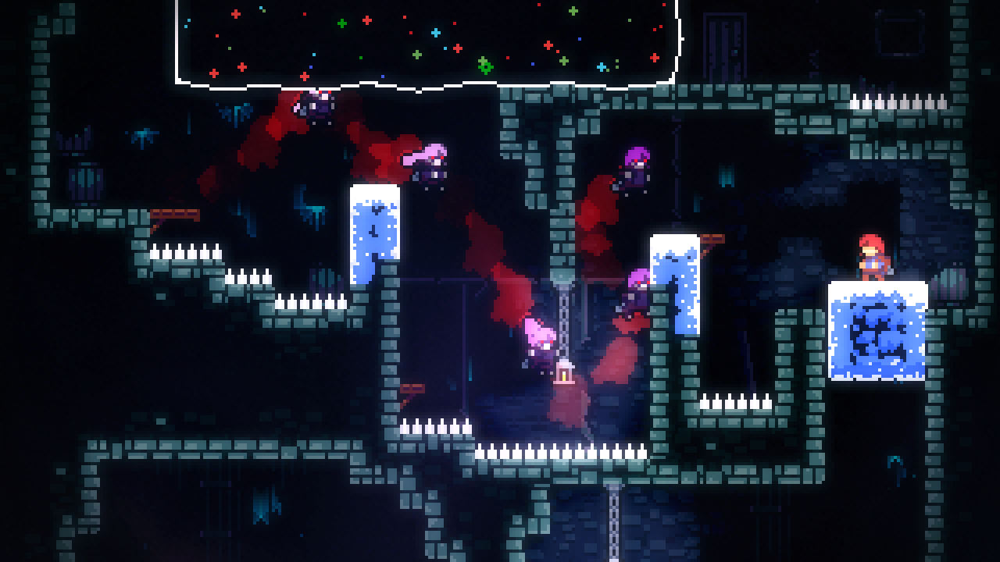

# Chapter 1: What Is MonoGame

Before we dive into writing code, let's talk a little bit about the history of MonoGame. MonoGame is an open-source implementation of the [Microsoft XNA 4.0 Framework](https://en.wikipedia.org/wiki/Microsoft_XNA). XNA was originally developed by Microsoft to facilitate game development for Windows and Xbox 360. An open-source project named XNA Touch was created by José Antonio Leal de Farias to port XNA games to mobile devices. XNA Touch was later renamed MonoGame and expanded over time to include  support for Mac and Linux, as well as OpenGL on Windows, making it truly cross-platform.

In 2013, Microsoft discontinued development of XNA while MonoGame continued to be developed and started seeing its first titles coming to the PS4 console.  Then in 2014 [Tom Spilman](https://github.com/tomspilman) and [Steve Willams](https://github.com/KonajuGames) became the new stewards of the MonoGame project.  Finally September 29th, 2023, the [MonoGame Foundation]<https://monogame.net/about/> was formed. Today, the MonoGame project is actively developed and supported by the foundation and the community of contributors and maintainers.

## What Can MonoGame Do
MonoGame, much like XNA, is a "bring your own tools" kind of framework, providing the building blocks to build your own engine and tools. It is a code-first approach to game development, meaning there is no editor or interface provided. Instead, developers are free to use existing tools, such as [Tiled](https://www.mapeditor.org/) or [LDtk](https://ldtk.io/) for level design, or create their own tools. This empowers developers with greater flexibility and freedom regarding what systems and features are included in their game.

MonoGame can be used to create 2D or 3D games and applications that run cross-platform on desktop, mobile, and consoles. This flexibility allows developers to target multiple platforms with a single codebase, reducing the need for extensive rewrites and porting.

Some examples of games created with MonoGame include [Celeste](https://store.steampowered.com/app/504230/Celeste/), [Stardew Valley](https://store.steampowered.com/app/413150/Stardew_Valley/), and [Streets of Rage 4](https://store.steampowered.com/app/985890/Streets_of_Rage_4/).

 

 

 

## Key Features and Capabilities
- **Cross-Platform Development**: Write once, run anywhere. MonoGame supports Windows, macOS, Linux, iOS, Android, and various consoles.
- **2D and 3D Rendering**: Support for both 2D and 3D graphics, enabling the creation of a wide range of games and visual experiences.
- **Sound Effect and Music Playback**: Incorporate audio effects and music to enhance the gaming experience using the built-in sound API.
- **Keyboard, Mouse, Touch, and Controller Inputs**: Comprehensive input handling for various input devices, ensuring a seamless user experience across different platforms.
- **Content Building and Optimization**: Tools for efficiently building and optimizing game content to ensure smooth performance.
- **Math Library Optimized for Games**: A math library specifically optimized for game development, providing essential mathematical functions and operations.

> [!NOTE]
> Developing games for consoles requires a more advanced skill set for programming or another developer or studio that can port the game for you.
>
> Console development is also unique in that the MonoGame Foundation can only provide the console-specific portions once developers have been approved by that console manufacturer. This is due to licensing terms and agreements imposed by console manufacturers.

## Programming Languages
C# is the language MonoGame is built with and is the primary language used when creating games, in documentation, samples, and community discussions. However, it is also a .NET library, so you can use any compatible .NET language to develop games, such as Visual Basic or F#. If you choose an alternative .NET language, please keep in mind that community help and support may be limited.

Developers should have a foundational understanding of C# and be comfortable with concepts such as classes and objects. If you are entirely new to C# or programming in general, we recommend following the official [Learn C#](https://dotnet.microsoft.com/en-us/learn/csharp) tutorials provided by Microsoft. These free tutorials teach you programming concepts as well as the C# language.

## Conclusion
Now that we've covered the history and capabilities of MonoGame, you should have a good grasp of what this framework can do. We've seen how it builds on the legacy of XNA to offer a flexible, cross-platform solution for game development. With an understanding of its key features and supported languages, you're ready to start using MonoGame to create your own games. In the next chapter, we'll guide you through setting up your development environment, so you can get started with your projects.

[Go to Chapter 2: Setting up your Development Environment](./02_setting_up_your_development_environment.md)
