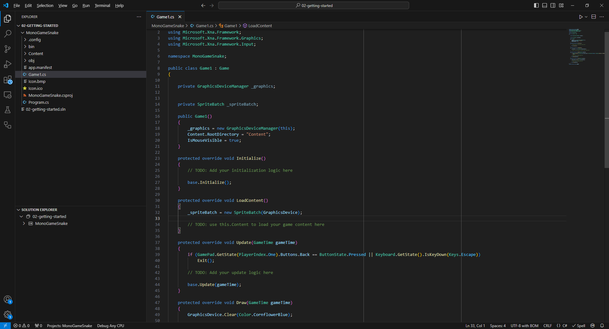

# Chapter 02: Getting Started

In this chapter, you'll get setup with MonoGame by preparing your environment for dotnet development and setting up Visual Studio Code as your IDE.

- [Installing the .NET SDK](#installing-the-net-sdk)
  - [Install Additional Workloads (Optional)](#install-additional-workloads-optional)
- [Install MonoGame Project Templates](#install-monogame-project-templates)
- [Installing Visual Studio Code](#installing-visual-studio-code)
  - [Install the C# Dev Kit Extension](#install-the-c-dev-kit-extension)
  - [Installing the "MonoGame for VSCode" Extension](#installing-the-monogame-for-vscode-extension)
- [Setup WINE for Effect Compilation (macOS and Linux Only)](#setup-wine-for-effect-compilation-macos-and-linux-only)
- [Creating Your First MonoGame Application](#creating-your-first-monogame-application)
- [Conclusion](#conclusion)
- [Test Your Knowledge](#test-your-knowledge)


Unlike game engines, MonoGame is a _framework_. This means it does not come as a standalone program that you download an install with a graphical user interface used to create games. Instead, MonoGame integrates into the standard .NET development workflow, offering a code-first approach to game development. This approach offers several advantages

* **Flexibility**: Developers are not locked into using a specific editor or interface, allowing them to use their preferred development tools.
* **Integration**: As a .NET library itself, MonoGame can easily integrate with other .NET libraries and tools.
* **Cross-platform Development**: Since C# is cross-platform, and MonoGame is cross-platform, developers can develop MonoGame projects on Windows, macOS, or Linux, with only slight differences in the setup process for each operating system.
* **Version Control Friendly**: The code-first approach makes it easier to use version control systems like Git for you game projects.

While the environment setup process is similar to the standard setup process for C# development, there are some MonoGame specific steps. These can vary slightly depending on your operating system and the _Integrated Development Environment_ (IDE).

## Installing the .NET SDK

The first thing we need to do is install the .NET _Software Development Kit_ (SDK). At the time of this writing, MonoGame targets the .NET 8.0 SDK. To install it, follow the instructions based on your operating system below

* Windows
  1. Open a web browser and navigate to https://dotnet.microsoft.com/en-us/download.
  2. Click the _Download .NET SDK x64_ button to start the download of the .NET SDK Installer.
  3. Once the download finishes, run the installer
* macOS
  1. Open a web browser and navigate to https://dotnet.microsoft.com/en-us/download.
  2.  Click the _Download .NET SDK x64 (Intel)_ button start the download of the .NET SDK Installer

      > [!NOTE]  
      > For the time being, MonoGame requires that you install the **Intel** version even if you are using an Apple Silicon (M1/M2) Mac. For Apple Silicon Macs, it also requires that [Rosetta](https://support.apple.com/en-us/HT211861) is enabled.
  3. Once the download finishes, run the installer
* Linux
  * Open a new _Terminal_ window
  *   Enter the following command to install the .NET SDK

      ```sh
      sudo apt-get update && sudo apt-get install -y dotnet-sdk-8.0
      ```

### Install Additional Workloads (Optional)

After installing the .NET SDK, if you intend to target mobile devices such as Android or iOS, you will also need to install the corresponding mobile workloads. To do this, open a \*_Command Prompt_ or _Terminal_ window and enter the following commands

```sh
dotnet workload install ios
dotnet workload install android
```

## Install MonoGame Project Templates

MonoGame provides project templates that can be installed to create new projects that are pre-configured to target the current version of MonoGame as a base to begin creating games. As of this writing, the current version of MonoGame targeted is 3.8.2.1105. To install the MonoGame templates, open a \*_Command Prompt_ or _Terminal_ window and enter the following command

```sh
dotnet new install MonoGame.Templates.CSharp
```

## Installing Visual Studio Code

_Visual Studio Code_ (VSCode) is a free, light weight editor. Depending on the programming language you are using, it's just a matter of installing the correct extension to support that language. VSCode is also cross-platform, meaning you can use it for development on Windows, macOS, and Linux. To ensure that all readers can follow this tutorial regardless of operating system, we'll be using VSCode as our IDE.

To install VSCode, follow the instructions for your operating system below:

* Windows
  1. Open a browser and navigate to https://code.visualstudio.com/.
  2. Click the _Download for Windows_ button to start the download of the installer.
  3. Once the download finishes, run the installer.
* macOS
  1. Open a web browser and navigate to https://code.visualstudio.com/.
  2. Click the _Download for macOS_ button to start the download of the _.zip_ archive.
  3. Once the download finishes, double click the _.zip_ archive to extract the _Visual Studio Code.app_ application package
  4. Drag-and-drop the _Visual Studio Code.app_ application package into your _Application_ directory to make it available in the macOS _LaunchPad_.
* Linux
  1. Open a web browser and navigate to https://code.visualstudio.com/.
  2. Click the _.deb_ download button to download the package for Debian based Linux distributions, or the _.rpm_ download button for Red Hat based Linux distributions.
  3. Once the download finishes, open the package downloaded to install.

### Install the C# Dev Kit Extension

For C# development using VSCode, it's recommended to use the official _C# Dev Kit_ extension provided by Microsoft. Installing this extension will add additional features to VSCode such as a project system and _Solution Explorer_ for C# projects. It also provides code editing features such as syntax highlighting, code completion, code navigation, refactoring, NuGet package management, and debugging tools.

To install the C# Dev Kit extension, perform the following:

1. Launch the Visual Studio Code application.
2. Open the _Extensions Panel_ by clicking the icon in the _Activity Bar_ on the left or choosing _View > Extensions_ from the top menu.
3. Enter `C#` in the _Search Box_
4. Click install for the _C# Dev Kit_ extension.

> [!NOTE]  
> When you search `C#` in the _Extension Panel_ you may notice there is the C# Dev Kit extension and a base standard C# extension. When installing the C# Dev Kit extension, the base extension will also be installed as a requirement.

### Installing the "MonoGame for VSCode" Extension

Throughout this tutorial, we'll be using the MonoGame Content Builder (MGCB) Editor to add content to the game. MonoGame offers an official extension for Visual Studio 2022 that allows you to double-click the _Content.mgcb_ file to automatically open it in the MGCB Editor. While there is no official tool for VSCode, there is a an extension developed by community member r88 to provide similar functionality and is regularly used by the MonoGame developers themselves. We'll be using that extension throughout this tutorial.

To install it, with VSCode open:

1. Open the _Extensions Panel_ by clicking the icon in the _Activity Bar_ on the left or choosing _View > Extensions_ from the top menu.
2. Enter `MonoGame for VSCode` as in the _Search Box_
3. Click install for the _MonoGame for VSCode_ extension by r88.

## Setup WINE for Effect Compilation (macOS and Linux Only)

_Effect_ (shader) compilation requires access to DirectX. This means it will not work natively on macOS and Linux systems, but it can be used through [WINE](https://www.winehq.org/). MonoGame provides a setup script that can be executed to setup the WINE environment. Below you can find the steps based on your operating system. To do this, follow the instructions for your operating system below:

* macOS
  *   Open a new _Terminal_ window and enter execute the following commands:

      ```sh
      brew install p7zip
      brew install --cask wine-stable
      wget -qO- https://monogame.net/downloads/net8_mgfxc_wine_setup.sh | bash
      ```
* Linux
  *   Open a new _Terminal_ window and execute the following commands:

      ```sh
      sudo apt-get update && sudo apt-get install -y curl p7zip-full wine64
      wget -qO- https://monogame.net/downloads/net8_mgfxc_wine_setup.sh | bash  
      ```

After performing these steps, regardless of macOS or Linux, a new directory called _.winemonogame_ will be created in your home directory. If you ever wish to undo the setup this script performed, you can just simply delete this directory.

## Creating Your First MonoGame Application

Now that you have your development environment setup, it's time to create your first MonoGame application.

1. Launch the VSCode application
2. Open the _Command Palette_ by clicking _View > Command Palette_ or by using the keyboard shortcut `CTRL+SHIFT+P`.
3. Type `.NET New Project` in the _Command Palette_ and choose the _.NET New Project_ command
4. Next you'll be shown a list of the available .NET project templates. Enter `MonoGame` into the prompt to filter the project templates to only show the MonoGame ones, then choose the _MonoGame Cross-Platform Desktop Application_ project template.
5. After choosing the template, a dialog window will appear asking you to choose a location to save the project.
6. Next you'll be prompted to enter a name for the project. Enter the name `MonoGameSnake`.
7. Finally, select the _Create Project_ prompt.

After selecting _Create Project_, a new C# project will be created based on the MonoGame template we choose and opened automatically in VSCode.

<figure><figcaption><p><strong>Figure 2-1: A new MonoGame project after being created in Visual Studio Code</strong></p></figcaption></figure>

Now that we have the project created, press the `F5` key on your keyboard, or choose _Run > Start Debugging_ from the top menu. If prompted for a configuration, choose _C#_. The project will compile and run, displaying a screen similar to the following

<figure><figcaption><p><strong>Figure 2-2: The default MonoGame cornflower blue game window.</strong></p></figcaption></figure>

Be amazed, the default MonoGame Cornflower Blue game window. You have just created your very first MonoGame application. While there isn't much happening here visually, there is a log going on behind the scenes that the MonoGame framework is handling for you. When you ran the application, the following occurred:

1. The application started
2. The game window was created and graphics were initialized
3. A loop is entered which performs the following over and over until the game is told to exit:
   1. The game is updated
   2. The game is rendered to the window

You can exit the game at any time by pressing the `Esc` key on your keyboard.

> [!NOTE]  
> Above, I mentioned that a loop is entered. This is commonly referred to as the _game loop_, which we'll discuss in more detail in the next chapter. The reason the application enters this loop is because game applications work differently than a traditional desktop application like your web browser.
>
> Desktop application are event based, meaning once loaded, the do not do much at all while waiting for input from the user, and then it response to that input event and redraws the window if needed based on the interaction.
>
> In games, things are always happening such as objects moving around like the player or particles. The handle this, games implement a loop structure that runs continuously, first calling a method to update the game logic, and then a draw method to render the current frame, until it has been told to exit.

## Conclusion

Let's review what you accomplished in this chapter:

* You setup your operating system to develop .NET applications by installing the .NET SDK
* You install the MonoGame project templates.
* You installed VSCode and the necessary extension to develop C# applications with VSCode
* You created and ran your first MonoGame project.

Now that your development environment is setup and ready to go, you can dive in and start building your first game. In the next chapter, we'll cover the contents of the _Game1.cs_ file that was included in the MonoGame project you just created.

## Test Your Knowledge

1. What version of the .NET SDK is currently targeted by MonoGame applications?
2. What is the current version of MonoGame?
3. What is the color of the game window when you run a MonoGame project for the first time?

## Next

* [Chapter 03: The Game1 File](03-the-game1-file.md)
