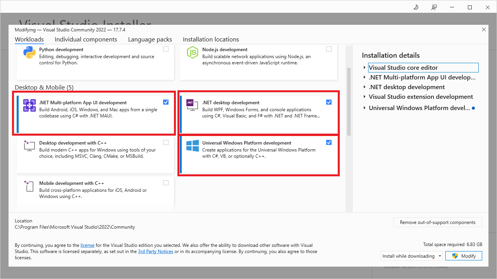

# Chapter 2: Setting Up Your Development Environment

- [Visual Studio 2022 (Windows Only)](#visual-studio-2022-windows-only)
- [Visual Studio Code](#visual-studio-code)
  - [Install the .NET SDK](#install-the-net-sdk)
  - [Install the MonoGame C# Templates](#install-the-monogame-c-templates)
  - [Install Visual Studio Code](#install-visual-studio-code)
  - [Install the C# Dev Kit Extension](#install-the-c-dev-kit-extension)
  - [Setup WINE for Effect Compilation (macOS and Linux Only)](#setup-wine-for-effect-compilation-macos-and-linux-only)
- [Conclusion](#conclusion)

--- 

Unlike game engines such as Godot, Unity, and Unreal, MonoGame is not a program that you download and install then use to create games. Instead, you just need to perform the typical setup any user would do for C# development then install the MonoGame C# templates.  Since you're setting up a typical C# development environment, this also means you can use Windows, macOS, or Linux for development, though there is a slight setup difference depending on which you are using.

## Visual Studio 2022 (Windows Only)
If you're using Windows, you can use Visual Studio 2022 as your development environment.  Visual Studio 2022 is the recommended development environment to use when creating games with MonoGame. To get stared, first download the Visual Studio 2022 Community Edition from https://visualstudio.microsoft.com/.  Once the installer has finished downloading, run it to install Visual Studio 2022.  During the installation, you will be asked to select which workloads you would like to install.  For MonoGame development the only workload required is the **.NET desktop development** workload.  If you plan to develop UWP applications which can be used on the Windows Store and Xbox, ensure that **Universal Windows Platform Development** workload is checked.  Finally, if you are going do mobile development for Android and/or iOS, ensure that the **.NET Multi-platform App UI Development** workload is checked.


**Figure 2-1:** *Workloads to select in the Visual Studio Installer.*

> [!WARNING]
>
> If you plan to target Windows only using the DirectX backend project type, you will also need to download and install [the DirectX June 2010 runtime](https://www.microsoft.com/en-us/download/details.aspx?id=8109) for audio and game pads to work properly.


Once the installation of Visual Studio 2022 is finished, you'll next need to download and install the official MonoGame Extension for Visual Studio.  To do this, first download the extension installer from https://marketplace.visualstudio.com/items?itemName=MonoGame.MonoGame-Templates-VSExtension.  Once it the download completes, run the installer.  This extension sets up two things.  First it installs the MonoGame C# Templates which are used to create a new MonoGame project in Visual Studio 2022.  Second, it adds functionality within Visual Studio 2022 to open the MonoGame Content Builder Editor (MGCB Editor) by double-clicking the Content.mgcb file in the Solution Explorer panel.  We'll discuss this and the MGCB Editor later in this tutorial.

If you chose to use Visual Studio 2022 as your development environment, you can skip the next section as it discuss the alternative of installing Visual Studio Code.  To get started, first download

## Visual Studio Code
Visual Studio Code (VSCode) is a light weight editor that can be used to develop many different types of applications.  Depending on the programming language you are using, it's just a matter of installing the correct extension to support that language. VSCode is also cross-platform, meaning you can install and use it for development on Windows, macOS, and Linux.

### Install the .NET SDK
Before installing VSCode we'll need to setup the .NET SDK in our environment. To do this, follow the instructions for your operating system below:

- **Windows**: Download the **.NET SDK x64** installer from https://dotnet.microsoft.com/en-us/download.  Once the download finishes, run the installer.
- **macOS**: Download the **.NET SDK x64 (Intel)** installer from https://dotnet.microsoft.com/en-us/download.  Once the download finishes, run the installer. **Note that for the time being, MonoGame requires that you install the **.NET SDK X64 (Intel)** version even if you are using an Apple Silicon (M1/M2/M3) Mac.  For Apple Silicon Macs, it also requires that [Rosetta](https://support.apple.com/en-us/HT211861) is enabled.**
- **Linux**: Microsoft provides an installation shell script for installing the .NET SDK.  To use it, open a terminal and execute the following commands
  - Download the installation script
      ```sh
      wget https://dot.net/v1/dotnet-install.sh -O dotnet-install.sh
      ```

  - Grant the script permission to execute
      ```sh
      chmod +x ./dotnet-install.sh
      ```

  - Execute the script to install the .NET SDK
      ```sh
      ./dotnet-install.sh
      ```

  - Update `PATH` variable
      ```sh
      echo 'export DOTNET_ROOT=$HOME/.dotnet' >> ~/.bashrc
      echo 'export PATH=$PATH:$DOTNET_ROOT:$DOTNET_ROOT/tools' >> ~/.bashrc
      ```

  - Resource terminal
      ```sh
      source ~/.bashrc
      ```

> [!NOTE]
> After installing the .NET SDK, if you intend to target mobile devices such as Android or iOS, you will also need to install the corresponding mobile workloads.  To do this, open a command prompt or terminal and enter the following commands
>
> ```sh
> dotnet workload install ios
> dotnet workload install android
> ```

### Install the MonoGame C# Templates
The .NET SDk installation provides the default C# project templates, but it does not include the MonoGame templates.  To install the MonOGame templates, open a command prompt or terminal and enter the following command

```sh
dotnet new install MonoGame.Templates.CSharp
```

We'll discuss the MonoGame templates and their differences later.

### Install Visual Studio Code
TO install VSCode, follow the instructions for your operating system below:

- **Windows**: Download the installer from https://code.visualstudio.com/.  Once the download finishes, run the installer to install VSCode.
- **Mac**: Download the archive from https://code.visualstudio.com/.  Once the archive finishes downloading, doubl-click it to extract the **Visual Studio Code.app** file.  Finally, drag-and-drop the **Visual Studio Code.app** file into your **Applications** directory to make it available in the macOS LaunchPad
- **Linux**: The recommended method for installing VSCode on Linux is to use snap as this is supported by most linus distributions.  Go to https://code.visualstudio.com/docs/setup/linux#_snap and click the **Get it from Snap Store** button to install.

### Install the C# Dev Kit Extension
For C# development using VSCode, it's recommended to use the official **C# Dev Kit** extension provided by Microsoft.  To install the extension, first go to https://marketplace.visualstudio.com/items?itemName=ms-dotnettools.csdevkit and click the **Install** button.  This will launch the installation of the extension in VSCode.

### Setup WINE for Effect Compilation (macOS and Linux Only)
Effect (shader) compilation requires access to DirectX. This means it will not work natively on macOS and Linux systems, but it can be used through [WINE](https://www.winehq.org/).  MonoGame provides a setup script that can be executed to setup the WINE environment.  Below you can find the steps based on your operating system. To do this, follow the instructions for your operating system below:

- **Mac**

  - Install prerequisites
    ```sh
    brew install p7zip curl
    brew install --cask wine-stable
    ```

  - Download and execute the MonoGame Wine Setup Script
    ```sh
    wget -qO- https://monogame.net/downloads/net6_mgfxc_wine_setup.sh | bash
    ```

- **Linux**

  - Install prerequisites.
    ```sh
    sudo apt install curl p7zip-full wine64
    ```
  - Download and execute the MonoGame Wine Setup Script
    ```sh
    wget -qO- https://monogame.net/downloads/net6_mgfxc_wine_setup.sh | bash
    ```

After performing these setups, regardless of macOS or Linux, a new directory called `.winemonogame` will be created in your home directory.  If you ever wish to undo the setup this script performed, you can just simply delete this directory.

## Conclusion
Now that you’ve set up your development environment for MonoGame, you’re ready to dive into game development. Whether you’re using Visual Studio 2022 or Visual Studio Code, you’ve got the tools and configurations you need to start coding. With everything in place, you’re well-prepared to begin creating your MonoGame projects. In the next chapter, we’ll walk through the steps for creating a new project and get you started on your first game.

[Go to Chapter 3: Hello World - A Crash Course in MonoGame](./03_hello_world_a_crash_course_in_monogame.md)
