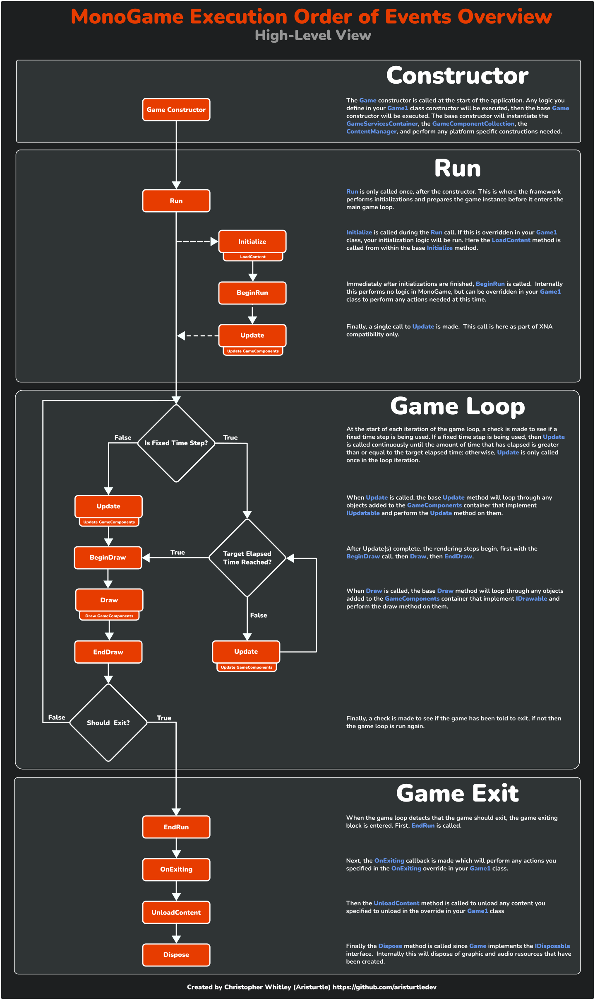

# Chapter 03: MonoGame Project Overview

- [The *.csproj* Project File](#the-csproj-project-file)
- [The *Content.mgcb* Content Project File](#the-contentmgcb-content-project-file)
  - [Global Properties Section](#global-properties-section)
  - [References Section](#references-section)
  - [Content Section](#content-section)
- [The *dotnet-tools.json* Tools Manifest File](#the-dotnet-toolsjson-tools-manifest-file)
- [The Icon Files](#the-icon-files)
- [The *Program.cs* File](#the-programcs-file)
- [The *Game1.cs* File](#the-game1cs-file)
  - [Namespace Imports](#namespace-imports)
  - [Class Declaration](#class-declaration)
  - [Instance Members](#instance-members)
  - [The Game1 Constructor](#the-game1-constructor)
  - [The Initialize Method](#the-initialize-method)
  - [The LoadContent Method](#the-loadcontent-method)
  - [The Update Method](#the-update-method)
  - [The Draw Method](#the-draw-method)
  - [Additional Methods](#additional-methods)
  - [Additional Properties](#additional-properties)
  - [Order of Execution](#order-of-execution)
- [Conclusion](#conclusion)
- [Test Your Knowledge](#test-your-knowledge)

---

In the previous chapter, you installed the [MonoGame project templates](./02-getting-started.md#install-monogame-project-templates), Then you [created a new project](./02-getting-started.md#creating-your-first-monogame-application) using hte *MonoGame Cross-Platform Desktop Application* project template.  Using the templates to create a new project will automatically generate files and a project structure as a starting point for a new MonoGame game application.  MonoGame offers several template to create a new project based on the platform(s) you are targeting and ancillary project templates for extensions and libraries. 

The following table lists the different templates available and what they are used for.

**Table 2-1:** *The MonoGame Project Templates.*  
| Template Name | Short Name | Description |
|---|---|---|
| *MonoGame Android Application* | `mgandroid` | A MonoGame game project template targeting the Android platform using OpenGL |
| *MonoGame Content Pipeline Extension* | `mgpipeline` | A MonoGame project template to create a content pipeline extension library. |
| *MonoGame Cross-Platform Desktop Application* | `mgdesktopgl` | A MonoGame project template targeting Windows, macOS, and Linux using OpenGl. |
| *MonoGame Game Library* | `mglib` | A MonoGame project template to create a game library that can be referenced by other projects. |
| *MonoGame iOS Application* | `mgios` | A MonoGame project template targeting iPhone and iPad. |
| *MonoGame Shared Library Project* | `mgshared` | A MonoGame project template that creates a shared C# project that can be used to share code and content with other projects. |
| *MonoGame Windows Desktop Application* | `mgwindowsdx` | A MonoGame project template targeting Windows only using DirectX. |

Regardless of the project template chosen, each project will generate a project structure similar to the following:

```
|   MyGame.sln
|
\---MyGame
    |   app.manifest
    |   Game1.cs
    |   Icon.bmp
    |   Icon.ico
    |   MyGame.csproj
    |   Program.cs
    |
    +---.config
    |       dotnet-tools.json
    |
    +---Content
    |       Content.mgcb
```

> [!NOTE]
> Project templates that target mobile devices such as Android and iOS may contain additional manifest files specific for those devices, which are not covered in this tutorial. 

In this chapter, we'll go through each of the common files generated by a MonoGame project template and discuss the contents of each file and what they are used for.

## The *.csproj* Project File

Every C# project contains a *\*.csproj* Project file.  This file defines the project level configurations for the application, including the target framework version of .NET and external references to third party libraries used by the project. 

The project file generated by a typical MonoGame template looks similar to the following:

```xml
<Project Sdk="Microsoft.NET.Sdk">
	<PropertyGroup>
		<OutputType>WinExe</OutputType>
		<TargetFramework>net8.0</TargetFramework>
		<RollForward>Major</RollForward>
		<PublishReadyToRun>false</PublishReadyToRun>
		<TieredCompilation>false</TieredCompilation>
	</PropertyGroup>
	<PropertyGroup>
		<ApplicationManifest>app.manifest</ApplicationManifest>
		<ApplicationIcon>Icon.ico</ApplicationIcon>
	</PropertyGroup>
	<ItemGroup>
		<None Remove="Icon.ico" />
		<None Remove="Icon.bmp" />
	</ItemGroup>
	<ItemGroup>
		<EmbeddedResource Include="Icon.ico" />
		<EmbeddedResource Include="Icon.bmp" />
	</ItemGroup>
	<ItemGroup>
		<PackageReference Include="MonoGame.Framework.DesktopGL" Version="3.8.2.1105" />
		<PackageReference Include="MonoGame.Content.Builder.Task" Version="3.8.2.1105" />
	</ItemGroup>
	<Target Name="RestoreDotnetTools" BeforeTargets="Restore">
		<Message Text="Restoring dotnet tools" Importance="High" />
		<Exec Command="dotnet tool restore" />
	</Target>
</Project>
```

> [!NOTE]
> The above project file is the one created when we [created a new project](../chapter-01-getting-started/01-03-hello-world.md#creating-a-new-monogame-project) in Chapter 1, which was done using the **MonoGame Cross-Platform Desktop Application** project template.  Depending on which MonoGame project template you choose to create a project with, there may be slight differences.  For instance, the the `<TargetFramework>` for mobile projects may be `net8.0-android` or `net8.0-ios`.  The `<PackageReference>` can also vary depending on the project template chosen.  For instance, in MonoGame projects that target OpenGL this will be **MonoGame.Framework.DesktopGL** and in projects that target DirectX this will be **MonoGame.Framework.WindowsDX**.

- The first and second `<PropertyGroup>` sections contain the standard information you would find in any C# project file, such as the `<TargetFrameWork>`, `<ApplicationManifest>` and `<ApplicationIcon>`.  

- In the first `<ItemGroup>` section there are two `<None>` tags with a `Remove` attribute to remove the icon *.ico* and *.bmp* files.  This removes them as files that are part of the project, so they will not show up in the *Solution Explorer* only.  It does not remove the files themselves such as deleting them.

- The second `<ItemGroup>` section specifies two `<EmbeddedResource>` tags with the `Include` attribute to include the icon *.ico* and *.bmp* files as embedded resources in the game application.  This means when the game project is built, those two icon files will be embedded into the assembly. Internally, the MonoGame framework will look for these within the assembly and use them as the icon files for the window title bar and the taskbar.  

- The third `<ItemGroup>` section specifies two `<PackageReferences>` tags, one to include the **MonoGame.Framework.DesktopGL\*** package and another to include **MonoGame.Content.Builder.Task** package.  This section is adding these two NuGet packages as references to the project, which is how the MonoGame framework is distributed.  The **MonoGame.Framework.DesktopGL** package contains the actual framework code specific for the platform you are targeting.  The **MonoGame.Content.Builder.Task** package contains tasks that will execute when you perform a build of your game that are responsible for automatically building the assets added to your content project and copying the compiled assets to the project build directory.

- Finally, the `<Target>` tag defines a target named **RestoreDotnetTool** that executes before the **Restore** target.  This is here to ensure that the dotnet tools defined in the *dotnet-tools.json* manifest file are downloaded and ready to use when you do a project restore.

## The *Content.mgcb* Content Project File

The *Content.mgcb* content project file, located in the */Content/* directory in the project root directory, defines the assets and configurations to use when compiling assets using the **MonoGame Content Builder**. Each line is actually a flag that is passed to the **MonoGame Content Builder** executable to build the content.

```sh
#----------------------------- Global Properties ----------------------------#

/outputDir:bin/$(Platform)
/intermediateDir:obj/$(Platform)
/platform:DesktopGL
/config:
/profile:Reach
/compress:False

#-------------------------------- References --------------------------------#


#---------------------------------- Content ---------------------------------#
```

> [!CAUTION]
> This is not a file you would typically edit by hand.  Instead you would load this file inside the *MonoGame Content Builder Editor (MGCB Editor)*, which provides a visual interface for managing assets that will write the appropriate configurations to this file for you.  We'll cover using the MGCB Editor throughout this documentation.
>
> However, it can still be useful to know how to read this file if there is ever a need, so it's covered below.

### Global Properties Section
The global properties section defines configurations used by the **MonoGame Content Builder** when building the assets defined in the content section of this file.

- `/outputDir` specifies the directory where the compile content is output to.  The `$(Platform)` variable is replaced by the value used in the `/platform` flag.
- `/intermediateDir` specifies the directory where intermediate files are written to during a build.  The `$(Platform)` variable is replaced by the value used in the `/platform` flag.
- `/platform` specifies the target platform that content is being built for so that hte content can be optimized for that platform.  Available values are
  - `Android`
  - `DesktopGL`
  - `iOS`
  - `PlayStation4`
  - `PlayStation5`
  - `Switch`
  - `Windows`
  - `WindowsStoreApp`
  - `XBoxOne`

> [!NOTE]
> Support for the `PlayStation4`, `PlayStation5`, `Switch`, and `XBoxOne` platforms is only available for licensed console developers.

- `/config` is an optional flag that can be used to specify a build configuration name.  This value is sometimes used as a hint in content processors.
- `/profile` specifies the target graphics profile to build for.  Available values are
  - `HiDef`
  - `Reach`
- `/compress` specifies whether compiled content should be compressed with LZ4 compression.  If `True`, content build times will increases.  Enabling this is not recommended when targeting Android since the *.apk* application package is already compressed.

### References Section
The references section defines references to third party assemblies that contain content pipeline extensions for the **MonoGame Content Builder** to provide content importers and processors that are not part of the standard ones provided. The syntax for including a reference is as follows:

```sh
/reference:<assembly_path>
```
For each assembly referenced, a new `/reference` line would be added. The `<assembly_path>` can be either an absolute path or a relative path.  When it is a relative path, it is relative to the *Content.mgcb* file itself.

### Content Section
The content section is where each asset to be compiled is defined along with the configurations for importing and processing that asset. The following flags must be defined for each asset in the order shown.

```sh
/importer:<class_name>
/processor:<class_name>
/processorParam:<name>=<value>
/build:<content_filepath>;[destination_filepath]
``` 

- The `/importer` flag specifies which importer to use to when importing the file asset.
  - `<class_name>` defines class name of the importer.
- The `/processor` flag specifies which processor to use to process the content imported by the importer. 
  - `<class_name>` defines the class name of the processor.
- The `/processorParam` flag specifies a named parameter and the value to set for the parameter.
  - `<name>` is the name of the parameter
  - `<value>` is the value to set.  
  - The parameter names and values available depend on the processor being used. 
- The `/build` flag specifies the file path to the asset to import and process using the previously defined flags.
  - `<content_filepath>` is the path to the file and can be an absolute path or a relative path.  When it is a relative path, it is relative to the *Content.mgcb* file.
  - `[destination_filepath]` is optional and can be used to change the output path of the asset when built. This can be an absolute path or a relative path.  When it is a relative path, it is relative to the `/outputDir` path defined in the [Global Properties Section](#global-properties-section).

## The *dotnet-tools.json* Tools Manifest File

The *dotnet-tools.mgcb* tools manifest file, located in the */.config/* directory, defines the tools used by the project that are distributed via NuGet.  When a new MonoGame project is created, this file is automatically generated for you containing the necessary tools used during development.

```json
{
  "version": 1,
  "isRoot": true,
  "tools": {
    "dotnet-mgcb": {
      "version": "3.8.2.1105",
      "commands": [
        "mgcb"
      ]
    },
    "dotnet-mgcb-editor": {
      "version": "3.8.2.1105",
      "commands": [
        "mgcb-editor"
      ]
    },
    "dotnet-mgcb-editor-linux": {
      "version": "3.8.2.1105",
      "commands": [
        "mgcb-editor-linux"
      ]
    },
    "dotnet-mgcb-editor-windows": {
      "version": "3.8.2.1105",
      "commands": [
        "mgcb-editor-windows"
      ]
    },
    "dotnet-mgcb-editor-mac": {
      "version": "3.8.2.1105",
      "commands": [
        "mgcb-editor-mac"
      ]
    }
  }
}
```

> [!NOTE]
> This is not a file you would normally need to edit.  However, if you ware updating to a new version of MonoGame in the future, you will need to edit this file for existing projects that are being update to change the version number to match the version of MonoGame you are updating too.


The table below contains a brief overview of what each of these tools are used for

| Tool | Description |
| --- | --- |
| *dotnet-mgcb* | This contains the *MonoGame Content Builder* tool that is responsible for compiling the assets added to your content project. |
| *dotnet-mgcb-editor* | This contains the *MonoGame Content Builder Editor* tool used to open the content project file and provides a visual UI managing the assets to add to your content project. |
| *dotnet-mgcb-editor-linux* | This contains the bootstrap launcher tool to open the *MonoGame Content Builder Editor* on a Windows operating system. |
| *dotnet-mgcb-editor-windows* | This contains the bootstrap launcher tool to open the *MonoGame Content Builder Editor* on a Linux operating system. |
| *dotnet-mgcb-editor-mac* | This contains the bootstrap launcher tool to open the *MonoGame Content Builder Editor* on a macOS operating system. |

These tools are necessary if you are using the *Content Pipeline* to manage and load assets in your game.  These tools are also expected to be part of the project for the *MonoGame.Content.Builder.Task* NuGet package mentioned earlier in the C# project file. 

> [!NOTE]
> It may seem wasted to include the *MonoGame Content Builder Editor* launchers for all three operating system types, especially if you are only developing on one operating system.  However, by including all three, it makes it easier if you ever need to switch to a different operating system for your project, or when working on a team where the code is shared using a git repository and team members have different operating system.

## The Icon Files

In the project root directory are the *Icon.bmp* and *Icon.ico* icon files.  These are the icon files used to display the icon for the executable on the PC, the window title bar area, and the icon displayed in the task bar on Windows or docs on macOs.  

When a new MonoGame project is created, the icons by default are of the MonoGame logo.

  
**Figure 3-1:** *The default MonoGame logo icon included in a new MonoGame project.*

If you want to customize the icons used for you game, you only need to replace these files in the project directory.  However, when replacing the files, ensure that your custom icon filenames are named exactly the same.  If you recall from [the *csproj* file section](#the-csproj-project-file) above, it embeds the icons into the assembly using the following

```xml
<ItemGroup>
    <EmbeddedResource Include="Icon.ico" />
    <EmbeddedResource Include="Icon.bmp" />
</ItemGroup>
```

The MonoGame framework expects the icon files to be named exactly this when they are embedded into the assembly in order to load and display them.

## The *Program.cs* File

This is the code file that contains the main entry point for the application. All C# application, regardless of being a MonoGame project or not, require a main entry point that specifies where code execution should start when the application runs.  This one provided by the MonoGame template very simple:

```cs
using var game = new Game1();
game.Run();
```

Here, a new instance of the `Game1` class is initialized within a `using` context, and then the `Run()` method is called to begin execution of the game. 

> [!NOTE]
> MonoGame projects use a [top-level statement](https://learn.microsoft.com/en-us/dotnet/csharp/fundamentals/program-structure/top-level-statements) style for the *Program.cs* file.  Top-level statements allows you to write code without the boilerplate that is typically included to define the main entry point.  For example, traditionally with the boilerplate code, the *Program.cs* file would look like the following
> ```cs
> public class Program 
> {
>     public static void Main(string[] args)
>     {
>         using var game = new Game1();
>         game.Run();
>     }
> }
> ```
>
> Top-level statements were introduced in C# 10.

## The *Game1.cs* File

At the heart of every MonoGame project is an implementation of the [`Game`](https://docs.monogame.net/api/Microsoft.Xna.Framework.Game.html) class.  The [`Game`](https://docs.monogame.net/api/Microsoft.Xna.Framework.Game.html) class is responsible for initializing the graphics services, initializing the game, loading content, and finally updating and rendering our game.

When creating a new MonoGame project, this is provided by the *Game1.cs* code file that defines the class `Game1` which derives from the MonoGame framework [`Game`](https://docs.monogame.net/api/Microsoft.Xna.Framework.Game.html) class.  When first generated, it contains the following code:

```cs
using Microsoft.Xna.Framework;
using Microsoft.Xna.Framework.Graphics;
using Microsoft.Xna.Framework.Input;

namespace MonoGameSnake
{
    public class Game1 : Game
    {
        private GraphicsDeviceManager _graphics;
        private SpriteBatch _spriteBatch;

        public Game1()
        {
            _graphics = new GraphicsDeviceManager(this);
            Content.RootDirectory = "Content";
            IsMouseVisible = true;
        }

        protected override void Initialize()
        {
            base.Initialize();
        }

        protected override void LoadContent()
        {
            _spriteBatch = new SpriteBatch(GraphicsDevice);
        }

        protected override void Update(GameTime gameTime)
        {
            if (GamePad.GetState(PlayerIndex.One).Buttons.Back == ButtonState.Pressed || Keyboard.GetState().IsKeyDown(Keys.Escape))
                Exit();

            base.Update(gameTime);
        }

        protected override void Draw(GameTime gameTime)
        {
            GraphicsDevice.Clear(Color.CornflowerBlue);

            base.Draw(gameTime);
        }
    }
}
```

> [!TIP]
> By default, the MonoGame project templates will name this class `Game1`.  This is not a hard requirement and you can change the name of this class to anything else that may make more sense for your project. Regardless, it will be referred to as `Game1` throughout the documentation in this tutorial.

The base MonoGame [`Game`](https://docs.monogame.net/api/Microsoft.Xna.Framework.Game.html) class provides [virtual methods](https://learn.microsoft.com/en-us/dotnet/csharp/language-reference/keywords/virtual) that can be overridden in our `Game1` implementation to provide the logic for our game.

> [!CAUTION]
> When overriding one of the virtual methods from the base [`Game`](https://docs.monogame.net/api/Microsoft.Xna.Framework.Game.html) class, it is important that you keep the `base` method call.  Many of the base [`Game`](https://docs.monogame.net/api/Microsoft.Xna.Framework.Game.html) class methods have logic for initializations, updating, and rendering that still need to be called even though we are overwriting the implementation.

Let's break this file down into individual sections to better understand it.

### Namespace Imports
Starting at the top of the file are the namespace imports

```cs
using Microsoft.Xna.Framework;
using Microsoft.Xna.Framework.Graphics;
using Microsoft.Xna.Framework.Input;
```

These import the most common used namespaces in a MonoGame project, including the base framework, graphics, and input. 

> [!NOTE] 
> You may be wondering why the types within MonoGame exist with `Microsoft.Xna.Framework.*` namespaces.  If you recall from the [Introduction to MonoGame](01_introduction_to_monogame.md), MonoGame is an open source reimplementation of Microsoft's XNA Framework.  To ensure compatibility with XNA projects, MonoGame implements the same namespaces that XNA did.

### Class Declaration
Following the namespace imports is the class declaration:

```cs
public class Game1 : Game
```

Here it is defining our class called `Game1` which is [inheriting](https://learn.microsoft.com/en-us/dotnet/csharp/fundamentals/object-oriented/inheritance) from the base [`Game`](https://docs.monogame.net/api/Microsoft.Xna.Framework.Game.html) class provided by the MonoGame framework. This inheritance is what gives us access to the virtual methods we can override and additional properties, which we'll discuss in more detail below.

### Instance Members
Inside the class declaration, the first things we see are teh following two instance members:

```cs
private GraphicsDeviceManager _graphics;
private SpriteBatch _spriteBatch;
```

- The [`GraphicsDeviceManager`](https://docs.monogame.net/api/Microsoft.Xna.Framework.GraphicsDeviceManager.html) is responsible for initializing and providing access to the graphics device and other graphic presentation configurations.  It contains a property named [`GraphicsDevice`](https://docs.monogame.net/api/Microsoft.Xna.Framework.Graphics.GraphicsDevice.html) that represents the actual graphics device on the device the game is running on. The [`GraphicsDevice`](https://docs.monogame.net/api/Microsoft.Xna.Framework.Graphics.GraphicsDevice.html) is the interface between your game and the graphics processing unit (GPU) for everything on screen.  It also contains the properties [`PreferredBackBufferWidth`](https://docs.monogame.net/api/Microsoft.Xna.Framework.GraphicsDeviceManager.html#Microsoft_Xna_Framework_GraphicsDeviceManager_PreferredBackBufferWidth) and [`PreferredBackBufferHeight`](https://docs.monogame.net/api/Microsoft.Xna.Framework.GraphicsDeviceManager.html#Microsoft_Xna_Framework_GraphicsDeviceManager_PreferredBackBufferHeight) which can be used to set the width and height, in pixels, of the game screen's back buffer.

- The [`SpriteBatch`](https://docs.monogame.net/api/Microsoft.Xna.Framework.Graphics.SpriteBatch.html) is used to perform 2D graphics rendering of the textures for the game.  A game will consist of multiple textures that are rendered to represent the game visually, and the [`SpriteBatch`](https://docs.monogame.net/api/Microsoft.Xna.Framework.Graphics.SpriteBatch.html) provides an optimized method of rendering multiple textures in a single batch call to the GPU instead of doing one render at a time.

We'll cover the [`GraphicsDeviceManager`](https://docs.monogame.net/api/Microsoft.Xna.Framework.GraphicsDeviceManager.html), the [`GraphicsDevice`](https://docs.monogame.net/api/Microsoft.Xna.Framework.Graphics.GraphicsDevice.html), and the [`SpriteBatch`](https://docs.monogame.net/api/Microsoft.Xna.Framework.Graphics.SpriteBatch.html) in more detail in later chapters.

### The Game1 Constructor
Next is the `Game1` constructor.  This responsible for creating a new instance of the `Game1` class when `new Game1()` is called in [the Program.cs](./02-05-the-program-file.md) file.

```cs
public Game1()
{
    _graphics = new GraphicsDeviceManager(this);
    Content.RootDirectory = "Content";
    IsMouseVisible = true;
}
```

When this constructor is called
1. First the base [`Game`](https://docs.monogame.net/api/Microsoft.Xna.Framework.Game.html) constructor that the `Game1` class inherits from is called.  Here instances of internal components needed are created and platform specific initializations occur.  Once the base constructor finishes, the logic `Game1` constructor is then executed
2. The [`GraphicsDeviceManager`](https://docs.monogame.net/api/Microsoft.Xna.Framework.GraphicsDeviceManager.html) is created and stored in the `_graphics` member variable.
3. The [`RootDirectory`](https://docs.monogame.net/api/Microsoft.Xna.Framework.Content.ContentManager.html#Microsoft_Xna_Framework_Content_ContentManager_RootDirectory) property of the [`Content`](https://docs.monogame.net/api/Microsoft.Xna.Framework.Game.html#Microsoft_Xna_Framework_Game_Content) object is set to the *Content* directory.  The [`Content`](https://docs.monogame.net/api/Microsoft.Xna.Framework.Game.html#Microsoft_Xna_Framework_Game_Content) object is of the type [`ContentManager`](https://docs.monogame.net/api/Microsoft.Xna.Framework.Content.ContentManager.html) and is provided to us through the [`Game`](https://docs.monogame.net/api/Microsoft.Xna.Framework.Game.html) class inheritance.  Setting the root directory tells the content manager to use that directory as the root directory when resolving relative paths during content loading.
4. [`IsMouseVisible`](https://docs.monogame.net/api/Microsoft.Xna.Framework.Game.html#Microsoft_Xna_Framework_Game_IsMouseVisible) is set to `true` so that the mouse cursor is visible when moved over the game window.  This is another property that is provided through the inheritance from the [`Game`](https://docs.monogame.net/api/Microsoft.Xna.Framework.Game.html) class.

### The Initialize Method
Below the constructor is the override of the [`Initialize()`](https://docs.monogame.net/api/Microsoft.Xna.Framework.Game.html#Microsoft_Xna_Framework_Game_Initialize) method.
This method is where we can do any initializations for our game.

```cs
protected override void Initialize()
{
    base.Initialize();
}
```

> [!NOTE]
> This method is called only once by the MonoGame framework and is called immediately after the constructor is called.

You might be wondering why we have an [`Initialize()`](https://docs.monogame.net/api/Microsoft.Xna.Framework.Game.html#Microsoft_Xna_Framework_Game_Initialize) method instead of performing all of our initializations within the constructor.  It's [advised to not call overridable methods from within a constructor](https://learn.microsoft.com/en-us/dotnet/fundamentals/code-analysis/quality-rules/ca2214) as this can lead to unexpected states in object construction when called.  Additionally, the constructor itself is initially called in [the Program.cs file](./02-05-the-program-file.md) when a new instance of the class is created.  As mentioned above in, when the constructor is called, the base constructor is executed first which instantiates properties and services that maybe needed later for our game initializations.  

> [!CAUTION]
> When `base.Initialize()` is called, the last thing it does before returning back is making a call to the [`LoadContent()`](https://docs.monogame.net/api/Microsoft.Xna.Framework.Game.html#Microsoft_Xna_Framework_Game_LoadContent) method.  This means that if anything you are initializing requires assets loaded from the [`LoadContent()`](https://docs.monogame.net/api/Microsoft.Xna.Framework.Game.html#Microsoft_Xna_Framework_Game_LoadContent) method, it should be done **after** the `base.Initialize()` call, not **before** it.

### The LoadContent Method
The [`LoadContent()`](https://docs.monogame.net/api/Microsoft.Xna.Framework.Game.html#Microsoft_Xna_Framework_Game_LoadContent) method is used to load any assets that are used by our game.  Content loading and managing assets will be discussed in later chapters, for now, it's only important to know that his is where you can load your game assets at.

```cs
protected override void LoadContent()
{
    _spriteBatch = new SpriteBatch(GraphicsDevice);
}
```

> [!NOTE]
> This method will only be called once by the MonoGame framework and it is called **during** the execution of the `base.Initialize()` call within the [`Initialize()`](https://docs.monogame.net/api/Microsoft.Xna.Framework.Game.html#Microsoft_Xna_Framework_Game_Initialize) method.

The default implementation provided in the template instantiates a new instance of the [`SpriteBatch`](https://docs.monogame.net/api/Microsoft.Xna.Framework.Graphics.SpriteBatch.html) and stores it in the `_spriteBatch` instance member.  When creating a new [`SpriteBatch`](https://docs.monogame.net/api/Microsoft.Xna.Framework.Graphics.SpriteBatch.html) instance, it requires that an instance of the [`GraphicsDevice`](https://docs.monogame.net/api/Microsoft.Xna.Framework.Graphics.GraphicsDevice.html) object type be given to it.  Here we pass in the one that is provided as a property from the [`Game`](https://docs.monogame.net/api/Microsoft.Xna.Framework.Game.html) class inheritance. 

> [!NOTE]
> The [`GraphicsDevice`](https://docs.monogame.net/api/Microsoft.Xna.Framework.Graphics.GraphicsDevice.html) object provided as a property from the inheritance of the [`Game`](https://docs.monogame.net/api/Microsoft.Xna.Framework.Game.html) class?  Yep! The [`Game`](https://docs.monogame.net/api/Microsoft.Xna.Framework.Game.html) class provides a property for accessing the [`GraphicsDevice`](https://docs.monogame.net/api/Microsoft.Xna.Framework.Graphics.GraphicsDevice.html) object without having to go through the [`GraphicsDeviceManager`](https://docs.monogame.net/api/Microsoft.Xna.Framework.GraphicsDeviceManager.html) to get it.  Not that this is not a `static` property and is only available at the class instance scope of the [`Game`](https://docs.monogame.net/api/Microsoft.Xna.Framework.Game.html) class.

### The Update Method
The [`Update()`](https://docs.monogame.net/api/Microsoft.Xna.Framework.Game.html#Microsoft_Xna_Framework_Game_Update_Microsoft_Xna_Framework_GameTime_) method is where we perform all of the game logic; input handling, physics, collisions, etc.  The method takes in a single [`GameTime`](https://docs.monogame.net/api/Microsoft.Xna.Framework.GameTime.html) parameter that provides a snapshot of the game's current timing values, sometimes known as delta time.

```cs
protected override void Update(GameTime gameTime)
{
    if (GamePad.GetState(PlayerIndex.One).Buttons.Back == ButtonState.Pressed || Keyboard.GetState().IsKeyDown(Keys.Escape))
        Exit();

    base.Update(gameTime);
}
```

The default implementation performs the following: 

1. Input is polled to determine if the **Back** button on the player one game pad is pressed or if the **Esc** key on the keyboard is pressed.  If either are `true`, then the [`Exit()`](https://docs.monogame.net/api/Microsoft.Xna.Framework.Game.html#Microsoft_Xna_Framework_Game_Exit) method is called to exit the game.
2. The `base.Update()` method is called.  When this is called, the base update method will call the [`Update()`](https://docs.monogame.net/api/Microsoft.Xna.Framework.Game.html#Microsoft_Xna_Framework_Game_Update_Microsoft_Xna_Framework_GameTime_) method on an [`IUpdateable`](https://docs.monogame.net/api/Microsoft.Xna.Framework.IUpdateable.html) objects that have been added to the [`GameComponentCollection`](https://docs.monogame.net/api/Microsoft.Xna.Framework.GameComponentCollection.html) of the [`Game`](https://docs.monogame.net/api/Microsoft.Xna.Framework.Game.html) class. 

### The Draw Method
The [`Draw()`](https://docs.monogame.net/api/Microsoft.Xna.Framework.Game.html#Microsoft_Xna_Framework_Game_Draw_Microsoft_Xna_Framework_GameTime_) method is where all of the game logic for rendering occurs.  Just like with the [`Update()`](https://docs.monogame.net/api/Microsoft.Xna.Framework.Game.html#Microsoft_Xna_Framework_Game_Update_Microsoft_Xna_Framework_GameTime_) method, it takes a single [`GameTime`](https://docs.monogame.net/api/Microsoft.Xna.Framework.GameTime.html) object as a parameter that provides a snapshot of the game's current timing values.

```cs
protected override void Draw(GameTime gameTime)
{
    GraphicsDevice.Clear(Color.CornflowerBlue);

    base.Draw(gameTime);
}
```

The default implementation performs the following:

1. [`GraphicsDevice.Clear(Color.CornflowerBlue)`](https://docs.monogame.net/api/Microsoft.Xna.Framework.Graphics.GraphicsDevice.html#Microsoft_Xna_Framework_Graphics_GraphicsDevice_Clear_Microsoft_Xna_Framework_Color_) is called, which clears the back buffer using the color Cornflower Blue to prepare it for rendering.
2. The `base.Draw()` method is called.  When this is called, the base draw method will call the [`Draw()`](https://docs.monogame.net/api/Microsoft.Xna.Framework.Game.html#Microsoft_Xna_Framework_Game_Draw_Microsoft_Xna_Framework_GameTime_) method on any [`IDrawable`](https://docs.monogame.net/api/Microsoft.Xna.Framework.IDrawable.html) objects that have been added to the [`GameComponentCollection`](https://docs.monogame.net/api/Microsoft.Xna.Framework.GameComponentCollection.html) collection of the [`Game`](https://docs.monogame.net/api/Microsoft.Xna.Framework.Game.html) class.

### Additional Methods
In additional to the methods mentioned above, the [`Game`](https://docs.monogame.net/api/Microsoft.Xna.Framework.Game.html) class offer other virtual methods that can be overridden, though they are used less often than the ones provided by default. The following table shows the additional virtual methods that can be overridden:

**Table 5-1:** *Virtual methods of the [`Game`](https://docs.monogame.net/api/Microsoft.Xna.Framework.Game.html) class that can be overridden in the `Game1` class.*  
| Virtual Method                                                                                                                                                                  | Description                                                                                                                                                                                                                                                                                                                                                                                                                   |
| ------------------------------------------------------------------------------------------------------------------------------------------------------------------------------- | ----------------------------------------------------------------------------------------------------------------------------------------------------------------------------------------------------------------------------------------------------------------------------------------------------------------------------------------------------------------------------------------------------------------------------- |
| [`BeginDraw()`](https://docs.monogame.net/api/Microsoft.Xna.Framework.Game.html#Microsoft_Xna_Framework_Game_BeginDraw)                                                         | Called automatically by the framework, immediately before [`Draw()`](https://docs.monogame.net/api/Microsoft.Xna.Framework.Game.html#Microsoft_Xna_Framework_Game_Draw_Microsoft_Xna_Framework_GameTime_) is called.  If this method returns `false` then [`Draw()`](https://docs.monogame.net/api/Microsoft.Xna.Framework.Game.html#Microsoft_Xna_Framework_Game_Draw_Microsoft_Xna_Framework_GameTime_) will not be called. |
| [`BeginRun()`](https://docs.monogame.net/api/Microsoft.Xna.Framework.Game.html#Microsoft_Xna_Framework_Game_BeginRun)                                                           | Called automatically by the framework, immediately after [`Initialize()`](https://docs.monogame.net/api/Microsoft.Xna.Framework.Game.html#Microsoft_Xna_Framework_Game_Initialize) but before the first call to [`Update()`](https://docs.monogame.net/api/Microsoft.Xna.Framework.Game.html#Microsoft_Xna_Framework_Game_Update_Microsoft_Xna_Framework_GameTime_).                                                          |
| [`Dispose()`](https://docs.monogame.net/api/Microsoft.Xna.Framework.Game.html#Microsoft_Xna_Framework_Game_Dispose)                                                             | Called when the game instance is disposed of, performing any clean up of unmanaged resources used by the application.                                                                                                                                                                                                                                                                                                         |
| [`EndDraw()`](https://docs.monogame.net/api/Microsoft.Xna.Framework.Game.html#Microsoft_Xna_Framework_Game_EndDraw)                                                             | Called automatically by the framework, immediately after [`Draw()`](https://docs.monogame.net/api/Microsoft.Xna.Framework.Game.html#Microsoft_Xna_Framework_Game_Draw_Microsoft_Xna_Framework_GameTime_) is called and performs the logic to present the rendered frame to the game window.  **If this method is overridden, ensure that you call `base.EndDraw()` so that the internal render presentation is called.**      |
| [`EndRun()`](https://docs.monogame.net/api/Microsoft.Xna.Framework.Game.html#Microsoft_Xna_Framework_Game_EndRun)                                                               | Called automatically by the framework, immediately after the game loop as been terminated before the application exits.                                                                                                                                                                                                                                                                                                       |
| [`OnActivated()`](https://docs.monogame.net/api/Microsoft.Xna.Framework.Game.html#Microsoft_Xna_Framework_Game_OnActivated_System_Object_System_EventArgs_)                     | Called automatically by the framework whenever the game window gains focus.  The base method raises the [`Activated`](https://docs.monogame.net/api/Microsoft.Xna.Framework.Game.html#Microsoft_Xna_Framework_Game_Activated) event.                                                                                                                                                                                          |
| [`OnDeactivated()`](https://docs.monogame.net/api/Microsoft.Xna.Framework.Game.html#Microsoft_Xna_Framework_Game_OnDeactivated_System_Object_System_EventArgs_)                 | Called automatically by the framework whenever the game window loses focus.  The base method raises the [`Deactivated`](https://docs.monogame.net/api/Microsoft.Xna.Framework.Game.html#Microsoft_Xna_Framework_Game_Deactivated) event.                                                                                                                                                                                      |
| [`OnExiting()`](https://docs.monogame.net/api/Microsoft.Xna.Framework.Game.html#Microsoft_Xna_Framework_Game_OnExiting_System_Object_Microsoft_Xna_Framework_ExitingEventArgs_) | Called automatically by the framework when it is detected that the game should be exited. The base method raises the [`Exiting`](https://docs.monogame.net/api/Microsoft.Xna.Framework.Game.html#Microsoft_Xna_Framework_Game_Exiting) event for the application.                                                                                                                                                             |
| [`UnloadContent()`](https://docs.monogame.net/api/Microsoft.Xna.Framework.Game.html#Microsoft_Xna_Framework_Game_UnloadContent)                                                 | Use this method to unload graphical resources loaded by the content manager. This method is called automatically when the game is exiting. 

### Additional Properties
Along with the above methods, by inheriting from the [`Game`](https://docs.monogame.net/api/Microsoft.Xna.Framework.Game.html) class, the `Game1` class has access to the following properties:

**Table 5-2:** *Properties of the [`Game`](https://docs.monogame.net/api/Microsoft.Xna.Framework.Game.html) class that are accessible in the `Game1` class through inheritance.*  

| Property Name                                                                                                                         | Type                                                                                                            | Description                                                                                                                                                                                                                                                                                                                                                                                                                                                                                                                                                                                                                                                                               |
| ------------------------------------------------------------------------------------------------------------------------------------- | --------------------------------------------------------------------------------------------------------------- | ----------------------------------------------------------------------------------------------------------------------------------------------------------------------------------------------------------------------------------------------------------------------------------------------------------------------------------------------------------------------------------------------------------------------------------------------------------------------------------------------------------------------------------------------------------------------------------------------------------------------------------------------------------------------------------------- |
| [`Components`](https://docs.monogame.net/api/Microsoft.Xna.Framework.Game.html#Microsoft_Xna_Framework_Game_Components)               | [`GameComponentCollection`](https://docs.monogame.net/api/Microsoft.Xna.Framework.GameComponentCollection.html) | A collection of game component objects that are automatically updated and/or rendered during the base calls to [`Update()`](https://docs.monogame.net/api/Microsoft.Xna.Framework.Game.html#Microsoft_Xna_Framework_Game_Update_Microsoft_Xna_Framework_GameTime_) and [`Draw()`](https://docs.monogame.net/api/Microsoft.Xna.Framework.Game.html#Microsoft_Xna_Framework_Game_Draw_Microsoft_Xna_Framework_GameTime_) respectively. To add components to this collection, they should derive from either [`IUpdateable`](https://docs.monogame.net/api/Microsoft.Xna.Framework.IUpdateable.html) or [`IDrawable`](https://docs.monogame.net/api/Microsoft.Xna.Framework.IDrawable.html). |
| [`Content`](https://docs.monogame.net/api/Microsoft.Xna.Framework.Game.html#Microsoft_Xna_Framework_Game_Content)                     | [`ContentManager`](https://docs.monogame.net/api/Microsoft.Xna.Framework.Content.ContentManager.html)           | The content manager used to load and manage the lifetime of assets for the game.                                                                                                                                                                                                                                                                                                                                                                                                                                                                                                                                                                                                          |
| [`GraphicsDevice`](https://docs.monogame.net/api/Microsoft.Xna.Framework.Game.html#Microsoft_Xna_Framework_Game_GraphicsDevice)       | [`GraphicsDevice`](https://docs.monogame.net/api/Microsoft.Xna.Framework.Graphics.GraphicsDevice.html)          | Gets the graphics device used for rendering by this game.                                                                                                                                                                                                                                                                                                                                                                                                                                                                                                                                                                                                                                 |
| [`InactiveSleepTime`](https://docs.monogame.net/api/Microsoft.Xna.Framework.Game.html#Microsoft_Xna_Framework_Game_InactiveSleepTime) | `TimeSpan`                                                                                                      | Gets or sets the time to sleep between frames when the game is not active. Must be a positive value. When the game window loses focus, the game loop will sleep for this duration between frames to reduce CPU usage.                                                                                                                                                                                                                                                                                                                                                                                                                                                                     |
| [`IsActive`](https://docs.monogame.net/api/Microsoft.Xna.Framework.Game.html#Microsoft_Xna_Framework_Game_IsActive)                   | `bool`                                                                                                          | Indicates if the game window currently has focus and is active.                                                                                                                                                                                                                                                                                                                                                                                                                                                                                                                                                                                                                           |
| [`IsFixedTimeStep`](https://docs.monogame.net/api/Microsoft.Xna.Framework.Game.html#Microsoft_Xna_Framework_Game_IsFixedTimeStep)     | `bool`                                                                                                          | Determines whether the game uses a fixed or variable time step for updates. When true, the game attempts to update at a consistent rate specified by `TargetElapsedTime`. This can provide more predictable game play and physics simulations, especially on varying hardware. When false, the game updates as frequently as possible, which can provide smoother animation on high-performance systems but may lead to inconsistent behavior across different hardware.                                                                                                                                                                                                                  |
| [`IsMouseVisible`](https://docs.monogame.net/api/Microsoft.Xna.Framework.Game.html#Microsoft_Xna_Framework_Game_IsMouseVisible)       | `bool`                                                                                                          | Gets or sets whether the mouse cursor is visible when it's over the game window.                                                                                                                                                                                                                                                                                                                                                                                                                                                                                                                                                                                                          |
| [`LaunchParameters`](https://docs.monogame.net/api/Microsoft.Xna.Framework.Game.html#Microsoft_Xna_Framework_Game_LaunchParameters)   | [`LaunchParameters`](https://docs.monogame.net/api/Microsoft.Xna.Framework.LaunchParameters.html)               | Gets the startup parameters for this game instance.                                                                                                                                                                                                                                                                                                                                                                                                                                                                                                                                                                                                                                       |
| [`MaxElapsedTime`](https://docs.monogame.net/api/Microsoft.Xna.Framework.Game.html#Microsoft_Xna_Framework_Game_MaxElapsedTime)       | [`TimeSpan`](https://learn.microsoft.com/en-us/dotnet/api/system.timespan?view=net-8.0)                         | The maximum amount of time allowed to pass between updates. If the time since the last update exceeds this value, it will be clamped to this value. This prevents the game from trying to "catch up" with too many updates after a large gap in time (like a freeze or breakpoint). Must be positive and greater than or equal to `TargetElapsedTime`.                                                                                                                                                                                                                                                                                                                                    |
| [`Services`](https://docs.monogame.net/api/Microsoft.Xna.Framework.Game.html#Microsoft_Xna_Framework_Game_Services)                   | [`GameServiceContainer`](https://docs.monogame.net/api/Microsoft.Xna.Framework.GameServiceContainer.html)       | Gets a container holding service providers attached to this game instance.                                                                                                                                                                                                                                                                                                                                                                                                                                                                                                                                                                                                                |
| [`TargetElapsedTime`](https://docs.monogame.net/api/Microsoft.Xna.Framework.Game.html#Microsoft_Xna_Framework_Game_TargetElapsedTime) | [`TimeSpan`](https://learn.microsoft.com/en-us/dotnet/api/system.timespan?view=net-8.0)                         | Specifies the desired time between frames when `IsFixedTimeStep` is true. This property sets the target update rate for the game. For example, setting it to 1/60th of a second targets 60 FPS. The game loop will attempt to maintain this update rate, potentially inserting small sleep periods if updates are completed faster than the target time. If updates take longer than this time, the game may run slower than intended. This property is crucial for creating consistent game play experiences across different hardware capabilities. Must be positive, non-zero, and less than or equal to `MaxElapsedTime`.                                                             |
| [`Window`](https://docs.monogame.net/api/Microsoft.Xna.Framework.Game.html#Microsoft_Xna_Framework_Game_Window)                       | [`GameWindow`](https://docs.monogame.net/api/Microsoft.Xna.Framework.GameWindow.html)                           | Gets the system window that this game is displayed on. Provides access to window-specific properties and methods.    

### Order of Execution
Knowing the methods available isn't enough.  We can know that the [`Initialize()`](https://docs.monogame.net/api/Microsoft.Xna.Framework.Game.html#Microsoft_Xna_Framework_Game_Initialize) method initializes the game for us, and that [`Update()`](https://docs.monogame.net/api/Microsoft.Xna.Framework.Game.html#Microsoft_Xna_Framework_Game_Update_Microsoft_Xna_Framework_GameTime_) will update the game.  However, the methods are called by the MonoGame framework in a specific order, and knowing the order of execution is important to know when to expect things to happen.  For instance, how often is [`Update()`](https://docs.monogame.net/api/Microsoft.Xna.Framework.Game.html#Microsoft_Xna_Framework_Game_Update_Microsoft_Xna_Framework_GameTime_) called?  Is [`Draw()`](https://docs.monogame.net/api/Microsoft.Xna.Framework.Game.html#Microsoft_Xna_Framework_Game_Draw_Microsoft_Xna_Framework_GameTime_) always called immediately after an [`Update()`](https://docs.monogame.net/api/Microsoft.Xna.Framework.Game.html#Microsoft_Xna_Framework_Game_Update_Microsoft_Xna_Framework_GameTime_) call?  

Figure 3-2 below provides a high-level view of the execution order of events for a MonoGame application.  This follows the events from the initial construction of the `Game1` class, to the initializations, the game loop, and finally the game exiting events.

  
**Figure 3-2:** *A high-level view of the execution order of events for a MonoGame application.*

1. Initial execution begins at the [constructor](#constructor) which is called in [the Program.cs file](../chapter-02-monogame-project-overview/02-05-the-program-file.md).
   1. The base [`Game`](https://docs.monogame.net/api/Microsoft.Xna.Framework.Game.html) constructor is executed where the [`GameServicesContainer`](https://docs.monogame.net/api/Microsoft.Xna.Framework.GameServiceContainer.html), [`GameComponentCollection`](https://docs.monogame.net/api/Microsoft.Xna.Framework.GameComponentCollection.html), adn the [`ContentManager`](https://docs.monogame.net/api/Microsoft.Xna.Framework.Content.ContentManager.html) are initialized, followed by any platform specific initializations
   2. Nex the logic of the `Game1` constructor is executed
2. After the constructor finishes, [`Game.Run()`](https://docs.monogame.net/api/Microsoft.Xna.Framework.Game.html#Microsoft_Xna_Framework_Game_Run) is called in [the Program.cs file](../chapter-02-monogame-project-overview/02-05-the-program-file.md)
   1. During the execution of the [`Game.Run()`](https://docs.monogame.net/api/Microsoft.Xna.Framework.Game.html#Microsoft_Xna_Framework_Game_Run) method, the [`Initialize()`](https://docs.monogame.net/api/Microsoft.Xna.Framework.Game.html#Microsoft_Xna_Framework_Game_Initialize) method is called first.  During the call to [`Initialize()`](https://docs.monogame.net/api/Microsoft.Xna.Framework.Game.html#Microsoft_Xna_Framework_Game_Initialize) is when [`LoadContent()`](https://docs.monogame.net/api/Microsoft.Xna.Framework.Game.html#Microsoft_Xna_Framework_Game_LoadContent) is called
   2. After initialize is finished, a call is made to [`BeginRun()`](https://docs.monogame.net/api/Microsoft.Xna.Framework.Game.html#Microsoft_Xna_Framework_Game_BeginRun).  Internally, this performs no logic in the base [`Game`](https://docs.monogame.net/api/Microsoft.Xna.Framework.Game.html) class, but can be overridden in the `Game1` class to provide any specific logic needed here.
   3. Finally, a single call to [`Update()`](https://docs.monogame.net/api/Microsoft.Xna.Framework.Game.html#Microsoft_Xna_Framework_Game_Update_Microsoft_Xna_Framework_GameTime_) is made.  single update call is made here for XNA compatibility reasons.
3. After [`Game.Run()`](https://docs.monogame.net/api/Microsoft.Xna.Framework.Game.html#Microsoft_Xna_Framework_Game_Run) is finished, the application enters what is called the *game loop*.  In the game loop, the [`Update()`](https://docs.monogame.net/api/Microsoft.Xna.Framework.Game.html#Microsoft_Xna_Framework_Game_Update_Microsoft_Xna_Framework_GameTime_) and [`Draw()`](https://docs.monogame.net/api/Microsoft.Xna.Framework.Game.html#Microsoft_Xna_Framework_Game_Draw_Microsoft_Xna_Framework_GameTime_) methods are called one after the other in each iteration of the loop until the game is told to exit.
   1. At the start of each game loop iteration, a check is made to see if the game is running in fixed time step mode.  If fixed time step is being used, then [`Update()`](https://docs.monogame.net/api/Microsoft.Xna.Framework.Game.html#Microsoft_Xna_Framework_Game_Update_Microsoft_Xna_Framework_GameTime_) will be call over and over until the amount of time that has elapsed is greater than or equal to the target elapsed time; otherwise, [`Update()`](https://docs.monogame.net/api/Microsoft.Xna.Framework.Game.html#Microsoft_Xna_Framework_Game_Update_Microsoft_Xna_Framework_GameTime_) is only called once.
   2. One the update(s) are completed, the rendering steps begin
      1. First a call is made to [`BeginDraw()`](https://docs.monogame.net/api/Microsoft.Xna.Framework.Game.html#Microsoft_Xna_Framework_Game_BeginDraw).  This method can be overridden in the `Game1` class to execute any logic needed before the actual rendering occurs.
      2. Next, the [`Draw()`](https://docs.monogame.net/api/Microsoft.Xna.Framework.Game.html#Microsoft_Xna_Framework_Game_Draw_Microsoft_Xna_Framework_GameTime_) method is called.  This is where all rendering of the game occurs.
      3. Finally, [`EndDraw()`](https://docs.monogame.net/api/Microsoft.Xna.Framework.Game.html#Microsoft_Xna_Framework_Game_EndDraw) is called.  This method can be overridden in the `Game1` class to execute any logic or cleanup needed after the main rendering is finished.
4. Once an exit condition is met during the game loop, the exit block is executed
   1. First, a call to [`EndRun()`](https://docs.monogame.net/api/Microsoft.Xna.Framework.Game.html#Microsoft_Xna_Framework_Game_EndRun) is made.  This method can be overridden in the `Game1` class to perform any actions needed at this point.
   2. Next, [`OnExiting()`](https://docs.monogame.net/api/Microsoft.Xna.Framework.Game.html#Microsoft_Xna_Framework_Game_OnExiting_System_Object_Microsoft_Xna_Framework_ExitingEventArgs_) is called, which will raise the [`Exiting`](https://docs.monogame.net/api/Microsoft.Xna.Framework.Game.html#Microsoft_Xna_Framework_Game_Exiting) event.  Any subscribers to this event will now execute here.
   3. Next, the [`UnloadContent()`](https://docs.monogame.net/api/Microsoft.Xna.Framework.Game.html#Microsoft_Xna_Framework_Game_UnloadContent) method is called.  This method can be overridden in the `Game1` class to perform any actions needed to unload graphic resources and other assets.
   4. Finally, the [`Dispose()`](https://docs.monogame.net/api/Microsoft.Xna.Framework.Game.html#Microsoft_Xna_Framework_Game_Dispose) method is called because the [`Game`](https://docs.monogame.net/api/Microsoft.Xna.Framework.Game.html) class implements the [`IDisposable`](https://learn.microsoft.com/en-us/dotnet/api/system.idisposable?view=net-8.0) interface.

## Conclusion
In this chapter, we 

- Discussed an overview of a typical MonoGame project using one of the MonoGame project templates.  
- Touched on each file generated as part of a new MonoGame project and the contents of each file. 
- Took a look at the heart of every MonoGame application, the *Game1.cs* file
- Discussed the order of execution for the methods in the *Game1.cs* file when a MonoGame application runs.

## Test Your Knowledge
1. What is the purposed of the `<PackageReference>` tags found in the *\*.csproj* project file and which two packages are typically included for a **MonoGame Cross-Platform Desktop Application** project?

    <details>

    <summary>Question 1 Answer</summary>

    > The `<PackageReference>` tags are used to add NuGet package references to the project.  For a typical MonoGame project, the following packages are included
    >
    > 1. **MonoGame.Framework.\***: This package contains the MonoGame framework code specific for the platform being targeted. For OpenGL projects it will be the **MonoGame.Framework.DesktopGL** package, and for DirectX projects it will be the **MonoGame.Framework.WindowsDX** package.
    > 2. **MonoGame.Content.Builder.Tasks**: This package includes tasks that are executed during the build process of the project.  It is responsible for automating the building of assets added to the content project and copying the compiled assets to the project build directory.

    </details><br />

2. What are the three sections of the *Content.mgcb* file

    <details>

    <summary>Question 2 Answer</summary>

    > The three sections of the *Content.mgcb* file are:
    > 1. Global Properties Section
    > 2. References Section
    > 3. Content Section
    
    </details><br />

3. What version should be used for the tools listed in the *dotnet-tools.json* manifest file?

    <details>

    <summary>Question 3 Answer</summary>

    > The version of each tool should match the version of MonoGame being used by the project.
    
    </details><br />

4. When replacing the icon files, can the name of the files be changed?
   
    <details>

    <summary>Question 4 Answer</summary>

    > No, the names of the icon files must match the original names of *Icon.bmp* and *Icon.ico*.  This is because they are embedded into the assembly when the project is built and the MonoGame framework expects the embedded resources to be named exactly like these.
    
    </details><br />

5. What is the purpose of the *Program.cs* file?

    <details>

    <summary>Question 5 Answer</summary>

    > The *Program.cs* file contains the main entry point for the MonoGame application, specifying where code execution should start when the application runs.
    
    </details><br />

6. If I need to create an object for my game during the `Initialize()` method, but the creation of this object depends on properties of an asset loaded during `LoadContent()`, at which point in the `Initialize()` method should I create the object?
   
    <details>

    <summary>Question 6 Answer</summary>

    > The object should be created **after** the call to `base.Initialize()` is made.  This is because the `LoadContent()` method is called during the `base.Initialize()` call.  If an object depends on properties of content that will be loaded, and the object is created before `base.Initialize()`, then the content item won't be loaded yet, which can lead to an exception being thrown.
    
    </details><br />


# Next
- [Chapter 04: Working With Textures]()
