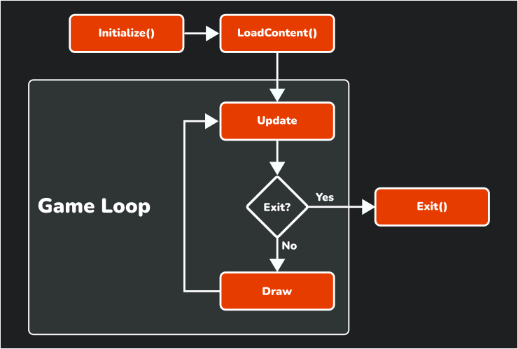
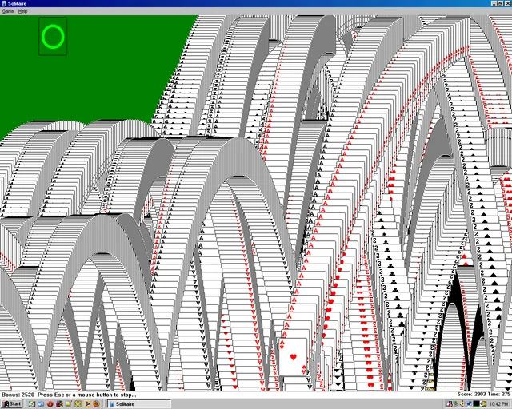

# Chapter 03: The Game1.cs File

- [Looking at the Code](#looking-at-the-code)
  - [The Game Loop](#the-game-loop)
- [Conclusion](#conclusion)
- [See Also](#see-also)
- [Test Your Knowledge](#test-your-knowledge)
- [Next](#next)


---

In the previous chapter, you created a new MonoGame project using the *MonoGame Cross-Platform Desktop Application* project template. Using the templates to create a new project will automatically generate files and a project structure as a starting point for a new MonoGame game application.  While MonoGame offers different templates to create a new project based on target platform, all projects will contain the *Game1.cs* file.  

In this chapter, we'll discuss this file and what it does for our game.  To get started, open the game project you created in Chapter 02 if not already open.

> [!NOTE]
> For an in-depth look at all files created in a MonoGame project when using the MonoGame templates, refer to [Appendix 02: MonoGame Project Overview](./appendix-02-monogame-project-overview.md).

## Looking at the Code
At the hearts of every MonoGame project is an implementation of the `Game` class.  This class is responsible for initializing the graphics services, initializing the game, loading content, and finally updating and rendering the game.  When creating a new MonoGame project, this is provided by the *Game1.cs* code file, which defines the `Game1` class that derives from the `Game` class.  

> [!TIP]
> By default, the MonoGame project templates will name this class `Game1`.  This is not a hard requirement and you can change the name of this class to anything else that may make more sense for your project. Regardless, it will be referred to as `Game1` throughout the documentation in this tutorial.

The code for the *Game1.cs* file will look something like this:

```cs
using Microsoft.Xna.Framework;
using Microsoft.Xna.Framework.Graphics;
using Microsoft.Xna.Framework.Input;

namespace MonoGameSnake;

public class Game1 : Game
{
    private GraphicsDeviceManager _graphics;
    private SpriteBatch _spriteBatch;

    public Game1()
    {
        _graphics = new GraphicsDeviceManager(this);
        Content.RootDirectory = "Content";
        IsMouseVisible = true;
    }

    protected override void Initialize()
    {
        base.Initialize();
    }

    protected override void LoadContent()
    {
        _spriteBatch = new SpriteBatch(GraphicsDevice);
    }

    protected override void Update(GameTime gameTime)
    {
        if (GamePad.GetState(PlayerIndex.One).Buttons.Back == ButtonState.Pressed || Keyboard.GetState().IsKeyDown(Keys.Escape))
            Exit();

        base.Update(gameTime);
    }

    protected override void Draw(GameTime gameTime)
    {
        GraphicsDevice.Clear(Color.CornflowerBlue);

        base.Draw(gameTime);
    }
}

```

The first thing you'll notice inside the `Game1` class are two instance member fields; a `GraphicsDeviceManager` and a `SpriteBatch` member.  The first instance member, `GraphicsDeviceManager`, is responsible for initializing and providing access to the graphics device and other graphical presentation configurations.  It contains a property called `GraphicsDevice` that represents the actual graphics device on the machine the game is running on.  The `GraphicsDevice` is the interface between your game and the graphics processing unit (GPU) for everything on screen.  

The second instance member, `SpriteBatch`, is used to perform 2D graphics rendering of *sprites* for the game. A *sprite* is term used to represent a 2D image.  The visuals for a 2D game are made by rendering multiple sprites on screen, and the `SpriteBatch` provides an optimized method of rendering multiple sprites in a single batch call.

Following the two instance member fields is the `Game1` constructor.  This is called when a new instance of `Game1` is created inside the *Program.cs* code file.  When first called, the base `Game` class constructor is executed first where instances of internal components needed are created and platform specific initializations occur. The `GraphicsDeviceManager` instance is then created, followed by setting the `Content.RootDirectory` property value to the *Content* directory, and finally setting the mouse to be visible when it is positioned over the game window. 

After the constructor is the `Initialize` method.  This method is called after the constructor is executed and is only called once during the lifetime of the game.  Here is where you initialize variables and objects used in the game.  While the default code isn't much, the `base.Initialize()` call is actually very important in terms of what you can do before and after it.  When the base method is called, this is when the graphics device object is instantiated.  During the base method call is also when the `LoadContent` method is called.  So any initializations that need to be performed that rely on either the graphics device object or content loaded should be done *after* the base method call and not before it.

Next is the `LoadContent` method.  Like with `Initialize` this method is only called once during the lifetime of the game, and, as mentioned previously, this is called during the `base.Initialize()` call.  Here is where you will load the content for your game such a images, audio, fonts, and models.  The default code just creates the `SpriteBatch` instance.

After initializations and content loading are performed, the game will enter into a *game loop*.  A *game loop*  is a series of methods that are called in sequence over and over until the game is told to exit.  In a MonoGame project, these methods are first the `Update` method and then the `Draw` method.  The `Update` method is where you will perform all of the logic that affects game play, such as input handling, physics, and collisions.  The `Draw` method is where you will perform the logic to render the game.

The figure below shows the lifecycle of a MonoGame game including the `Update` and `Draw` methods that make up the *game loop*.

  
**Figure 3-1:** *Lifecycle of a MonoGame game.*

## The Game Loop
As just mentioned, MonoGame implements a *game loop* by calling `Update` and `Draw` over and over until the game is told to exit.  Recall at the end of the previous chapter when you ran the project for the first time, I mentioned that there is a lot going on behind the scenes?  This *game loop* is what I was referring to.

MonoGame is executing the `Update` method and then the `Draw` method 60 times per second. The `Update` method at the moment is not doing much, only checking for input from a controller or keyboard to determine if the game should exit.  However, the `Draw` method is doing more than what it appears to at first glance.

Take a look at the `Draw` method

```cs
protected override void Draw(GameTime gameTime)
{
    GraphicsDevice.Clear(Color.CornflowerBlue);

    base.Draw(gameTime);
}
```

The first line is executing the `Clear` method of the `GraphicsDevice` property using the color `CornflowerBlue`.  Recall that the `GraphicsDevice` object is your direct interface between the game and what is rendered to the screen.  Every time the `Draw` method is called, this line of code of erasing the contents of the game window and refilling it with the color specified.  Without clearing the contents of the screen first, every draw call would draw the new frame render overtop of the previous render, and you'd end up with something like the old solitaire win screen

  
**Figure 3-2:** *Windows XP Solitaire Win Screen.*

While this can make for a neat effect, it's not something you want all the time. So, the screen is cleared and refilled with a solid color.  You can test this yourself by modifying the code to use a different color, such as `Color.MonoGameOrange` (yes, there is a MonoGame Orange color).

Each time the game loops completes and the game is drawn to the screen, we call this a *frame*.  So if MonoGame is running the game loop at 60 frames per second, that means it is performing and update and a render of each frame in 16ms. Notice that both the `Update` and the `Draw` methods both receive a parameter of the type `GameTime`.  The `GameTime` parameter provides a snapshot of the timing values for the game, including the amount of time that it took for the previous frame to execute.  This is commonly referred to as the *delta time*.  

*Delta time* allows you to track time accurately for things such as animations and events based on *game time* and not the speed of the processor (CPU) on the machine running the game.  While in ideal circumstances, the delta time will always be 16ms, there are any number of things that could cause a temporary slow down or hiccup in a frame, and using the delta time ensures that timing based events are always correct.

## Conclusion
In this chapter we
- Discussed the default code provided in a *Game1.cs* file created by a MonoGame template
- Discussed the lifecycle of a MonoGame game.
- Discussed what a game loop is and how it is implemented in MonoGame.

In the next chapter, you'll start working with sprites and learn how to load and render them.

## See Also
This chapter briefly touched on the *Game1.cs* file and the `Game` class.  For an in-depth detailed discussion of all files created in a MonoGame project, including a full overview of the order of execution for a MonoGame game, see [Appendix 02: MonoGame Project Overview](./appendix-02-monogame-project-overview.md).

## Test Your Knowledge
1. Can the `Game1` class be renamed or is it required to be called `Game1`

    <details>

    <summary>Question 1 Answer</summary>

    > It is not a requirement that it be called `Game1`.  This is just the default name given to it by the templates when creating a new MonoGame game project.  

    </details><br />

2. What is the `SpriteBatch` used for?

    <details>

    <summary>Question 2 Answer</summary>

    > The `SpriteBatch` is used to perform 2D graphics rendering of sprites in an optimized method by rendering multiple sprites in a single batch call.
    
    </details><br />

3. When is the `LoadContent` method executed and why is it important to know this?

    <details>

    <summary>Question 3 Answer</summary>

    > `LoadContent` is executed during the `base.Initialize()` method call within the `Initialize` method.  It's important to know this because anything being initialized that is dependent on content loaded should be done *after* the `base.Initialize()` call and not *before*. 
    
    </details><br />

4. How does MonoGame provide a *delta time* value?
   
    <details>

    <summary>Question 4 Answer</summary>

    > Through the `GameTime` parameter that is given to both the `Update` and the `Draw` methods.
    
    </details><br />


# Next
- [Chapter 04: Working With Textures]()
