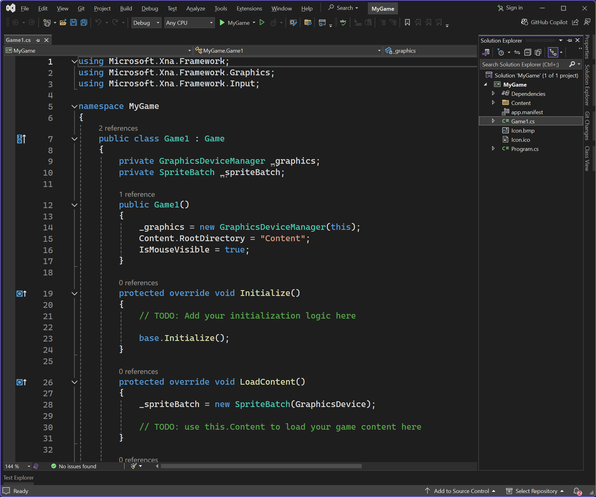
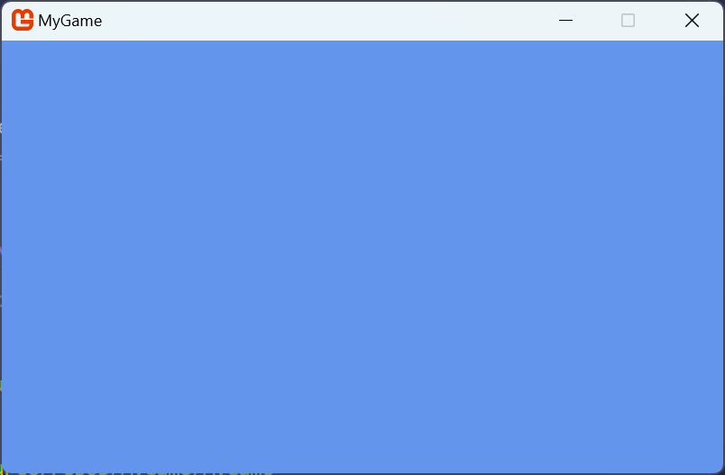
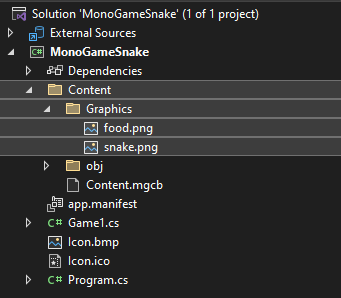
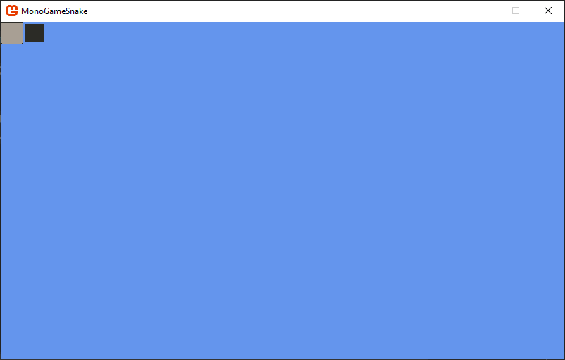
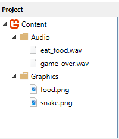
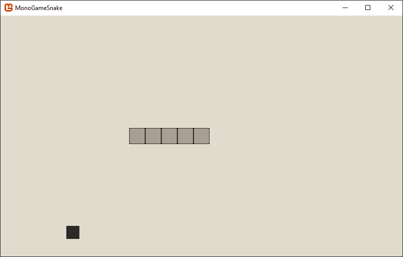

# Chapter 3: Hello World - A Crash Course in MonoGame

- [MonoGame Snake Game](#monogame-snake-game)
- [Creating the Project](#creating-the-project)
  - [Visual Studio 2022](#visual-studio-2022)
  - [Visual Studio Code](#visual-studio-code)
  - [Running The Game For The First Time](#running-the-game-for-the-first-time)
- [Loading Textures](#loading-textures)
- [Loading and Rendering](#loading-and-rendering)
- [Game Logic](#game-logic)
  - [Create Instance Members](#create-instance-members)
  - [Spawning Food](#spawning-food)
  - [Initializations](#initializations)
  - [Update](#update)
  - [Rendering](#rendering)
  - [Audio](#audio)
- [Conclusion](#conclusion)

---

When learning a new programming language, tutorials will often start with some form of the "Hello World" program.  For example, a classic Hello World program in C# would look something like this

```cs
using System;

namespace HelloWorldApplication
{
    public class Program
    {
        public static void Main(string[] args)
        {
            Console.WriteLine("Hello World");
        }
    }
}
```

The entire point of the Hello World program is to introduce some usage of the language in as minimal an example as possible.  For game development, there are many "Hello World" style games that could be made as a simple introduction.  For this tutorial, we're going to use one of the classic games, Snake, as our Hello World.  We'll create a simple prototype in this crash course to get started and then in later chapters start to expand on the game and introduce new concepts to better familiarize you with game development in MonoGame.

## MonoGame Snake Game
The Snake game we're going to create is by itself a very simple and straightforward game.  This is because the goal of this tutorial isn't to teach you to create a Snake game, but to teach you game development with MonoGame.  By creating a Snake game, we'll cover the following topics

1. Creating a new project
2. Creating assets such as graphics, audio.
3. Loading the assets using the Content Pipeline
4. Setting up the program structure
5. Updating the game by handling input and checking for collision
6. Rendering the game

When we are finished with creating this initial prototype, you should be familiar enough with MonoGame to begin creating your own projects.  After this chapter, we'll dive more deeply into MonoGame and take the Snake game from prototype to a completed game.


## Creating the Project
To create a new project.  Follow the instructions below depending on if you are using Visual Studio 2022 or VSCode

### Visual Studio 2022
If you are using Visual Studio 2022, to create a new project, first launch the Visual Studio 2022 application.  This will open the initial launch window.  In the launch window, click the **Create New Project** button.  Next, in the **Project Type** dro-down, choose **MonoGame** to filter the templates to only show the MonoGame templates.  In the list of MonoGame templates shown, choose the **MonoGame Cross-Platform Desktop Application** project template and click the **Next** button.  You'll now be prompted to enter a name for the project and a location to save it.  For the name, we're going to enter `MonoGameSnake`.  As for the location, you can choose where you would like it to be saved.  When finished, click the **Create** button to have the project created based on the template and opened automatically in Visual Studio 2022.


**Figure 3-1:** *A new MonoGame project after being created in Visual Studio 2022.*

### Visual Studio Code
If instead you are using VSCode, to create a new project, first launch the VSCode application.  In VSCode, the vertical bar of icons on the left is called the **Activity Bar**, and the first icon is for the **Explorer** panel.  If the **Explorer** panel is not already expanded, click this button to expand it.  Inside the **Explorer** panel is a button labeled **Create .NET Project**.  This button is not here by default, it is available because we installed the C# Dev Kit extension.  Click this button, which will open up a prompt at the top center of the VSCode window asking which project template to use.  Type **MonoGame** in the **Search for templates** box to filter the templates to only show the MonoGame templates, then select the **MonoGame Cross-Platform Desktop Application** template.  After choosing this, a dialog box will open asking you to select the location to save the project at, you can choose whatever location you would like.  Once the location is chosen, you will be prompted to enter a name for the project.  We're going to call the project `MonoGameSnake`, so enter that.  Finally, a last prompt will be shown with an option to **Create project**.  Click this option to have the project created based on the template and opened automatically in VSCode


**Figure 3-2:** *A new MonoGame project after being created in Visual Studio Code.*

### Running The Game For The First Time
Congratulations, you've just created your very first MonoGame project above.  We'll cover more of what each of these files are in depth later, instead let's run our project as is and see the results. You can press the `F5` key on your keyboard to run the application in debug mode regardless of you are using Visual Studio 2022 or VSCode.

> [!TIP]
> - In Visual Studio 2022, you can also run the project by clicking the run button in the tool bar at the top, or by selecting **Debug > Start Debugging* from the top menu
> - In VSCode, you can also run the project by opening the **Solution Explorer** panel on the left, then right-clicking the project and selecting **Debug > Start New Instance**, or alternatively selecting **Run > Start Debugging** from the top menu.

> [!NOTE]
> The first time you build a MonoGame project, a dotnet restore will be executed, which will download the NuGet packages used by the MonoGame project.  If they've never been restored before, then they will be downloaded from the official NuGet feed.  One of the tool packages, The *dotnet-mgcb* package is ~400mb, so depending on your internet connection speed, it may take a moment for the first build to finish.  Once the packages have been downloaded for the first time, they are cached in your global NuGet directory, so subsequent builds and projects will not have to download them.

Be amazed, the default MonoGame cornflower blue game window

  
**Figure 3-3:** *The default MonoGame cornflower blue game window.*


While there isn't much happening here visually, there is a lot going on behind the scenes that the MonoGame framework is handling for you.  When you ran the application, the game initialization started which initializes the graphics device and creates the game window.  It's also running the main game loop over and over to render the cornflower blue background at 60 frames per second.  Additionally, it is also managing polling input from the keyboard, mouse, and any connected gamepads for the game window.  You can test this yourself by pressed the `Esc` key on your keyboard and the game will exit.

If you were to set all of this up manually, it could take hours of research and thousands of lines of code written just to get the window rendering and input polling.  Instead, we can take advantage of this base starting point that MonoGame offers us to get started creating our game without having to worry about the lower level implementations like this.

> [!NOTE]
> Above we mentioned the **main game loop** running to render the game at 60fps.  Game applications work differently than a traditional desktop application like your web browser.  Desktop applications are event based, meaning once loaded, they do not do much at all while waiting for input from the user, and then it responds to that input event.  In games, things are always happening such as objects moving around like the player or particles.  To handle this, games implement a loop structure that runs continuously, first calling the Update method and then the Draw method, until it has been told to exit.

Next we'll load some graphical assets and rendering them to the screen.  If you still have the game window open, you can close it now by pressing `Esc` on your keyboard or clicking the [x] in the window title bar.

## Loading Textures
Textures are the graphical assets in our game that get rendered. Textures and most other content types can be created or loaded in MonoGame in various ways.  For instance, you can load a texture directly from a file

```cs
Texture2D texture = Texture2D.FromFile("image.png");
```

Or you can create a texture directly from code

```cs
Texture2D texture = new Texture2D(GraphicsDevice, 1, 1);
texture.SetData<Color>(new Color[] { Color.White });
```

However, MonoGame also offers the **Content Pipeline** that we can use to maintain and load all of a game's content, including textures.  Using the **Content Pipeline** has the advantage that it will compile our assets into a format that is more optimized for the platform we are targeting for the game.  We'll go in more detail about the **Content Pipeline** and the advantages of using it in [{TODO Add Chapter Link Text}]({TODO Add Chapter Link}).  For now, we'll go through the process of adding image files that we can later load and render in the game.

To get started, first create a new directory called `Graphics` inside the **Content** directory in your game project.  Then, right-click on each of the square images files below (Figure 3-4 and Figure 3-5) and save them in the **Graphics** directory you just created. Ensure they are named `snake.png` and `food.png`

  
[**Figure 3-4:** *snake.png*](./images/chapter_03/snake.png)

  
[**Figure 3-5:** *food.png*](./images/chapter_03/food.png)

If saved correctly, your **Content** directory in your project should look similar to the following:

  
**Figure 3-6:** *snake.png and food.png files saved to the Content/Graphics directory in the game project*

Adding the images to the **Content** directory isn't enough though.  We now need to configure the content project file so that it knows to build these images.  The content project file is the **Content.mgcb** file located in the **Content** directory.  We can edit the file manually, but the amount of information needed to be added for each piece of content can be a lot depending on the asset type.  Instead, MonoGame provides the **MonoGame Content Builder Editor** (MGCB Editor), which is a tool we can use to edit the file with a visual editor.

To open the **MGCB Editor**
- **Visual Studio 2022**: Double-click the **Content.mgcb** file in the **Solution Explorer** panel.  This will launch the **MGCB Editor** with the **Content.mgcb** opened thanks to the MonoGame Visual Studio extension
- **Visual Studio Code**: VSCode does not have an official extension to automatically open the **MGCB Editor** by double-clicking the **Content.mgcb** file (though there are some third-party extension that offer this).  Instead, VSCode users will need to use the command line interface (CLI) commands to open it

    1. Open the terminal in VSCode by pressing `CTRL+~` or by clicking **Terminal > New Terminal** in the top menu.

    2. The **Terminal Panel** will open by default in the directory that is the root directory in the current workspace.  This will typically be the directory containing your `*.sln` file and project directory.  To use the CLI command, we need the terminal to be in the project directory so enter the following to change to the project directory
        ```sh
        cd ./MonoGameSnake
        ```

    3. Now that we are in the project directory, enter the following CLI command to open the **Content.mgcb** file in the **MGCB Editor**
        ```sh
        dotnet mgcb-editor ./Content/Content.mgcb
        ```

  
**Figure 3-7:** *The MonoGame Content Builder Editor (MGCB Editor).*

With the **MGCB Editor** now open, right-click on the **Content** node in the **Project Panel** on the left, then select **Add > Existing Folder**.  In the **Select Folder** dialog that opens, choose the **Graphics** folder we created and added the images too.  This will automatically add all files in that folder to our content project.  If you expand the **Graphics** node in the **MGCB Editor**, you can see both the **food.png** and **snake.png** files.

  
**Figure 3-8:** *The Graphics directory containing the food.png and snake.png files were added to the content project.*

If you click on either of the two image files in the **MGCB Editor**, you can view the properties in the **Properties Panel** at the bottom left.  Here you can see the configurations used by the content pipeline such as the build action, which importer and processor is used, and the configurations that can be adjusted for the processor.

  
**Figure 3-9:** *The properties panel in the MGCB Editor for the snake.png file.*

Generally leaving these properties on the default settings are optimal, though there are use cases for adjusting them depending on the asset.  Notice however that by default the **Build Action** is set to **Build**.  This means, when we build our game project, during the project build when the content pipeline runs, it will compile this texture asset into a `.xnb` file that we can then load in our game at runtime.

Once you've finished exploring the MGCB Editor, click the **Save** icon on the **Toolbar** to save the changes, then close the **MGCB Editor**.

> [!CAUTION]
> Ensure that after making changes in the **MGCB Editor** that you save your changes.  The editor does not autosave changes and will not prompt you to save when exiting if you haven't already saved.

Now that we have added the textures to the content project, we're ready to move over into code.

## Loading and Rendering
If you don't already have it open, open the **Game1.cs** file in your project.  We'll discuss this file in more detail in [{TODO ADD CHAPTER}]({TODO ADD CHAPTER LINK}), for now we're going to focus on the steps needed to get the textures we added loaded and rendering.

Inside the class declaration, add the following two instance fields

```cs
private Texture2D _snakeTexture;
private Texture2D _foodTexture;
```

These two instance fields are of the `Texture2D` object type which we'll use to store the textures once we load them in.  

Next, let's take a brief look at the `Game1` constructor.

```cs
public Game1()
{
    _graphics = new GraphicsDeviceManager(this);
    Content.RootDirectory = "Content";
    IsMouseVisible = true;
}
```

In here there are some initializations happening, but what I want you to focus on is the `Content.RootDirectory` property being set.  It is being set to the value `"Content"`.  The value set here is the path to the directory that will contain the content assets for our game.  When we build the game, the content pipeline will perform a build of all the content we added to the **Content.mgcb** file, then copy the content that was built into the output directory where the game project is built.  By default this will be in a directory called *Content*.  So when setting the value of `Content.RootDirectory`, it should be the path of the directory the built content in **relative to the game executable** when built.


A little bit further down in the class locate the `LoadContent` method.  Update the method to load our two textures and store them in the instance fields we created.

```cs
protected override void LoadContent()
{
    _spriteBatch = new SpriteBatch(GraphicsDevice);

    _snakeTexture = Content.Load<Texture2D>("Graphics/snake");
    _foodTexture = Content.Load<Texture2D>("Graphics/food");
}
```

Here, we are using the `Content` property of our `Game1` class, which is a `ContentManager` object type.  We use the `ContentManager` to load the snake and food images that we processed through the content pipeline.  When using the `Content.Load` method, we have to specify which type of content is being loaded using the *generic type parameter*.  The type we specify is `Texture2D` since we are loading `Texture2D` content.  For the parameter of the `Load` method, we need to specify the path to the content file to load, **minus the extension**. The path that we specify should be relative to the `Content.RootPath` value that we discussed above in the constructor. Since we placed both the *snake.png* and *food.png* images inside the *Graphics/* directory, then we specify the path to load for each is prefixed with *Graphics/*

Now that we have loaded the textures, let's add the code to render them to the game window. Further down in the `Game1` class is the `Draw` method.  For now, we'll just draw the snake and food images to show how rendering works.  Update the method to draw our textures as shown below

```cs
protected override void Draw(GameTime gameTime)
{
    GraphicsDevice.Clear(Color.CornflowerBlue);

    _spriteBatch.Begin();
    _spriteBatch.Draw(_snakeTexture, Vector2.Zero, Color.White);
    _spriteBatch.Draw(_foodTexture, new Vector2(32, 0), Color.White);
    _spriteBatch.End();

    base.Draw(gameTime);
}
```

Before we updated the `Draw` method, it was only performing two actions; clearing the graphics device to the color cornflower blue, and then the call to the base `Draw` method.  The lines we added draw the snake and food textures to the screen.  If you run the project now you should the same window as Figure 3-10

  
**Figure 3-10:** *The snake and food textures loaded and rendered.*

The first line of code we added is `_spriteBatch.Begin()`.  When this is called the `SpriteBatch` object sets up the `GraphicsDevice` to prepare for rendering.  Here we are using the parameterless overload, which means the default states are set up on the `GraphicsDevice`.  The next two lines are the `_spriteBatch.Draw()` calls to draw the snake texture and then the food texture.  Here we're using one of the minimal overloads where we only have to supply the `Texture2D` to render, a `Vector2` position to render it at, and a `Color` which defines the color mask to apply to the texture when rendering it.  Finally, we close it all off by calling `_spriteBatch.End()`. Here the `SpriteBatch` submits any remaining batched draw calls to the `GraphicsDevice` to be rendered. 

Well dive more into detail about the `SpriteBatch` object in [{TODO ADD CHAPTER}]({TODO ADD CHAPTER LINK}).  For now, it's important to understand the order of methods when using the `SpriteBatch` object.  All calls made to the `SpriteBatch.Draw()` method must exist inside a `SpriteBatch.Begin()` and `SpriteBatch.End()` block. Attempting to draw without beginning the `SpriteBatch` will result in an exception.  Additionally, any `SpriteBatch.Begin()` call must have a matching `SpriteBatch.End()` call before another `SpriteBatch.Begin()` can be made.  Calling `SpriteBatch.Begin()` and then calling `SpriteBatch.Begin()` again before doing a `SpriteBatch.End()` will result in an exception. 

Now that we have our graphics loading and rendering, we can start adding logic to the game to make it an actual playable game.

## Game Logic
The game logic is the code that actually makes things happen in our game.  This can be polling user input, moving the player, or updating the score.  Generally, you would not want to put all of the game logic within the `Game1` class.  Overtime it can grow quite large and become harder to maintain.  For small projects, like our current prototype, it's ok. Later, as we begin to develop beyond the prototype, we'll start separating logic into classes.

For now, the logic for our prototype will look something like this

1. Create instance members to keep track of the snake, food, and direction the snake is moving.
2. Update the game by polling for keyboard input, updating the snake location, and checking for collisions.


### Create Instance Members
First we need to define a few class level instance members used to track different object and values in the game, such as the snake, the food, and the direction the snake is moving.  Add the following to the `Game1` class:

```cs
private const int GRID_SIZE = 32;
private int _columns;
private int _rows;
private List<Rectangle> _snake;
private Rectangle _food;
private int _direction;
private TimeSpan _timer;
private TimeSpan _tickTime;
private bool _isPlaying;
```
A snake game is played on a grid like game structure.  So there are going to be various times that we need to know how many columns and rows total there are on the screen.  We'll calculate this in a moment and store them in the `_columns` and `_rows` member values.  The `GRID_SIZE` constant value represents the width and height size of each grid cell in pixels.

The snake itself is made up of individual body part segments.  Each body part can be represented as a `Rectangle` value which defines the xy-coordinate location and the width and height components of the segment.  We'll also need to add a new segment each time the snake eats food, which means our collection will need to be able to grow over time. For this, a `List<Rectangle>` collection works nicely.

There will only ever be a single piece of food in the game at any given time, so much like the individual body segments of the snake, we can use a `Rectangle` to represent the food object.

For the prototype, we can use a simple `int` value to represent the direction the snake is moving.  The following table represents the values and the direction they correlate to.

| Value | Direction |
| ----- | --------- |
| `1`   | Right     |
| `2`   | Left      |
| `3`   | Up        |
| `4`   | Down      |

The `_timer` will be used to track the total amount of time passed between updates, and the `_tickTime` is the target time that needs to be reached before we actually update the snake.  Basically X amount of time must pass before the snake is updated to move one space.  By default MonoGame will attempt to run the game at 60 frames per second (FPS).  If we don't limit how often the snake moves, then it will move 60 spaces every second, which is visually too fast to play the game. So we use the timers to limit this.

Finally, a single `bool` value `_isPlaying` will be used to track the game state for if the game is being played or not.

### Spawning Food
When the food in the game spawns, we want the location it spawns in to be random.  Since the logic for this is something we'll need to call from multiple places, it makes sense to put this it its own method.  Add the following method to the `Game1` class.

```cs
private void SpawnFood()
{
    _food = new Rectangle();
    _food.X = Random.Shared.Next(0, _columns) * GRID_SIZE;
    _food.Y = Random.Shared.Next(0, _rows) * GRID_SIZE;
    _food.Width = _food.Height = GRID_SIZE;
}
```

Here, we initialize the `_food` member as a new `Rectangle`.  Then the `X` and `Y` location components are chosen by picking a random column and row.  The `Width` and `Height` components are set to the size of a grid cell.

### Initializations
When the game first loads, we need to set up the initial values used by each game session.   We also need to initialize the game session to be played.  Whenever there is a game over, we want the player to be able to hit Enter to start a new game, there are multiple places in our code where initializing the game session will be called, so we can split that into it's own method.  Locate the `Initialize()` method in the `Game1` class and update it to the following, adding the `InitializeNewGame()` method after it as well.

```cs
protected override void Initialize()
{
    _columns = _graphics.PreferredBackBufferWidth / GRID_SIZE;
    _rows = _graphics.PreferredBackBufferHeight / GRID_SIZE;
    _tickTime = TimeSpan.FromMilliseconds(100);

    InitializeNewGame();

    base.Initialize();
}

private void InitializeNewGame()
{
    _snake = new List<Rectangle>();
    for (int i = 0; i < 5; i++)
    {
        Rectangle segment = new Rectangle();
        segment.X = ((_columns / 2) - i) * GRID_SIZE;
        segment.Y = (_rows / 2) * GRID_SIZE;
        segment.Width = segment.Height = GRID_SIZE;
        _snake.Add(segment);
    }

    SpawnFood();

    _timer = TimeSpan.Zero;
    _direction = 1;
    _isPlaying = true;
}
```

When initializing, first we determine how many total columns and rows there are available to use.  We calculate this by dividing the `_graphics.PreferredBackBufferWidth` and `_graphics.PreferredBackBufferHeight` by the size of each grid cell.  These two values represent the total width and height, in pixels, of the render-able game area (aka the *back buffer*). 

> [!NOTE]
> The back buffer is only the visible render-able area of the game window.  When we ran our initial project that showed the cornflower blue window in Figure 3-3, the blue area is the back buffer.  It also does not include the width and height of things like the title bar of the game window or any border around the game window.

After calculating the total number of columns and rows, we then initialize the `_tickTime` and set it to 100ms.  The value defines the total amount of time that must elapse before the snake moves. Increasing this number will increase that delay, making the snake move slower while lowering it will shorten the delay making it move faster.  You can adjust this value to what you find to be comfortable, I find 100ms to be a good value for most players.

Then in the `Initialize()` method we call the `InitializeNewGame()` method to setup a new game session to be played.

> [!NOTE]
> Notice that while updating the `Initialize()` method, we did not remove the call to `base.Initialize()`.  This is because the during the call to the base `Initialize()` method, the final thing it does before returning back is calling the `LoadContent()` method.  If `base.Initialize()` is removed, then `LoadContent()` will not be called automatically by the framework.


The `InitializeNewGame()` method is straight forward.  First it initialize the `_snake` collection. Next it iterates a loop five times, each loop creating a new body segment for the snake.  Each segment is position at the center of the screen with the `X` location component decrementing by 1 grid cell for each.  This will make it so the snake is laid out left-to-right horizontally when initially rendering.  Next, the food is spawned by calling `SpawnFood()`, the `_timer` is set to it's initialize zero value, `_direction` is set to 1, and `_isPlaying` is set to `true`.

### Update
Now that our game can initialize, let's setup the logic for updating. Updating the game is going to handle multiple things like polling for user input, increment the timers, moving the snake and handling collision.  Find the `Update()` method in the `Game1` class and change it to the following:

```cs
protected override void Update(GameTime gameTime)
{
    KeyboardState keyboard = Keyboard.GetState();

    if (_isPlaying == false)
    {
        if (keyboard.IsKeyDown(Keys.Enter))
        {
            InitializeNewGame();
        }

        return;
    }

    int newDirection = _direction;

    if (keyboard.IsKeyDown(Keys.Right) && _direction != 2)
    {
        newDirection = 1;
    }
    else if (keyboard.IsKeyDown(Keys.Left) && _direction != 1)
    {
        newDirection = 2;
    }
    else if (keyboard.IsKeyDown(Keys.Up) && _direction != 4)
    {
        newDirection = 3;
    }
    else if (keyboard.IsKeyDown(Keys.Down) && _direction != 3)
    {
        newDirection = 4;
    }


    _timer += gameTime.ElapsedGameTime;

    if (_timer >= _tickTime)
    {
        _timer = _tickTime - _timer;

        _direction = newDirection;

        int x = _snake[0].X;
        int y = _snake[0].Y;

        if (_direction == 1)
        {
            x += GRID_SIZE;
        }
        else if (_direction == 2)
        {
            x -= GRID_SIZE;
        }
        else if (_direction == 3)
        {
            y -= GRID_SIZE;
        }
        else if (_direction == 4)
        {
            y += GRID_SIZE;
        }

        Rectangle previousHead = _snake[0];
        Rectangle newHead = new Rectangle(x, y, GRID_SIZE, GRID_SIZE);

        bool isGameOver = false;

        if (newHead.X < 0 || newHead.X >= _graphics.PreferredBackBufferWidth ||
           newHead.Y < 0 || newHead.Y >= _graphics.PreferredBackBufferHeight)
        {
            isGameOver = true;
        }
        else
        {

            if (newHead.Intersects(_food))
            {
                SpawnFood();
            }
            else
            {
                _snake.RemoveAt(_snake.Count - 1);
            }
            _snake.Insert(0, newHead);

            for (int i = 1; i < _snake.Count; i++)
            {
                if (newHead.Intersects(_snake[i]))
                {
                    isGameOver = true;
                    break;
                }
            }
        }

        if (isGameOver)
        {
            _isPlaying = false;
        }
    }
}
```

A lot was added to the `Update()` method so let's break it down into smaller chunks to explain whats happening.

1. First we poll the `Keyboard` for the current state of keyboard input.  This returns back a `KeyboardState` value that we can use to check which keys on the keyboard are currently pressed down.

2. Next, we check if the value of `_isPlaying` is `false`.  This will only be `false` when a game over is detected, so we check for that first here.  If this condition passes, then we check if the player has hit the Enter key on the keyboard, and if so, initialize a new game session.  Regardless, since it's a game over state, the final thing that occurs within this block is an early return since the remainder of the `Update()` method can be ignored.

3. If the game is being played, then we poll the keyboard to check for input from the user.  First we cache the current value of the `_direction` into `newDirection`.  The the *Right*, *Left*, *Up*, and *Down* keys are checked to see if they are pressed.  For each one, there is an additional condition to prevent it from passing if the snake is moving in the opposite direction currently of the direction that was pressed.  For instance, if the snake is moving up, we don't want to allow it to move down into itself, it should only be able to continue up, or move left or right.

4. After handling input, we increment the `_timer` by the amount of time that has elapsed since the last update, then check if the accumulated time is greater than or equal to the `_tickTime`.  If not, this is where update ends

5. If the `_tickTime` has been reached, we then move into the logic of updating the snake.  
   
   5.1. First, we decrement the `_timer`, keeping any time that was left over.  
   
   5.2. Then the `_direction` is set to the `newDirection` detected and the `x` and `y` position that the snake head will be moving to is calculated based on this.  
   
   5.3. The current head segment is cached and the new head segment is created at the location that it will be moving too.  

   5.4. We create a `bool` value called `isGameOver` which we can use to flag if the game over condition has been met.

   5.5. Then we check if the position the new head segment will move to is outside the bounds of the game area.  If it is, we set `isGameOver` to `true`.

   5.6. If the new head segment position is still within the bounds of the play area, then we check if it will collide with the `_food` using the `Rectangle.Intersects()` method.  If collision with food is detected, then a new food is spawned.  If there is no collision with food, then the tail is removed from the collection.
    
   5.7. The `newHead` is inserted at the front of the collection. If food was eaten above, this means the new head becomes the new segment making our snake grow. If no food was eaten, this is logically like taking the tail out of the collection and moving it to the front of the collection.  Doing it this way means we only ever have to update the movement of the head and tail of the snake, not every single body segment.  
   
   5.8. Next a loop is iterated, starting at index `1` and looping through each body segment of the snake.  Each loop iteration will check if the `newHead` collides with the body segment for that iteration of the loop using the `Rectangle.Intersects()` method.  If `true`, then `isGameOver` is set to `true` and the loop will `break` early.

   5.9. Finally a check is made to see if `isGameOver` was set to `true` during any of the previous checks.  If so, the `_isPlaying` state is changed to `false`.

And that's it for the update logic.  We are now polling for player input from the keyboard and updating the game based on the value of `_isPlaying`.  Now that we're updating the game, the final step is to render the game.

### Rendering
Rendering out prototype Snake game is rather straight forward.  We just need to draw each of the snake segments and the food.  Find the `Draw()` method in the `Game1` class and update it to the following:

```cs
protected override void Draw(GameTime gameTime)
{
    GraphicsDevice.Clear(new Color(224, 219, 205));

    _spriteBatch.Begin();
   
    for (int i = 0; i < _snake.Count; i++)
    {
        _spriteBatch.Draw(_snakeTexture, _snake[i], Color.White);
    }
    _spriteBatch.Draw(_foodTexture, _food, Color.White);
   
    _spriteBatch.End();
}
```

This new updated `Draw()` method only has a few changes.  First, when clearing the graphics device, we're now using the color `new Color(224, 219, 205)`.  This color better matches the color palette of our textures than the default cornflower blue.  Next a loop was added that iterates through the entire collection of the snake, then renders a `_snakeTexture` at the destination represented by the `Rectangle` bounds of that segment.  Then it renders the `_foodTexture` at the destination represented by the `Rectangle` bounds of the `_food` value.

### Audio
Finally, to give some extra life to our prototype, let's add some sound effects that will play either with a piece of food is eaten or when there is a game over.  To do this, first create a new directory inside the *Content* directory called *Audio*.  Then right-click the following audio files and save them into that *Audio* directory:


- [eat_food.wav](./images/chapter_03/eat_food.wav)
- [game_over.wav](./images/chapter_03/game_over.wav)  

Next, open the *MGCB Editor* just like we did previously when adding the images.  When it's open, right-click on the *Content* node, and select **Add > Existing Folder**, then choose the *Audio* the wav files were added to.  Expand the *Audio* node in the *Project Panel* and ensure both files were added.  It should look similar to the following

  
**Figure 3-11:** *The eat_food.wav and game_over.wav audio files added to the content project in the MGCB Editor.*

After verifying they were added, be sure you click the *Save* icon and then close the *MGCB Editor*.

Switch back to the *Game1.cs* class file. First add two new instance members inside the `Game1` class

```cs
private SoundEffect _eatFoodSound;
private SoundEffect _gameOverSound;
```

These are `SoundEffect` type which we'll use to load the two audio files into using the `ContentManager`.  To do that, next, find the `LoadContent()` method and add the following

```cs
_eatFoodSound = Content.Load<SoundEffect>("Audio/eat_food");
_gameOverSound = Content.Load<SoundEffect>("Audio/game_over");
```

This will load the two sound effect audio files that were processed by the content pipeline into the two `SoundEffect` members.

Finally, we need to adjust parts of the `Update()` method so that it plays the appropriate sound effect at the appropriate time.  First, locate the `if` block where we check if the `newHead` is colliding with `_food` and update it to the following so the `_eatFoodSound` is played

```cs
if (newHead.Intersects(_food))
{
    _eatFoodSound.Play();
    SpawnFood();
}
```

Next locate the the `if` block where the check is made to determine if `isGameOver` is `true` and update it to the following:

```cs
if (isGameOver)
{
    _gameOverSound.Play();
    _isPlaying = false;
}
```

That's it for the game logic.  Run the game and play the prototype

  
**Figure 3-12:** *Playing the prototype of the snake game we just created.*


## Conclusion
During this chapter, we covered loading and rendering images, keyboard input, audio, and managing the the state of the game.  It doesn't have a lot of polish, but that was not the point.  The goal was to touch on concepts of MonoGame that we'll be using the the upcoming chapters.

[Go to Chapter 4: MonoGame Project Overview](./04_monogame_project_overview.md)
