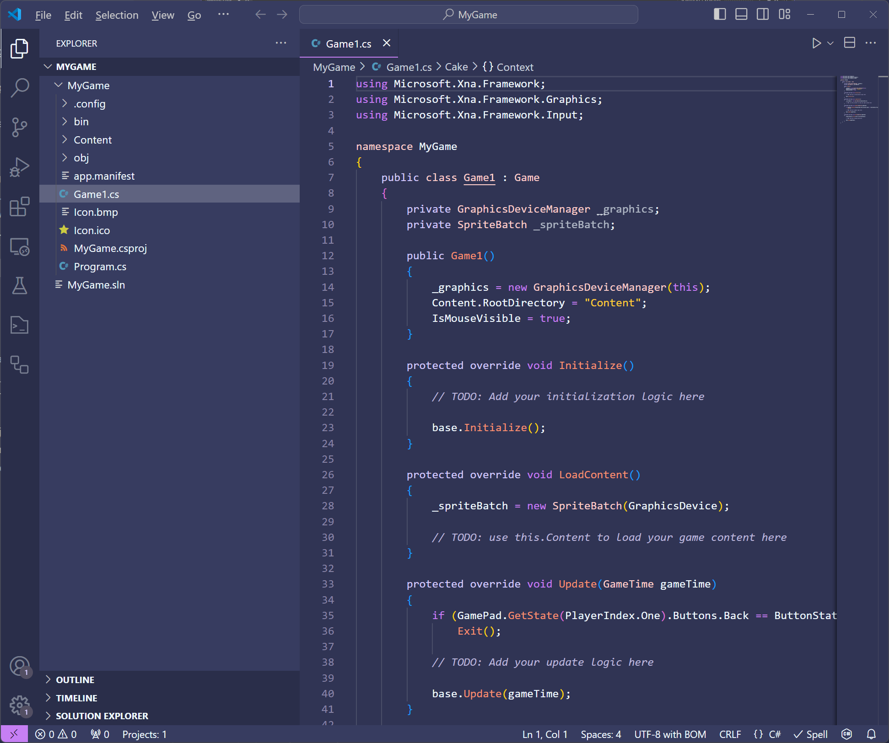

# Chapter 3: Hello World - A Crash Course in MonoGame
When learning a new programming language, tutorials will often start with some form of the "Hello World" program.  For example, a classic Hello World program in C# would look something like this

```cs
using System;

namespace HelloWorldApplication
{
    public class Program
    {
        public static void Main(string[] args)
        {
            Console.WriteLine("Hello World");
        }
    }
}
```

The entire point of the Hello World program is to introduce some usage of the language in as minimal an example as possible.  For game development, there are many "Hello World" style games that could be made as a simple introduction.  For this tutorial, we're going to use one of the classic games, Snake, as our Hello World.  We'll create a simple prototype in this crash course to get started and then in later chapters start to expand on the game and introduce new concepts to better familiarize you with game development in MonoGame.

## MonoGame Snake Game
The Snake game we're going to create is by itself a very simple and straightforward game.  This is because the goal of this tutorial isn't to teach you to create a Snake game, but to teach you game development with MonoGame.  By creating a Snake game, we'll cover the following topics

1. Creating a new project
2. Creating assets such as graphics, audio, and text
3. Loading the assets using the Content Pipeline
4. Setting up the program structure
5. Updating the game by handling input, checking for collision, and tracking score
6. Rendering the game

When we are finished with creating this initial prototype, you should be familiar enough with MonoGame to begin creating your own projects.


## Creating the Project
To create a new project.  Follow the instructions below depending on if you are using Visual Studio 2022 or VSCode

### Visual Studio 2022
If you are using Visual Studio 2022, to create a new project, first launch the Visual Studio 2022 application.  This will open the initial launch window.  On the the, click the **Create New Project** button.  Next, in the **Project Type** dro-down, choose **MonoGame** to filter the templates to only show the MonoGame templates.  In the list of MonoGame templates shown, choose the **MonoGame Cross-Platform Desktop Application** project template and click the **Next** button.  You'll now be prompted to enter a name for the project and a location to save it.  For the name, we're going to enter `MonoGameSnake`.  As for the location, you can choose where you would like it to be saved.  When finished, click the **Create** button to have the project created based on the template and opened automatically in Visual Studio 2022.


**Figure 3-1:** *A new MonoGame project after being created in Visual Studio 2022.*

### Visual Studio Code
If instead you are using VSCode, to create a new project, first launch the VSCode application.  In VSCode, the vertical bar of icons on the left is called the **Activity Bar**, and the first icon is for the **Explorer** panel.  If the **Explorer** panel is not already expanded, click this button to expand it.  Inside the **Explorer** panel is a button labeled **Create .NET Project**.  This button is not here by default, it is available because we installed the C# Dev Kit extension.  Click this button, which will open up a prompt at the top center of the VSCode window asking which project template to use.  Type **MonoGame** in the **Search for templates** box to filter the templates to only show the MonoGame templates, then select the **MonoGame Cross-Platform Desktop Application** template.  After choosing this, a dialog box will open asking you to select the location to save the project at, you can choose whatever location you would like.  Once the location is chosen, you will be prompted to enter a name for the project.  We're going to call the project `MonoGameSnake`, so enter that.  Finally, a last prompt will be shown with an option to **Create project**.  Click this option to have the project created based on the template and opened automatically in VSCode


**Figure 3-2:** *A new MonoGame project after being created in Visual Studio Code.*

### Running The Game For The First Time
Congratulations, you've just created your very first MonoGame project above.  We'll cover more of what each of these files are in depth later, instead let's run our project as is and see the results. You can press the `F5` key on your keyboard to run the application in debug mode regardless of you are using Visual Studio 2022 or VSCode.

> [!TIP]
> - In Visual Studio 2022, you can also run the project by clicking the run button in the tool bar at the top, or by selecting **Debug > Start Debugging* from the top menu
> - In VSCode, you can also run the project by opening the **Solution Explorer** panel on the left, then right-clicking the project and selecting **Debug > Start New Instance**, or alternatively selecting **Run > Start Debugging** from the top menu.

Be amazed, the default MonoGame cornflower blue game window

  
**Figure 3-3:** *The default MonoGame cornflower blue game window.*

While there isn't much happening here visually, there is a lot going on behind the scenes that the MonoGame framework is handling for you.  When you ran the application, the game initialization started which initializes the graphics device and creates the game window.  It's also running the main game loop over and over to render the cornflower blue background at 60 frames per second.  Additionally, it is also managing polling input from the keyboard, mouse, and any connected gamepads for the game window.  You can test this yourself by pressed the `Esc` key on your keyboard and the game will exit.

If you were to set all of this up manually, it could take hours of research and thousands of lines of code written just to get the window rendering and input polling.  Instead, we can take advantage of this base starting point that MonoGame offers use to get started creating our game without having to worry about the lower level implementations like this.

> [!NOTE]
> Above we mentioned the **main game loop** running to render the game at 60fps.  Game applications work differently than a traditional desktop application like your web browser.  Desktop applications are event based, meaning once loaded, they do not do much at all while waiting for input from the user, and then it responds to that input event.  In games, things are always happening such as objects moving around like the player or particles.  To handle this, games implement a loop structure that runs continuously, first calling the Update method and then the Draw method, until it has been told to exit.

Next we'll load some graphical assets and rendering them to the screen.  If you still have the game window open, you can close it now by pressing `Esc` on your keyboard or clicking the [x] in the window title bar.

## Loading Textures
Textures are the graphical assets in our game that get rendered.  Textures, as well as most other content types in general, can be created or loaded in MonoGame in various ways.  For instance, you can load a texture directly from a file

```cs
Texture2D texture = Texture2D.FromFile("image.png");
```

Or you can create a texture directly from code

```cs
Texture2D texture = new Texture2D(GraphicsDevice, 1, 1);
texture.SetData<Color>(new Color[] { Color.White });
```

However, MonoGame also offers the **Content Pipeline** that we can use to maintain and load all of a game's content, including textures.  Using the **Content Pipeline** has the advantage that it will compile our assets into a format that is more optimized for the platform we are targeting for the game.  We'll go in more detail about the **Content Pipeline** and the advantages of using it in [{TODO Add Chapter Link Text}]({TODO Add Chapter Link}).  For now, we'll go through the process of adding image files that we can later load and render in the game.

To get started, first create a new directory called `Graphics` inside the **Content** directory in your game project.  Then, right-click on each of the square images below (Figure 3-4 and Figure 3-5) and save them in the **Graphics** directory you just created. Ensure they are named `snake.png` and `food.png`

  
**Figure 3-4:** *snake.png*

  
**Figure 3-5:** *food.png*

If saved correctly, your **Content** directory in your project should look similar to the following:

  
**Figure 3-6:** *snake.png and food.png files saved to the Content/Graphics directory in the game project*

Adding the images to the **Content** directory isn't enough though.  We now need to configure the content project file so that it knows to build these images.  The content project file is the **Content.mgcb** file located in the **Content** directory.  We can edit the file manually, but the amount of information needed to be added for each piece of content can be a lot depending on the asset type.  Instead, MonoGame provides the **MonoGame Content Builder Editor** (MGCB Editor), which is a tool we can use to edit the file with a visual editor.

To open the **MGCB Editor**
- **Visual Studio 2022**: Double-click the **Content.mgcb** file in the **Solution Explorer** panel.  This will launch the **MGCB Editor** with the **Content.mgcb** opened thanks to the MonoGame Visual Studio extension
- **Visual Studio Code**: VSCode does not have an official extension to automatically open the **MGCB Editor** by double-clicking the **Content.mgcb** file (though there are some third-party extension that offer this).  Instead, VSCode users will need to use the command line interface (CLI) commands to open it

    1. Open the terminal in VSCode by pressing `CTRL+~` or by clicking **Terminal > New Terminal** in the top menu.

    2. The **Terminal Panel** will open by default in the directory that is the root directory in the current workspace.  This will typically be the directory containing your `*.sln` file and project directory.  To use the CLI command, we need the terminal to be in the project directory so enter the following to change to the project directory
        ```sh
        cd ./MonoGameSnake
        ```

    3. Now that we are in the project directory, enter the following CLI command to open the **Content.mgcb** file in the **MGCB Editor**
        ```sh
        dotnet mgcb-editor ./Content/Content.mgcb
        ```

  
**Figure 3-7:** *The MonoGame Content Builder Editor (MGCB Editor).*

With the **MGCB Editor** now open, right-click on the **Content** node in the **Project Panel** on the left, then select **Add > Existing Folder**.  In the **Select Folder** dialog that opens, choose the **Graphics** folder we created and added the images too.  This will automatically add all files in that folder to our content project.  If you expand the **Graphics** node in the **MGCB Editor**, you can see both the **food.png** and **snake.png** files.


**Figure 3-8:** *The Graphics directory containing the food.png and snake.png files were added to the content project.*

If you click on either of the two image files in the **MGCB Editor**, you can view the properties in the **Properties Panel** at the bottom left.  Here you can see the configurations used by the content pipeline such as the build action, which importer and processor is used, and the configurations that can be adjusted for the processor.

  
**Figure 3-9:** *The properties panel in the MGCB Editor for the snake.png file.*

Generally leaving these properties on the default settings are optimal, though there are use cases for adjusting them depending on the asset.  Notice however that by default the **Build Action** is set to **Build**.  This means, when we build our game project, during the project build when the content pipeline runs, it will compile this texture asset into a `.xnb` file that we can then load in our game at runtime.

Once you've finished exploring the MGCB Editor, click the **Save** icon on the **Toolbar** to save the changes, then close the **MGCB Editor**.

> [!CAUTION]
> Ensure that after making changes in the **MGCB Editor** that you save your changes.  The editor does not autosave changes and will not prompt you to save when exiting if you haven't already saved.

Now that we have added the textures to the content project, we're ready to move over into code.

## Loading and Rendering
If you don't already have it open, open the **Game1.cs** file in your project.  We'll discuss this file in more detail in [{TODO ADD CHAPTER}]({TODO ADD CHAPTER LINK}), for now we're going to focus on the steps needed to get the textures we added loaded and rendering.

Inside the class declaration, add the following two instance fields

```cs
private Texture2D _snakeTexture;
private Texture2D _foodTexture;
```

These two instance fields are of the `Texture2D` object type which we'll use to store the textures once we load them in.  

Next, let's take a brief look at the `Game1` constructor.

```cs
public Game1()
{
    _graphics = new GraphicsDeviceManager(this);
    Content.RootDirectory = "Content";
    IsMouseVisible = true;
}
```

In here there are some initializations happening, but what I want you to focus on is the `Content.RootDirectory` property being set.  It is being set to the value `"Content"`.  The value set here is the path to the directory that will contain the content assets for our game.  When we build the game, the content pipeline will perform a build of all the content we added to the **Content.mgcb** file, then copy the content that was built into the output directory where the game project is built.  By default this will be in a directory called *Content*.  So when setting the value of `Content.RootDirectory`, it should be the path of the directory the built content in **relative to the game executable** when built.


A little bit further down in the class locate the `LoadContent` method.  Update the method to load our two textures and store them in the instance fields we created.

```cs
protected override void LoadContent()
{
    _spriteBatch = new SpriteBatch(GraphicsDevice);

    _snakeTexture = Content.Load<Texture2D>("Graphics/snake");
    _foodTexture = Content.Load<Texture2D>("Graphics/food");
}
```

Here, we are using the `Content` property of our `Game1` class, which is a `ContentManager` object type.  We use the `ContentManager` to load the snake and food images that we processed through the content pipeline.  When using the `Content.Load` method, we have to specify which type of content is being loaded using the *generic type parameter*.  The type we specify is `Texture2D` since we are loading `Texture2D` content.  For the parameter of the `Load` method, we need to specify the path to the content file to load, **minus the extension**. The path that we specify should be relative to the `Content.RootPath` value that we discussed above in the constructor. Since we placed both the *snake.png* and *food.png* images inside the *Graphics/* directory, then we specify the path to load for each is prefixed with *Graphics/*

Now that we have loaded the textures, let's add the code to render them to the game window. Further down in the `Game1` class is the `Draw` method.  For now, we'll just draw the snake and food images to show how rendering works.  Update the method to draw our textures as shown below

```cs
protected override void Draw(GameTime gameTime)
{
    GraphicsDevice.Clear(Color.CornflowerBlue);

    _spriteBatch.Begin();
    _spriteBatch.Draw(_snakeTexture, Vector2.Zero, Color.White);
    _spriteBatch.Draw(_foodTexture, new Vector2(32, 0), Color.White);
    _spriteBatch.End();

    base.Draw(gameTime);
}
```

Before we updated the `Draw` method, it was only performing two actions; clearing the graphics device to the color cornflower blue, and then the call to the base `Draw` method.  The lines we added draw the snake and food textures to the screen.  If you run the project now you should the same window as Figure 3-10

  
**Figure 3-10:** *The snake and food textures loaded and rendered.*

The first line of code we added is `_spriteBatch.Begin()`.  When this is called the `SpriteBatch` object sets up the `GraphicsDevice` to prepare for rendering.  Here we are using the parameterless overload, which means the default states are set up on the `GraphicsDevice`.  The next two lines are the `_spriteBatch.Draw()` calls to draw the snake texture and then the food texture.  Here we're using one of the minimal overloads where we only have to supply the `Texture2D` to render, a `Vector2` position to render it at, and a `Color` which defines the color mask to apply to the texture when rendering it.  Finally, we close it all off by calling `_spriteBatch.End()`. Here the `SpriteBatch` submits any remaining batched draw calls to the `GraphicsDevice` to be rendered. 

Well dive more into detail about the `SpriteBatch` object in [{TODO ADD CHAPTER}]({TODO ADD CHAPTER LINK}).  For now, it's important to understand the order of methods when using the `SpriteBatch` object.  All calls made to the `SpriteBatch.Draw()` method must exist inside a `SpriteBatch.Begin()` and `SpriteBatch.End()` block. Attempting to draw without beginning the `SpriteBatch` will result in an exception.  Additionally, any `SpriteBatch.Begin()` call must have a matching `SpriteBatch.End()` call before another `SpriteBatch.Begin()` can be made.  Calling `SpriteBatch.Begin()` and then calling `SpriteBatch.Begin()` again before doing a `SpriteBatch.End()` will result in an exception. 

Now that we have our graphics loading and rendering, we can start adding logic to the game to make it an actual playable game.

## Game Logic
The game logic is the code that actually makes things happen in our game.  This can be polling user input, moving the player, or updating the score.  Generally, you would not want to put all of the game logic within the `Game1` class.  Overtime it can grow quite large and become harder to maintain.  For small projects, like our current prototype, it's ok. Later, as we begin to develop beyond the prototype, we'll start separating logic into classes that we can make reusable modules to use with other game projects.

For now, the logic for our prototype will look something like this

1. Create instance members to keep track of the snake location, food location, direction the snake is moving, score, and the state of the game.
2. Handle keyboard input and game state
3. Update snake location
4. Check for collisions.  
   4.A. When colliding with food, increase length of snake by 1, increase score, and spawn new food  
   4.B. When colliding with itself, change state to game over
 
### Create Instance Members
We'll start with the class level instance members used to keep track of the snake, food, direction the snake is moving, score, and the state of the game.  In the `Game1` class, add the following instance members

```cs
private bool[] _grid;
private readonly Point _cellSize = new Point(32, 32);

private List<Rectangle> _snake;
private Rectangle _food;

private int _score;
private int _highScore;

private Point _direction;
private bool _playing;
```

The `_grid` array is a 1D representation of the 2D game grid.  Each index can be mapped to a corresponding column and row that can tell us if that location is empty (`false`) or contains part of the snake or a food block (`true`). The `_cellSize` represents the pixel width and height of each grid cell.

The snake itself is made up of individual body part segments.  Each body part part can be represented as a `Rectangle` value which defines the xy-coordinate location and the width and height of the segment.  We'll also need to add a new segment each time the snake eats food, which means our collection will need to grow.  Knowing this, we can represent the snake using a `List<Rectangle>` collection.  There will only ever be a single piece of food spawned at a time.  The food, much like the body part segments of the snake, can be represented using a `Rectangle`.  

Each time a piece of food is eaten, the score will increase for the player.  Score will be tracked as a whole number, so we'll use an `int` value for that.  We'll also use an `int` to keep track of the highest score a player has achieved to give incentive to do better each game session.

The snake itself can only move in four direction; up, down, left, and right.  These directions can be represented by using a `-1` or `1` value for the `X` or `Y` components of a `Point` object.  For instance is `_direction.X` is `-1` we can use this to represent left, or if `_direction.Y` is `1`, we can use this to represent down.  `1` is down because the y-axis in graphics begins in the top-left of the screen at `0` and increments positively when moving down the screen.

Finally, we can use a `bool` to represent the state of the game, whether the player is currently playing or not.

### Grid Mapping
Since we are using a 1D array representation of the 2D grid of the game world, we'll need to implement methods that can map between the two systems.  Add the following methods to the `Game1` class:

```cs
private Point GetLocation(int gridID)
{
    int totalColumns = _graphics.PreferredBackBufferWidth / _cellSize.X;
    int row = gridID / totalColumns;
    int column = gridID % totalColumns;
    return new Point(column * _cellSize.X, row * _cellSize.Y);
}

private int GetGridID(int column, int row)
{
    int columns = _graphics.PreferredBackBufferWidth / _cellSize.X;
    return row * columns + column;
}
```

The first method, `GetLocation()` takes the index of the 1D array, which we'll call the `gridID` and uses integer division and modulo division to calculate which column and row that index maps to.  It then returns back a new `Point` value that maps to a physical location within the game world by multiplying the column and row values by the cell size  Conversely, `GetGridID()` takes the column and row and calculates the index that they map too.

We'll also need a method that can determine all of the grid IDs that represent an empty space.  This will be useful when we are picking a random location on the grid to spawn the food.  Add the following method to the `Game1` class

```cs
public int[] GetEmptyGridIDs()
{
    return Enumerable.Range(0, _grid.Length)
                     .Where(gridID => _grid[gridID] == false)
                     .ToArray();
}
```

This method will enumerator all elements of the grid and only select the index of those elements that are empty (`false`), then return back an array containing those indices.

### Spawning Food
Each time food is eaten in by the snake, a new location will need to be calculated for the food to spawn at.  We want the location to be random and also ensure it only spawns in grid cells that are empty.  To do this, add the following method to the `Game1` class:

```cs
private void SpawnFood()
{
    int[] emptyIndices = GetEmptyGridIDs();
    int gridID = Random.Shared.Next(0, emptyIndices.Length);
    Point location = GetLocation(gridID);
    _food = new Rectangle(location, _cellSize);
    _grid[gridID] = true;
}
```

The method itself is rather simple.  First, we get an array of all grid IDs in the grid that are empty by calling the `GetEmptyGridIDs()` method we created above.  Next, we choose one of the grid IDs at random, then we use the `GetLocation()` method, passing in that grid ID to get the actual location. Then we initialize the `_food` value to a new `Rectangle` using the location calculated.  Finally, we tell the grid that this new grid cell is no longer empty by setting it to `true`.

### Initializations
When the game first loads, we need to initialize a new game session to be ready to played.  We'll also need a way to initialize a new game each time there is a game over and the player decides to play again.  Since there are two logical times this initialization can occur, let's create a method that can be called when we need it.  Add the following method to the `Game1` class:

```cs
private void InitializeNewGame()
{
    _score = 0;

    int totalColumns = _graphics.PreferredBackBufferWidth / _cellSize.X;
    int totalRows = _graphics.PreferredBackBufferHeight / _cellSize.Y;
    _grid = new bool[totalColumns * totalRows];

    _snake = new List<Rectangle>();

    for (int i = 0; i < 5; i++)
    {
        int column = (totalColumns / 2) - i;
        int row = totalRows / 2;
        int gridID = GetGridID(column, row);
        Point location = GetLocation(gridID);

        Rectangle segment = new Rectangle(location, _cellSize);

        _snake.Add(segment);
        _grid[gridID] = true;
    }

    SpawnFood();
}
```

Here we set the `_score` to zero.  Then the `_grid` is initialized by calculating the total number of columns and rows available. We use the `_graphics.PreferredBackBufferWidth` and `_graphics.PreferredBackBufferHeight` values here which represent the total width and height in pixels of the game screen (back buffer).

Once the grid is initialized, we the initialize the `_snake`.  First, it is set to a new `List<Rectangle>` instance and then five segments are created for the snake by using a loop.  Each iteration of the loop will calculate the `column` and `row` for the segment.  The row for each segment will be the center row, and the column will be the center column but decremented by `1` for each segment so the snake will appear horizontally.  We use the `column` and `row` calculated to get the `gridID`, then use the `gridID` to determine the `location` in the game.  The `segment` is then created using the `location` and added to the `_snake` collection.  Finally, the `gridID` for that `segment` is set to `true` in the `_grid` since it now contains something.

With the grid and the snake initialized, the final action to perform is to spawn the food.

Now that we have a method for initializing a new game session, we need to ensure that it's called at the start of the game when it's first initializing.  Find the `Initialize()` method and update it to the following

```cs
protected override void Initialize()
{
    InitializeNewGame();
    base.Initialize();
}
```

Now when the game first runs, during the initialization we also initialize a new game session by calling the `InitializeNewGame()` method we just created.

### Update
bleh
