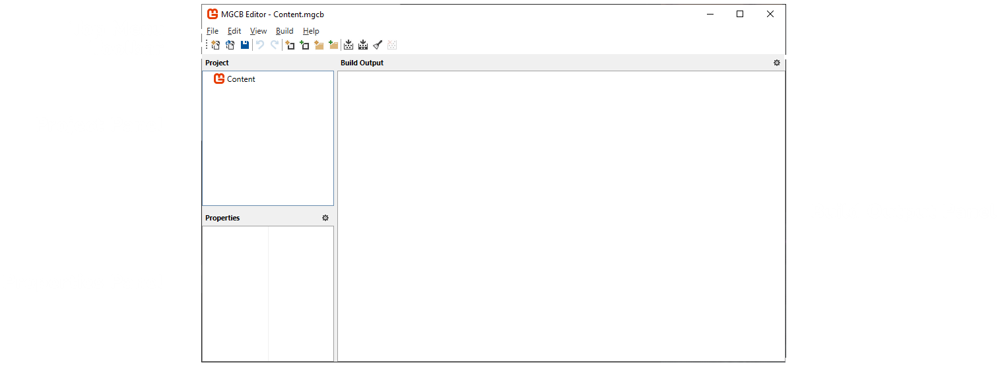

# Chapter 3: Hello World - A Crash Course in MonoGame
When learning a new programming language, tutorials will often start with some form of the "Hello World" program.  For example, a classic Hello World program in C# would look something like this

```cs
using System;

namespace HelloWorldApplication
{
    public class Program
    {
        public static void Main(string[] args)
        {
            Console.WriteLine("Hello World");
        }
    }
}
```

The entire point of the Hello World program is to introduce some usage of the language in as minimal an example as possible.  For game development, there are many "Hello World" style games that could be made as a simple introduction.  For this tutorial, we're going to use one of the classic games, Snake, as our Hello World.  We'll create a simple prototype in this crash course to get started and then in later chapters start to expand on the game and introduce new concepts to better familiarize you with game development in MonoGame.

## MonoGame Snake Game
The Snake game we're going to create is by itself a very simple and straightforward game.  This is because the goal of this tutorial isn't to teach you to create a Snake game, but to teach you game development with MonoGame.  By creating a Snake game, we'll cover the following topics

1. Creating a new project
2. Creating assets such as graphics, audio, and text
3. Loading the assets using the Content Pipeline
4. Setting up the program structure
5. Updating the game by handling input, checking for collision, and tracking score
6. Rendering the game

When we are finished with creating this initial prototype, you should be familiar enough with MonoGame to begin creating your own projects.


## Creating the Project
To create a new project.  Follow the instructions below depending on if you are using Visual Studio 2022 or VSCode

### Visual Studio 2022
If you are using Visual Studio 2022, to create a new project, first launch the Visual Studio 2022 application.  This will open the initial launch window.  On the the, click the **Create New Project** button.  Next, in the **Project Type** dro-down, choose **MonoGame** to filter the templates to only show the MonoGame templates.  In the list of MonoGame templates shown, choose the **MonoGame Cross-Platform Desktop Application** project template and click the **Next** button.  You'll now be prompted to enter a name for the project and a location to save it.  For the name, we're going to enter `MonoGameSnake`.  As for the location, you can choose where you would like it to be saved.  When finished, click the **Create** button to have the project created based on the template and opened automatically in Visual Studio 2022.


**Figure 3-1:** *A new MonoGame project after being created in Visual Studio 2022.*

### Visual Studio Code
If instead you are using VSCode, to create a new project, first launch the VSCode application.  In VSCode, the vertical bar of icons on the left is called the **Activity Bar**, and the first icon is for the **Explorer** panel.  If the **Explorer** panel is not already expanded, click this button to expand it.  Inside the **Explorer** panel is a button labeled **Create .NET Project**.  This button is not here by default, it is available because we installed the C# Dev Kit extension.  Click this button, which will open up a prompt at the top center of the VSCode window asking which project template to use.  Type **MonoGame** in the **Search for templates** box to filter the templates to only show the MonoGame templates, then select the **MonoGame Cross-Platform Desktop Application** template.  After choosing this, a dialog box will open asking you to select the location to save the project at, you can choose whatever location you would like.  Once the location is chosen, you will be prompted to enter a name for the project.  We're going to call the project `MonoGameSnake`, so enter that.  Finally, a last prompt will be shown with an option to **Create project**.  Click this option to have the project created based on the template and opened automatically in VSCode


**Figure 3-2:** *A new MonoGame project after being created in Visual Studio Code.*

### Running The Game For The First Time
Congratulations, you've just created your very first MonoGame project above.  We'll cover more of what each of these files are in depth later, instead let's run our project as is and see the results. You can press the `F5` key on your keyboard to run the application in debug mode regardless of you are using Visual Studio 2022 or VSCode.

> [!TIP]
> - In Visual Studio 2022, you can also run the project by clicking the run button in the tool bar at the top, or by selecting **Debug > Start Debugging* from the top menu
> - In VSCode, you can also run the project by opening the **Solution Explorer** panel on the left, then right-clicking the project and selecting **Debug > Start New Instance**, or alternatively selecting **Run > Start Debugging** from the top menu.

Be amazed, the default MonoGame cornflower blue game window


**Figure 3-3:** *The default MonoGame cornflower blue game window.*

While there isn't much happening here visually, there is a lot going on behind the scenes that the MonoGame framework is handling for you.  When you ran the application, the game initialization started which initializes the graphics device and creates the game window.  It's also running the main game loop over and over to render the cornflower blue background at 60 frames per second.  Additionally, it is also managing polling input from the keyboard, mouse, and any connected gamepads for the game window.  You can test this yourself by pressed the `Esc` key on your keyboard and the game will exit.

If you were to set all of this up manually, it could take hours of research and thousands of lines of code written just to get the window rendering and input polling.  Instead, we can take advantage of this base starting point that MonoGame offers use to get started creating our game without having to worry about the lower level implementations like this.

> [!NOTE]
> Above we mentioned the **main game loop** running to render the game at 60fps.  Game applications work differently than a traditional desktop application like your web browser.  Desktop applications are event based, meaning once loaded, they do not do much at all while waiting for input from the user, and then it responds to that input event.  In games, things are always happening such as objects moving around like the player or particles.  To handle this, games implement a loop structure that runs continuously, first calling the Update method and then the Draw method, until it has been told to exit.

Next we'll load some graphical assets and rendering them to the screen.  If you still have the game window open, you can close it now by pressing `Esc` on your keyboard or clicking the [x] in the window title bar.

## Loading Textures
Textures are the graphical assets in our game that get rendered.  Textures, as well as most other content types in general, can be created or loaded in MonoGame in various ways.  For instance, you can load a texture directly from a file

```cs
Texture2D texture = Texture2D.FromFile("image.png");
```

Or you can create a texture directly from code

```cs
Texture2D texture = new Texture2D(GraphicsDevice, 1, 1);
texture.SetData<Color>(new Color[] { Color.White });
```

However, MonoGame also offers the **Content Pipeline** that we can use to maintain and load all of a game's content, including textures.  Using the **Content Pipeline** has the advantage that it will compile our assets into a format that is more optimized for the platform we are targeting for the game.  We'll go in more detail about the **Content Pipeline** and the advantages of using it in [{TODO Add Chapter Link Text}]({TODO Add Chapter Link}).  For now, we'll go through the process of adding image files that we can later load and render in the game.

To get started, first create a new directory called `Graphics` inside the **Content** directory in your game project.  Then, right-click on each of the square images below (Figure 3-4 and Figure 3-5) and save them in the **Graphics** directory you just created. Ensure they are named `snake.png` and `food.png`


**Figure 3-4:** *snake.png*


**Figure 3-5:** *food.png*

If saved correctly, your **Content** directory in your project should look similar to the following:


**Figure 3-6:** *snake.png and food.png files saved to the Content/Graphics directory in the game project*

Adding the images to the **Content** directory isn't enough though.  We now need to configure the content project file so that it knows to build these images.  The content project file is the **Content.mgcb** file located in the **Content** directory.  We can edit the file manually, but the amount of information needed to be added for each piece of content can be a lot depending on the asset type.  Instead, MonoGame provides the **MonoGame Content Builder Editor** (MGCB Editor), which is a tool we can use to edit the file with a visual editor.

To open the **MGCB Editor**
- **Visual Studio 2022**: Double-click the **Content.mgcb** file in the **Solution Explorer** panel.  This will launch the **MGCB Editor** with the **Content.mgcb** opened thanks to the MonoGame Visual Studio extension
- **Visual Studio Code**: VSCode does not have an official extension to automatically open the **MGCB Editor** by double-clicking the **Content.mgcb** file (though there are some third-party extension that offer this).  Instead, VSCode users will need to use the command line interface (CLI) commands to open it

    1. Open the terminal in VSCode by pressing `CTRL+~` or by clicking **Terminal > New Terminal** in the top menu.

    2. The **Terminal Panel** will open by default in the directory that is the root directory in the current workspace.  This will typically be the directory containing your `*.sln` file and project directory.  To use the CLI command, we need the terminal to be in the project directory so enter the following to change to the project directory
        ```sh
        cd ./MonoGameSnake
        ```

    3. Now that we are in the project directory, enter the following CLI command to open the **Content.mgcb** file in the **MGCB Editor**
        ```sh
        dotnet mgcb-editor ./Content/Content.mgcb
        ```


**Figure 3-7:** *The MonoGame Content Builder Editor (MGCB Editor).*

With the **MGCB Editor** now open, right-click on the **Content** node in the **Project Panel** on the left, then select **Add > Existing Folder**.  In the **Select Folder** dialog that opens, choose the **Graphics** folder we created and added the images too.  This will automatically add all files in that folder to our content project.  If you expand the **Graphics** node in the **MGCB Editor**, you can see both the **food.png** and **snake.png** files.


**Figure 3-8:** *The Graphics directory containing the food.png and snake.png files were added to the content project.*

If you click on either of the two image files in the **MGCB Editor**, you can view the properties in the **Properties Panel** at the bottom left.  Here you can see the configurations used by the content pipeline such as the build action, which importer and processor is used, and the configurations that can be adjusted for the processor.


**Figure 3-9:** *The properties panel in the MGCB Editor for the snake.png file.*

Generally leaving these properties on the default settings are optimal, though there are use cases for adjusting them depending on the asset.  Notice however that by default the **Build Action** is set to **Build**.  This means, when we build our game project, during the project build when the content pipeline runs, it will compile this texture asset into a `.xnb` file that we can then load in our game at runtime.

Once you've finished exploring the MGCB Editor, click the **Save** icon on the **Toolbar** to save the changes, then close the **MGCB Editor**.

> [!CAUTION]
> Ensure that after making changes in the **MGCB Editor** that you save your changes.  The editor does not autosave changes and will not prompt you to save when exiting if you haven't already saved.

Now that we have added the textures to the content project, we're ready to move over into code.

## Loading and Rendering

Textures, as well as most other content types in general, can be created or loaded in MonoGame in various ways.
Textures are the graphical assets in our game that we render.
