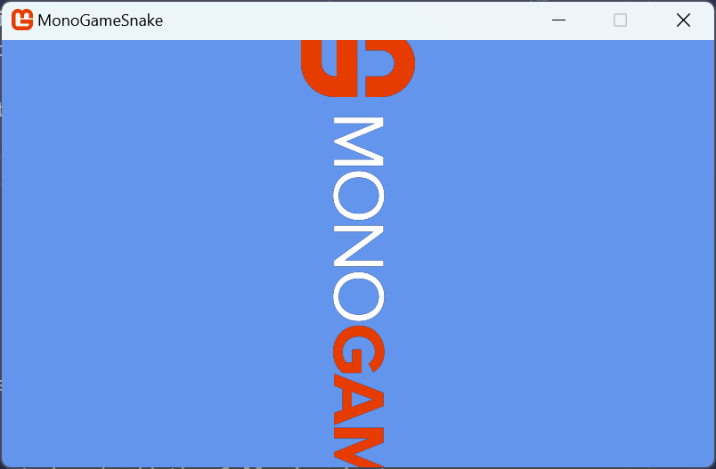

# Chapter 04: Working with Textures

---

Textures are images that you use in your game to represent the visual graphics to the player.  In order to use them, you need to either create the texture in code or load an existing one from a file and then draw the texture using the `SpriteBatch`.  

In this chapter, we'll cover loading a texture from file vs pre-processing it using the *content pipeline* and rendering textures.

## Loading a Texture
To load a texture in your game, you can either load it directly from its file (*.png*, *.jpg*, etc) or you can pre-process it using the *content pipeline* and load it using the `ContentManager`.

The *content pipeline* can be used for more than just pre-processing images as textures; you can use it to also load audio, fonts, effects, and 3D models, all of which will be covered in upcoming chapters.  It can also be customized to load various other types of file formats, however these extension are not covered in this tutorial.

Let's go over both methods of loading a texture, and then we can discuss the pros and cons of each one.  First, we need an image to load. Perform the following:

1. Locate the *Content* directory inside your game project directory
2. Create a new folder inside the *Content* directory called *images*.
3. Right-click the following image of the MonoGame logo and save it in the *Content/images* directory you just created with the filename *logo.png*

  
**Figure 4-1:** *MonoGame Horizontal Logo*.


### Loading From File
First we'll go over the process of loading the texture directly from the file at runtime.  Open the the *Game1.cs* file in your project and add the following instance member to the class where the `GraphicsDeviceManager` and `SpriteBatch` instance member variables are:

```cs
private Texture2D _logo;
```

This adds a new instance member to the class called `_logo` that is of type `Texture2D`.  `Texture2D` is the type used to store a reference to 2D image data in MonoGame.

Next, find the `LoadContent` method and add the following after the `_spriteBatch` is instantiated:

```cs
_logo = Texture2D.FromFile(GraphicsDevice, "Content/images/logo.png");
```

If you run the game now by press F5, the game will crash with the following exception:

```
Exception has occurred: CLR/System.IO.DirectoryNotFoundException
An unhandled exception of type 'System.IO.DirectoryNotFoundException' occurred in System.Private.CoreLib.dll: 'Could not find a part of the path 'C:\dev\MonoGameSnake\MonoGameSnake\bin\Debug\net8.0\Content\images\logo.png'.'
```

Your path may be different, but you'll get the same exception.  This is because even though we added the *logo.png* file, we need to tell the project to copy the file to the project output when a build occurs.  To do this, open the *MonoGameSnake.csproj* file and add the following before the closing `</Project>` element at the bottom:

```xml
<ItemGroup>
    <Content Include="Content\images\logo.png" CopyToOutputDirectory="PreserveNewest" />
</ItemGroup>
```

This will inform the build process that when the project builds, it should include the *Content\images\logo.png* file as part of the build and copy it to the build output directory.  

After adding the above, if you run the game now, it will launch with no exception, but with just the default cornflower blue screen.  The texture is being loaded from file, but we haven't told the game to draw it just yet.  We'll draw it in a moment, but for now, let's look at doing hte same process of loading the texture, but using the *content pipeline*.

### Loading From Content Pipeline
All content you would use in your game, such as graphics and audio, can be loaded in MonoGame through the *content pipeline*.  The *content pipeline* isn't one single thing, instead it's a set of tools and utilities that create a workflow provided by the MonoGame framework to:

1. Convert assets to an internal format that is optimized for the platform(s) your game is targeting.
2. Copy the compiled assets to your game project's build directory.
3. Load the compiled assets at runtime.

The *content pipeline* is not a requirement to use; assets can be loaded at runtime as we demonstrated above by loading the texture directly from the file.  Doing this, however, removes the benefits you get from pre-processing them.  For instance, when an image is loaded as a texture in your game, the data for that image has to be sent to the GPU and stored in memory there.  The GPU doesn't understand formats like PNG and JPEG, instead it has to be decompressed from those formats into raw bytes as a format the GPU understands.  Using the *content pipeline* to pre-process image files compiles them to a format that is understood by the GPU on the target platform(s).  For instance, on desktop platforms, an image can be compressed using [DXT compression](https://en.wikipedia.org/wiki/S3_Texture_Compression).  The GPU understands this compressed format without having to decompress it first, reducing the overall memory footprint.

To use the *content pipeline* to load our image, we first need to open the *MonoGame Content Builder Editor (MGCB Editor)*.  Since we are using VSCode for this tutorial, you should have installed the *MonoGame for VSCode* extension in [Chapter 02](./02-getting-started.md#installing-the-monogame-for-vscode-extension).  With this extension installed, when you have a code file open, you will see the MonoGame logo in the top-right of the code window like below:

  
**Figure 4-2:** *MonoGame for VSCode Extension Icon.*

Clicking this icon will open the MGCB Editor with the *Content.mgcb* file in the current project loaded.

> [!NOTE]
> If you did not install the *MonoGame for VSCode* extension or prefer to not use it, you can use the CLI commands to open the MGCB Editor instead.   Do do this:
> 
> 1. Open the terminal in VSCode pressing `` CTRL+` ``or choosing *View > Terminal* from the top menu
> 2. If the terminal directory is not in the project root directory (the one with the .csproj file), then use the `cd` command to navigate to that directory. 
> 3. Enter the command `dotnet mgcb-editor ./Content/Content.mgcb` to open the MGCB Editor using the *Content.mgcb* file from the project.

  
**Figure 4-3:** *MonoGame Content Builder Editor (MGCB Editor) Window.*

With th MGCB Editor now open, perform the following
1. Right-click on the *Content* node in the *Project* panel on the left.
2. Select *Add > New Folder*. 
3. Name the folder `images`.
4. Right-click on the new *images* folder
5. Select *Add > Existing Item*.
6. Navigate to the *icon.png* file and choose it

After adding an existing file, you will be prompted with a pop-up asking if you would like to *Copy the file* or *Add a link*.  Since the file is already in our *Content/images* directory, the copy option is greyed out, so choose the *Add a link* option, then click the *Add* button.  

  
**Figure 4-4:** *Add Existing File Popup.*

> [!CAUTION]
> When adding existing files in the future, the choice between copying the file and adding a link can make a big difference.  When you choose to copy the file, it makes a literal copy of the current file and puts that copy inside the Content directory in your project.  This means any changes to the original source file will not be reflected in the copy.  
>
> By adding as a link, it will instead reference the source file without making a copy.  This means changes made in the source file will be reflected, however the link is stored as a relative link, relative to the *Content.mgcb* file.  So if the source file moves, or you move the project, then you'll need to re-add the link.

After adding the *logo.png* file, you're project node should look similar to the following:

  
**Figure 4-5:** *Logo image added to the MGCB Editor.*

Save the changes by pressing `CTRL+S`, or by clicking the *Save* icon in the top tool bar, or by choosing *File > Save* from the top menu.  When you save the changes made, the MGCB Editor will write updates to the *Content.mgcb* file in your project to reflect the changes made.  After saving, you can close the MGCB Editor.

Now that we have added the logo image to our content project using the MGCB Editor, we need to make some small adjustments in our code to load the image using the *content pipeline*.  First, open the *MonoGameSnake.csproj* file and remove the `<ItemGroup>` section we added before.  We no longer need the project build itself to copy the file over for us.

Next, open the *Game1.cs* file and navigate to the `LoadContent` method.  Change the line of code where we loaded the texture from file to the following

```cs
_logo = Content.Load<Texture2D>("images/logo");
```

The change we made now uses the instance of the `ContentManager` object provided by the `Content` property in the `Game` class.  We call the `Load<T>` method, where `T` is the content type that we are loading.  The parameter we pass to it is the *asset name* which is a string representation of the path to the content to load, without any extensions.  The path used as the *asset name* is also relative to the `Content.RootDirectory` value, which was set to `Content` in the `Game1` constructor above.  This means the *asset name* of our logo image located at *Content/images/logo.png* is `images/logo`. 

If you run the game now, you'll get the same result as before when we loaded the texture from file.  The texture will be loaded in, without error. Before we move on to drawing the texture, let's briefly cover what is actually happening now that we are using the *content pipeline*.

- When you opened the MGCB Editor, the *Content.mgcb* file in your project was loaded inside it.  Then in the editor, you added the *logo.png* file.  When you saved the changes, these changes were written back to the *Content.mgcb* file.  

- When you told the project to run, it has to perform a build first.  One of the NuGet references in a MonoGame project is the *MonoGame.Content.Builder.Tasks* NuGet reference.  This adds build tasks that will perform the following:

  1. Compile the assets defined in the *Content.mgcb* file using the MonoGame Content Builder Tool (MGCB Tool) into *.xnb* files.  This compilation process performs the pre-processing of the content.

  2. Copy the compiled *.xnb* files to your game project's build directory
  
- Used the `ContentManager` at runtime to load the compiled asset.

The following image illustrates this workflow:

  
**Figure 4-6:** *MonoGame Content Pipeline Workflow.*

While doing all of this may have seemed like more work than just loading from file, it doesn't actually add more work on you as the developer.  

- You add the assets using the MGCB Editor instead of just copying them to you *Content* directory.  
- The *MonoGame.Content.Build.Tasks* reference builds and copies the assets to your game project build directory instead of you having to edit the *.csproj* file for each asset.
- You use the `ContentManager` to load the assets instead of a `FromFile` method call.

And for the same amount of steps, you also get the benefits mentioned before of the assets being pre-processed to an optimized format for the platform(s) your game is targeting.  Regardless of which method you use to load assets, the end result gives you a texture loaded and ready to be drawn. Let's move on now to drawing the texture.

## Drawing a Texture
As mentioned in [Chapter 03](./03-the-game1-file.md#looking-at-the-code), all draw logic should be done inside the `Draw` method. So locate the `Draw` method in the *Game1.cs* file and add the following after the `Clear` method call is made:

```cs
_spriteBatch.Begin();
_spriteBatch.Draw(_logo, Vector2.Zero, Color.White);
_spriteBatch.End();
```

These lines of code tell the `SpriteBatch` to draw the logo texture you loaded in the top-left corner of the game window.  Run the game and you should see something similar to the following:

  
**Figure 4-7:** *The MonoGame logo drawn to the game window.*

When drawing with MonoGame, the graphics device needs to be prepared and told that it is going to receive data to pass to the GPU to render.  When using the `SpriteBatch` for rendering, we do this by using the `SpriteBatch.Begin` method.  We can't use the `SpriteBatch.Draw` method without first using the `SpriteBatch.Begin` so the graphics device is set to a state ready to draw.

In the above example, we use the `SpriteBatch.Draw` method with the following parameters

| Parameter | Type | Description |
| --- | --- | --- |
| texture | `Texture2D` | The `Texture2D` to draw |
| position | `Vector2` | The xy-coordinate position to draw the texture at.  The origin point being the top-left corner of the image. |
| color | `Color` | The color mask (tint) to apply to the image drawn.  Specifying `Color.White` will render the texture with no tint. |

Try adjusting the position and color parameters to see how they can affect the image being drawn.

In MonoGame, the xy-coordinate space on the screen begins at (0, 0) in the top left corner, with the x-coordinate increasing to the right, and the y-coordinate increasing downward. Knowing this, let's try drawing the logo centered on the game window.  To do this, we would first need to know the xy-coordinate position of the center of the game window. We can get this information from the `Window.ClientBounds` property provided by the `Game` class.

`Window.ClientBounds` has both an `X` and `Y` property that represent the top-left coordinates of the game window (0, 0).  It also `Width` and `Height` properties that represent the width and height of the game window in pixels.  Knowing this, we only need to get half of the width and height to know the xy-coordinate position of the center of the game window.  Let's update our draw method to use this information, adjust the `Draw` method call to the following

```cs
_spriteBatch.Draw(_logo, new Vector2(Window.ClientBounds.Width, Window.ClientBounds.Height) * 0.5f, Color.White);
```

> [!TIP]
> In the example above, we multiply the `Vector2` created by `0.5f` to half the value instead of dividing it by `2.0f`.  If you're not used to seeing this, it might seem strange at first, but it's actually an optimization technique.  CPUs are able to perform multiplication operations much faster than division operations and reading `* 0.5f` is easily understood to be the same thing as `/ 2.0f` when reading.

We're now telling the position to be a half the width and height of the client bounds.  If we run the game now, the logo should be drawn at the center of the game window correct?  Well, not exactly.  If you run the game now, it will look similar to the following:


  
**Figure 4-8:** *Attempting to draw the MonoGame logo centered on the game window.*

So what happened here?  Recall from the table above that the *position* parameter is the xy-coordinate position to draw the texture at, with the texture's origin being the top-left corner of the texture.  This means, that the image will be drawn at that position starting with the top-left corner of the image.  So while we are drawing the image at the center of the game window, the image itself is not centered.  

One way to correct this is to subtract half the width and height of the logo image from the game window center position like so:

```cs
_spriteBatch.Draw(_logo, 
  new Vector2(
    (Window.ClientBounds.Width * 0.5f) - (_logo.Width * 0.5f),
    (Window.ClientBounds.Height * 0.5f) - (_logo.Height * 0.5f)),
  Color.White);
```

This offsets the position so that it correctly centers the image to the game window.  

  
**Figure 4-9:** *The MonoGame logo drawn centered on the game window.*

While this works, this may not be the best way to do it. Let's explore why.  The `SpriteBatch.Draw` method contains other overloads that accept more parameters.  Let's change the `SpriteBatch.Draw` method call to use the one with all parameters.  Adjust the code to the following:

```cs
_spriteBatch.Draw(_logo, 
  new Vector2(
    (Window.ClientBounds.Width * 0.5f) - (_logo.Width * 0.5f),
    (Window.ClientBounds.Height * 0.5f) - (_logo.Height * 0.5f)),
  null,
  Color.White,
  0.0f,
  Vector2.Zero,
  1.0f,
  SpriteEffects.None,
  0.0f);
```

Changing the `SpriteBatch.Draw` method call to this overload will render it the same as before, centered on the game window, only now we can see all of the parameters available.  The parameters for this `SpriteBatch.Draw` overload are

| Parameter | Type | Description |
| --- | --- | --- |
| texture | `Texture2D` | The `Texture2D` to draw |
| position | `Vector2` | The xy-coordinate position to draw the texture at.  The origin point being the top-left corner of the image. |
| sourceRectangle | `Rectangle` | An optional region within the texture to be rendered in order to draw only a portion of the texture.  Specifying `null` will render the entire texture. |
| color | `Color` | The color mask (tint) to apply to the image drawn.  Specifying `Color.White` will render the texture with no tint. |
| rotation | `float` | The amount of rotation, in radians, to apply to the texture when rendering.  Specifying `0.0f` will render the image with no rotation. |
| origin | `Vector2` | The xy-coordinate origin point of the texture when rendering.  This will affect the offset of the texture when rendered as well being the origin in which the texture is rotated around and scaled from. |
| scale | `float` | The amount to scale the image across the x- and y-axes. Specifying `1.0f` will render the image at its default size with no scaling. |
| effects | `SpriteEffects` | A `SpriteEffects` enum value to that specifies if the texture should be rendered flipped across the horizontal axis, the vertical axis, or both axes. |
| layerDepth | `float` | Specifies the depth at which the texture is rendered.  Textures with a higher layer depth value are drawn on top of those with a lower layer depth value.  **Note: This value will only apply when using `SpriteSortMode.FrontToBack` or `SpriteSortMode.BackToFront.  We'll cover this in a moment.** |

Let's adjust the rotation of the texture when it draws so that it is rotation 90°, making it vertical instead of horizontal.  Rotation, however, has to be specified in radians, not degrees.  We can use the built-in math library in MonoGame to convert from 90° to radians by calling `MathHelper.ToRadians`.  Update the code to the following

```cs
_spriteBatch.Draw(_logo, 
  new Vector2(
    (Window.ClientBounds.Width * 0.5f) - (_logo.Width * 0.5f),
    (Window.ClientBounds.Height * 0.5f) - (_logo.Height * 0.5f)),
  null,
  Color.White,
  MathHelper.ToRadians(90),
  Vector2.Zero,
  1.0f,
  SpriteEffects.None,
  0.0f);
```

The image should now be drawn centered on the game window and rotated so that it's vertical instead of horizontal right? Let's run it and find out.

  
**Figure 4-10:** *Attempting to draw the MonoGame logo rotated 90° and centered on the game window.*

What happened here?  We told it to draw it at the center position of the game window like before and to rotate it by 90°, which it did, but not exactly how we expected.  So why did this happen?  Recall from the parameters table above that the *origin* parameter specifies the point of origin in the texture where it is not only rendered from but also the point at which it's rotated from.  In the code sample above, we used `Vector2.Zero` as the origin, which is the default origin point, or the top-left corner of the image.  So when we told it to rotate 90°, it did so from the top-left corner of the image.  Let's fix the code so that the origin is now in the center of the image.

```cs
_spriteBatch.Draw(_logo, 
  new Vector2(Window.ClientBounds.Width, Window.ClientBounds.Height) * 0.5f,
  null,
  Color.White,
  MathHelper.ToRadians(90),
  new Vector2(_logo.Width, _logo.Height) * 0.5f,
  1.0f,
  SpriteEffects.None,
  0.0f);
```

In the code above, we have adjust the *origin* parameter to use the center point of the texture.  This will be the origin point at which it will now rotate from.  It is also the origin point at which it is rendered from, so we no longer need to subtract half the logo width and height from the *position* parameter. After making this change, if we run the game now, we'll see it drawn correctly rotated 90° and centered on the game window.

  
**Figure 4-11:** *The MonoGame logo drawn rotated 90° and centered on the game window.*

## Drawing Texture Regions
Above, we saw the full parameter list for drawing a texture using `SpriteBatch.Draw`.  One of those parameters was called *sourceRectangle*.  So far, we've just set this parameter to `null`, which specifies that the full texture should be rendered.  However, we can make use of the *sourceRectangle* parameter to specify a region within the texture itself to draw instead of drawing the full texture.
