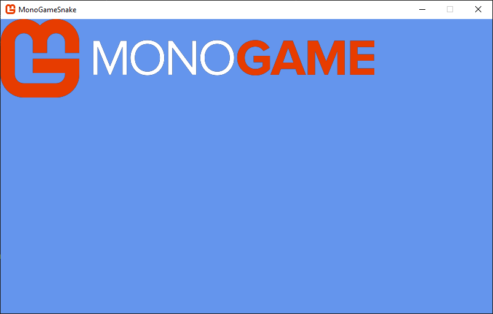

# Chapter 04: Working with Textures

---

Textures are images that you use in your game to represent the visual graphics to the player.  In order to use them, you need to either create the texture in code or load an existing one from a file and then draw the texture using the `SpriteBatch`.  

In this chapter, we'll cover both creating a texture and loading it from file, the benefits of pre-processing the image using the *content pipeline*, and finally rendering textures.

## Loading a Texture
To load a texture in your game, you can either load it directly from its file (*.png*, *.jpg*, etc) or you can pre-process it using the *content pipeline* and load it using the `ContentManager`.

The *content pipeline* can be used for more than just pre-processing images as textures; you can use it to also load audio, fonts, effects, and 3D models.  It can also be customized to load various other types of file formats, however these extension are not covered in this tutorial.

Let's go over both methods of loading a texture, and then we can discuss the pros and cons of each one.  First, we need an image to load. Perform the following:

1. Locate the *Content* directory inside your game project directory
2. Create a new folder inside the *Content* directory called *images*.
3. Right-click the following image of the MonoGame logo and save it in the *Content/images* directory you just created with the filename *logo.png*

  
**Figure 4-1:** *MonoGame Horizontal Logo*.


Next, open the *Game1.cs* file in your project and add the following instance member to the class where the `GraphicsDeviceManager` and `SpriteBatch` instance member variables are:

```cs
private Texture2D _logo;
```

This adds a new instance member to the class called `_logo` that is of type `Texture2D`.  `Texture2D` is the type used to store a reference to 2D image data in MonoGame.

Next, we'll load a texture directly from file. Find the `LoadContent` method and add the following after the `_spriteBatch` is instantiated:

```cs
_logo = Texture2D.FromFile(GraphicsDevice, "Content/images/logo.png");
```

If you run the game now by press F5, the game will crash with the following exception:

```
Exception has occurred: CLR/System.IO.DirectoryNotFoundException
An unhandled exception of type 'System.IO.DirectoryNotFoundException' occurred in System.Private.CoreLib.dll: 'Could not find a part of the path 'C:\dev\MonoGameSnake\MonoGameSnake\bin\Debug\net8.0\Content\images\logo.png'.'
```

Your path may be different, but you'll get the same exception.  This is because even though we added the *logo.png* file, we need to tell the project to copy the file to the project output when a build occurs.  Ideally, we would want it to copy all assets that we're going to add over time in one go.  To do that, open the *MonoGameSnake.csproj* file and add the following before the closing `</Project>` element at the bottom

```xml
<ItemGroup>
    <Content Include="Content\**\*"
             Exclude="Content\bin\**\*;Content\obj\**\*;Content\**\*.mgcb">
        <CopyToOutputDirectory>PreserveNewest</CopyToOutputDirectory>
    </Content>
</ItemGroup>
```

This will tell the project to copy all files inside the *Content* directory of the project to the build output, but exclude the *Content\bin* and *Content\obj* directories, as well as the *Content.mgcb* file since these are not asset files.  After adding the above, if you run the game now, it will launch with no exception, but with just the default cornflower blue screen.  This is because we haven't told the game to draw the texture yet.

Locate the `Draw` method and add the following after the `Clear` call is made:

```cs
_spriteBatch.Begin();
_spriteBatch.Draw(_logo, Vector2.Zero, Color.White);
_spriteBatch.End();
```

These lines of code tell the `SpriteBatch` to draw the logo texture you loaded in the top-left corner of the game window.  Run the game and you should see something similar to the following:

  
**Figure 4-1:** *The MonoGame logo drawn to the game window.*


Notice, however, that the edges of the image has artifacts, particularly noticeable around the MonoGame fist bump logo. 


## Creating a Texture In Code
One method to get a texture in your game is to create it manually in code.  This is not something you would do often, but it's still beneficial to learn and understand the process and why it can be useful.

First, open the *Game1.cs* file in the project you created and add the following instance member field after the `SpriteBatch` declaration:

```cs
private Texture2D _pixel;
```

This adds a new instance member to the class call `_pixel` that is of the type `Texture2D`.  `Texture2D` is the type used to store 2D image data in your game.  

Next, find the `LoadContent` method and add the following after the `_spriteBatch` is initialized:

```cs
_pixel = new Texture2D(GraphicsDevice, 1, 1);
_pixel.SetData(new Color[] { Color.White });
```

The first line here is instantiating the `_pixel` as a new instance of the `Texture2D` class.  To do this, the `Texture2D` constructor requires that we pass it the `GraphicsDevice` object, followed by the `width` and then the `height` of the texture being created.  In this case, we are creating a simple 1x1 texture, hence the name `_pixel`.

The second line is where we are injecting the actual color data into the texture.  While we have to supply it with an array of `Color` values, since this is a 1x1 texture, there is only one pixel color value to set in the texture, and we set it to `Color.White`.  The order of the color values supplied in the array start at the top-left most pixel in the texture, going left-to-right, top-to-bottom.  For instance, if we had wanted this to be a 4x4 texture with the top-left pixel red, the top-right pixel green, the bottom-left pixel blue, and the bottom right-pixel white, we could have done the following (this is an example, do not add this to your code):

```cs
Color[] data = new Color[]
{
    Color.Red, Color.Green,
    Color.Blue, Color.White
}
_square.SetData(data);
```

When the `SetData` method is executed, the color data has to be transferred from the CPU to the Video Random Access Memory (VRAM) on the GPU, which can be a slow operation depending on how much data is being sent.  This is why it's generally not a good practice to create textures this way, but there are valid use cases, which we'll explore shortly.

For now, let's draw our pixel to the screen.  All drawing in MonoGame should be done inside the `Draw` method, so locate that and add the following lines after the `Clear` method call:

```cs
_spriteBatch.Begin();
_spriteBatch.Draw(_pixel, Vector2.Zero, Color.White);
_spriteBatch.End();
```


All content you would use in your game, such as graphics and audio, can be loaded in MonoGame through the *content pipeline*.  The *content pipeline* isn't one single thing, instead it's a set of tools and utilities provided by the MonoGame framework to:

1. Convert assets to an internal format that is optimized for the platform(s) your game is targeting.
2. Copy the compiled assets to your game project's build folder.
3. Load the compiled assets at runtime.

The *content pipeline* is not a requirement to use; assets can be loaded at runtime in your game directly from their raw file format.  Doing this, however, removes the benefits you get from pre-processing them.  For instance, when an image is loaded as a texture in your game, the data for that image has to be sent to the GPU and stored in memory there.  The GPU doesn't understand formats like PNG and JPEG, instead it has to be decompressed from those formats into raw bytes as a format the GPU understands.  Using the *content pipeline* to pre-process image files compiles them to a format that is understood by the GPU on the target platform(s).  For instance, on a desktop platform, an image can be compressed using DXT compression](https://en.wikipedia.org/wiki/S3_Texture_Compression), as the GPU understands this compressed format without having to decompress it first, reducing the overall memory footprint.

Enough talk already, let's actually load some textures and see it in action.

## Adding a Texture


