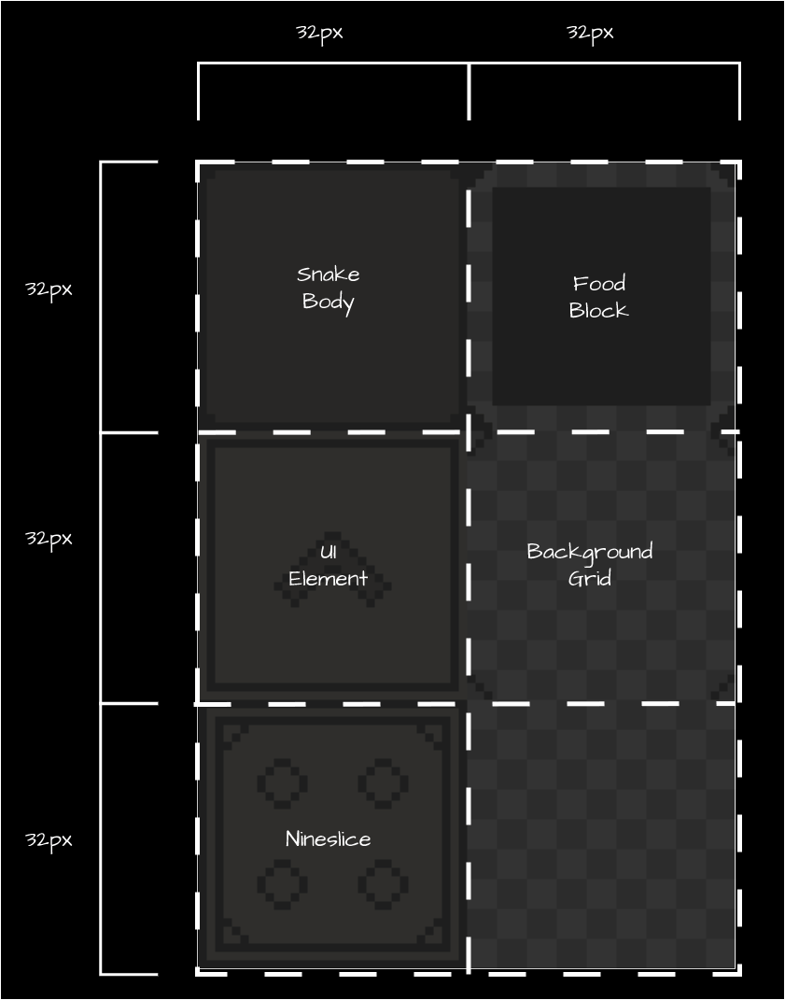
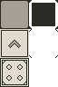

# Chapter 05: Texture Atlas

In this chapter, we'll learn about texture atlases, an optimization technique for game rendering. Building on the source rectangle concept from [Chapter 04](04-working-with-textures.md#drawing-texture-regions), we'll create a class to represents a Texture Atlas that will help us manage sprites more efficiently and improve our game's performance.

When rendering graphics in MonoGame using `SpriteBatch`, the goal is to minimize state changes by batching similar draw calls together. While putting all your draw calls between `SpriteBatch.Begin()` and `SpriteBatch.End()` is important, another factor to consider is *texture swapping*.

Every time `SpriteBatch.Draw()` is called with a different texture than the previous call, MonoGame must perform a texture swap on the GPU - an expensive operation that can impact performance. Let's examine this using a simple Pong game example:

```cs
private Texture2D _ball;
private Texture2D _paddle;
private Vector2 _leftPaddlePosition;
private Vector2 _rightPaddlePosition;
private Vector2 _ballPosition;

protected override void Draw(GameTime gameTime)
{
    GraphicsDevice.Clear(Color.CornflowerBlue);

    _spriteBatch.Begin();

    // First draw call - initial texture bind
    _spriteBatch.Draw(_paddle, _leftPaddlePosition, Color.White);

    // Second draw call - requires texture swap to ball
    _spriteBatch.Draw(_ball, _ballPosition, Color.White);

    // Third draw call - requires texture swap back to paddle
    _spriteBatch.Draw(_paddle, _rightPaddlePosition, Color.White);

    _spriteBatch.End();
}
```

Let's break down what happens in the GPU during these draw calls:

1. First paddle draw: GPU binds the paddle texture
2. Ball draw: GPU must unbind paddle texture and bind ball texture (Texture Swap #1)
3. Second paddle draw: GPU must unbind ball texture and rebind paddle texture (Texture Swap #2)

These texture swaps, while negligible in our simple Pong example, can become a performance issue in a full game where you might be drawing hundreds or thousands of sprites per frame.

You might think we could optimize this by reordering our draw calls to minimize texture swaps:

```cs
// Optimized draw order - only one texture swap needed
_spriteBatch.Draw(_paddle, _leftPaddlePosition, Color.White);
_spriteBatch.Draw(_paddle, _rightPaddlePosition, Color.White);
_spriteBatch.Draw(_ball, _ballPosition, Color.White);
```

While this reduces texture swaps from two to one in our example, it's not a scalable solution. In a real game with dozens of different textures and complex draw orders (think layered sprites, UI elements, particles, etc.), managing draw order by texture becomes impractical and can conflict with desired visual layering.


A better solution to this is to use a *texture atlas*.

## What is a Texture Atlas

A texture atlas (also known as a sprite sheet) is a large image file that contains multiple smaller images packed together. Instead of loading separate textures for each game element, you load the single texture file with all the images combined like a scrapbook where all your photos are arranged on the same page.

In the Pong example above, imagine taking the paddle and ball image and combining them into a single image file like in Figure 5-1 below:

<figure><figcaption><p><strong>Figure 5-1: Pong Texture Atlas Example.</strong></p></figcaption></figure>

Now when we draw these images, we would be using the same texture and just specify the source rectangles for the paddle or ball when needed, completely eliminating texture swaps.

```cs
private Texture2D _textureAtlas;
private Rectangle _paddleSourceRect;
private Rectangle _ballSourceRect;

protected override void LoadContent()
{
    _textureAtlas = Content.Load<Texture2D>("pong-atlas");
    _paddleSourceRect = new Rectangle(0, 0, 32, 32);
    _ballSourceRect = new Rectangle(32, 0, 32, 32);
}

protected override void Draw(GameTime gameTime)
{
    GraphicsDevice.Clear(Color.CornflowerBlue);

    _spriteBatch.Begin();

    //  All draw calls use the same texture, so there is no texture swapping!
    _spriteBatch.Draw(_textureAtlas, _leftPaddlePosition, _paddleSourceRect, Color.White);
    _spriteBatch.Draw(_textureAtlas, _rightPaddlePosition, _paddleSourceRect, Color.White);
    _spriteBatch.Draw(_textureAtlas, _ballPosition, _ballSourceRect, Color.White);
    _spriteBatch.End();
}

```

## The `Sprite` class
In the example above, we applied the concept of using a source rectangle to define a single image to be drawn from a source texture.  In a 2D game, we can think of each of these images we draw with the `SpriteBatch.Draw` method as a *sprite*.  Even though they all use the same source `Texture2D` as a texture atlas, each sprite will have different parameters to use, like the source rectangle, and other parameters such as *rotation*, *scale*, and *origin*.

Instead of creating ton of variables to track all of this information, we can apply object-oriented programming design and create a `Sprite` class that represents each sprite.  The properties of a `Sprite` should match the parameters used in the `SpriteBatch.Draw` call so they can be used when rendering the sprite.  The following tables lists the field, properties, and methods the `Sprite` class well created.

| Field              | Type        | Description                                        |
| ------------------ | ----------- | -------------------------------------------------- |
| `_texture`         | `Texture2D` | The source texture used when rendering the sprite. |
| `_sourceRectangle` | `Rectangle` | The boundary within the source texture to render.  |

| Property     | Type            | Description                                                                                                          |
| ------------ | --------------- | -------------------------------------------------------------------------------------------------------------------- |
| `Color`      | `Color`         | The color tint to apply when rendering the sprite.                                                                   |
| `Rotation`   | `float`         | The amount of rotation, in radians, to apply when rendering the sprite.                                              |
| `Scale`      | `Vector2`       | The scale factor to apply to the x- and y-axes when rendering the sprite.                                            |
| `Origin`     | `Vector2`       | The xy-coordinate origin point, relative to the top-left corner, of the sprite.                                      |
| `Effects`    | `SpriteEffects` | The `SpriteEffects` value to apply when rendering to flip the sprite horizontally, vertically, or both.              |
| `LayerDepth` | `float`         | The depth at which the sprite is rendered.                                                                           |
| `Width`      | `float`         | The width of the sprite, calculated by multiplying the width of the `_sourceRectangle` by the x-axis scale factor.   |
| `Height`     | `float`         | The height of the sprite, calculated by multiplying the heigh tof the `_sourceRectangle` by the y-axis scale factor. |

| Methods                        | Return Type | Description                                                                                              |
| ------------------------------ | ----------- | -------------------------------------------------------------------------------------------------------- |
| `Sprite(Texture2D, Rectangle)` | `Sprite`    | Creates a new instance of the `Sprite` class using source texture and source rectangle parameters given. |
| `Draw(SpriteBatch, Vector2)`   | `void`      | Draws the sprite using the `SpriteBatch` provided at the specified position.                             |

Knowing how to define our `Sprite` class, let's add it to our game project.  Add a new file named *Sprite.cs*, then replace the contents of the file with the following

```cs
using System.Diagnostics;
using Microsoft.Xna.Framework;
using Microsoft.Xna.Framework.Graphics;

namespace MonoGameSnake;

public class Sprite
{
    //  The reference to the source texture used when rendering this sprite.
    private readonly Texture2D _texture;

    //  The source rectangle that represents the region in the source texture to use when rendering this sprite.
    private readonly Rectangle _sourceRectangle;

    /// <summary>
    /// Gets or Sets the color tint to apply when rendering this sprite.
    /// Default value is Color.White.
    /// </summary>
    public Color Color { get; set; } = Color.White;

    /// <summary>
    /// Gets or Sets the amount of rotation, in radians, to apply when rendering this sprite.
    /// Sprite is rotated around the Origin.
    /// Default value is 0.0f
    /// </summary>
    public float Rotation { get; set; } = 0.0f;

    /// <summary>
    /// Gets or Sets the scale factor to apply to the x- and y-axes when rendering this sprite.
    /// Sprite is scaled from the Origin.
    /// Default value is Vector2.One.
    /// </summary>
    public Vector2 Scale { get; set; } = Vector2.One;

    /// <summary>
    /// Gets or Sets the xy-coordinate origin point, relative to the top-left corner, of this sprite.
    /// Default value is Vector2.Zero
    /// </summary>
    public Vector2 Origin { get; set; } = Vector2.Zero;

    /// <summary>
    /// Gets or Sets whether this sprite should be flipped horizontally, vertically, or both, when rendered.
    /// Default value is SpriteEffects.None.
    /// </summary>
    public SpriteEffects Effects { get; set; } = SpriteEffects.None;

    /// <summary>
    /// Gets or Sets the depth at which this sprite is rendered.
    /// Default value is 0.0f.
    /// </summary>
    public float LayerDepth { get; set; } = 0.0f;

    /// <summary>
    /// Gets the width of this sprite multiplied by the x-axis scale factor.
    /// </summary>
    public float Width => _sourceRectangle.Width * Scale.X;

    /// <summary>
    /// Gets the height of this sprite, multiplied by the y-axis scale factor.
    /// </summary>
    public float Height => _sourceRectangle.Height * Scale.Y;

    /// <summary>
    /// Creates a new Sprite instance using the source texture and source rectangle provided.
    /// </summary>
    /// <param name="texture">The source texture of the sprite.</param>
    /// <param name="sourceRectangle">The source rectangle to use when rendering the sprite.</param>
    public Sprite(Texture2D texture, Rectangle sourceRectangle)
    {
        Debug.Assert(texture is not null);
        Debug.Assert(!texture.IsDisposed);

        _texture = texture;
        _sourceRectangle = sourceRectangle;
    }

    /// <summary>
    /// Draws this sprite using the SpriteBatch given at the position specified.
    /// </summary>
    /// <param name="spriteBatch">The SpriteBatch to use when rendering this sprite.</param>
    /// <param name="position">The xy-coordinate position to render this sprite at.</param>
    public void Draw(SpriteBatch spriteBatch, Vector2 position)
    {
        spriteBatch.Draw(_texture, position, _sourceRectangle, Color, Rotation, Origin, Scale, Effects, LayerDepth);
    }
}
```

At the top of the `Sprite` class, there are two instance members defines; `_texture` and `_sourceRectangle`.  Just like with the `TextureAtlas` class, the `_texture` member holds a reference to the `Texture2D` that represents the texture atlas.  The `_sourceRectangle` member is the `Rectangle` value that defines the region within the `_texture` to use when the sprite is rendered.

Below the instance members are the properties of the `Sprite` class.  These properties are `Color`, `Rotation`, `Scale`, `Origin`, `Effects`, and `LayerDepth`, all of which mirror the parameter values that can be supplied to the `SpriteBatch.Draw` method when rendering the sprite.   Each of the properties are given a default value which mirrors the default value of the `SpriteBatch.Draw` parameter they are used for.

Two additional properties for the `Width` and `Height` of the `Sprite` also exist.  These dimensions are derived from the width and height of the source rectangle used by the `Sprite`, and multiplied by the `Scale` factor to give the accurate width and height of the `Sprite` when it's rendered.

Following the properties is the `Sprite` constructor.  Similar to the `TextureAtlas` here we specify that it requires a `Texture2D` parameter to be given and the texture given is checked to ensure that it is not null and was not previously disposed of using the `Debug.Assert` method calls.  The second parameter is the `Rectangle` value that defines the source rectangle within the texture to render.  Both of these are stored in their respective field members of the `Sprite` class.  

Finally, we have the `Draw` method.  This method is responsible for rendering the sprite.  It requires a `SpriteBatch` as parameter which will be the `SpriteBatch` instance used to render the sprite, and a `Vector2` value that represents the position to render the sprite at. Then the `SpriteBatch.Draw` method is executed using the `SpriteBatch` given, using the fields and properties of the `Sprite` as the parameters, to render it at the position specified.

## Creating a `Sprite` From the `TextureAtlas`
We now have a `TextureAtlas` class that represents a source texture with defined regions and a `Sprite` class that represents an image that uses one of the regions and the properties to use when rendering it.  All that's left is to combine the two so that we can tell the `TextureAtlas` a region and have it return back a `Sprite` that represents that region. Open up the *TextureAtlas.cs* class file and add the follow method to it at the bottom of the class:

```cs
/// <summary>
/// Creates a new Sprite instance from this texture atlas using the region specified.
/// </summary>
/// <param name="regionName">The name of the region.</param>
/// <returns>The Sprite created by this method.</returns>
public Sprite CreateSprite(string regionName)
{
    Debug.Assert(_regionLookup.ContainsKey(regionName));

    Rectangle region = _regionLookup[regionName];
    return new Sprite(_texture, region);
}
```

For this new `CreateSprite` method we only need to supply it with the name of the region to create the sprite from.  First, a check is made using `Debug.Assert` to ensure that the region has been defined so we can catch any slip ups in development.  Then we get the `Rectangle` value that represents that region from the `_regionLookup` dictionary and use the source `_texture` of the `TextureAtlas` and the region to create and return a new `Sprite` instance.

## Putting It All Together
Let's take the `TextureAtlas` and `Sprite` classes that we've created and put them to use for our game.  For our snake game, the texture atlas we're going to use is composed of the following images

- The image used to represent the snake body pieces.
- The image used to represent the food the snake eats.
- A repeatable image we can use to create the background grid the snake moves across.
- An image containing an arrow that will be a reusable UI element to represent directions by rotating it.
- A nineslice image used to create window and menu borders within the UI. We'll cover what a nineslice is later in this tutorial.

Each of the of the images in the texture atlas are 32px by 32px.  See Figure 5-2 below for a diagram of how it's all laid out.

<figure><figcaption><p><strong>Figure 5-2: Snake game texture atlas diagram.</strong></p></figcaption></figure>

To get started, first, right-click Figure 5-3 below, the texture atlas for our snake game, and save it in the *Content/images* directory int eh game project as *texture-atlas.png*.

<figure><figcaption><p><strong>Figure 5-3: Snake game texture atlas.</strong></p></figcaption></figure>

Next, add the image to your content project using the MGCB Editor like we did in [Chapter 04](04-working-with-textures.md#loading-from-content-pipeline). Be sure to put it inside the *images* folder node in the *Project* panel in the MGCB Editor.

Open the *Game1.cs* file in the project and add the following instance members just below where we added the `_logo` instance member field:

```cs
private TextureAtlas _textureAtlas;
private Sprite _bodySprite;
private Sprite _foodSprite;
```

Find the `LoadContent` method and add the following to the end of it after the logo is loaded:

```cs

```
