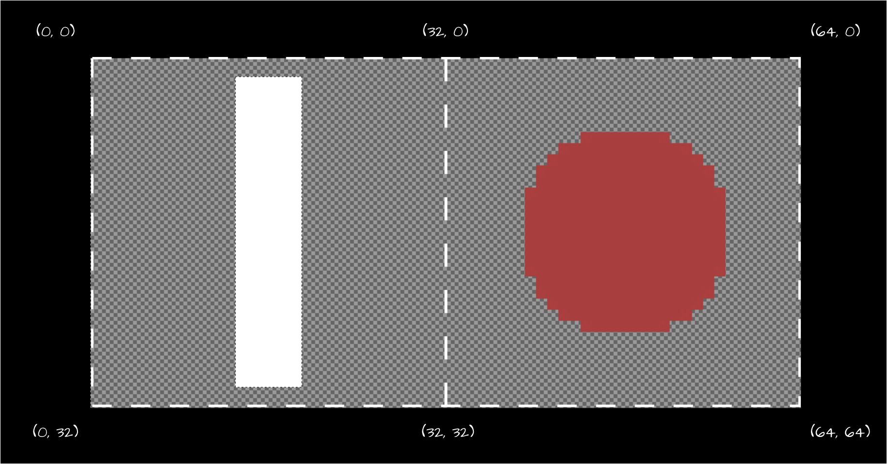

# Chapter 05: Texture Atlas

In this chapter, we'll learn about texture atlases, an optimization technique for game rendering. Building on the source rectangle concept from [Chapter 04](04-working-with-textures.md#drawing-texture-regions), we'll create a class to represents a Texture Atlas that will help us manage sprites more efficiently and improve our game's performance.

When rendering graphics in MonoGame using `SpriteBatch`, the goal is to minimize state changes by batching similar draw calls together. While putting all your draw calls between `SpriteBatch.Begin()` and `SpriteBatch.End()` is important, another factor to consider is *texture swapping*.

Every time `SpriteBatch.Draw()` is called with a different texture than the previous call, MonoGame must perform a texture swap on the GPU - an expensive operation that can impact performance. Let's examine this using a simple Pong game example:


```cs
private Texture2D _ball;
private Texture2D _paddle;
private Vector2 _leftPaddlePosition;
private Vector2 _rightPaddlePosition;
private Vector2 _ballPosition;

protected override void Draw(GameTime gameTime)
{
    GraphicsDevice.Clear(Color.CornflowerBlue);

    _spriteBatch.Begin();

    // First draw call - initial texture bind
    _spriteBatch.Draw(_paddle, _leftPaddlePosition, Color.White);

    // Second draw call - requires texture swap to ball
    _spriteBatch.Draw(_ball, _ballPosition, Color.White);

    // Third draw call - requires texture swap back to paddle
    _spriteBatch.Draw(_paddle, _rightPaddlePosition, Color.White);

    _spriteBatch.End();
}
```

Let's break down what happens in the GPU during these draw calls:

1. First paddle draw: GPU binds the paddle texture
2. Ball draw: GPU must unbind paddle texture and bind ball texture (Texture Swap #1)
3. Second paddle draw: GPU must unbind ball texture and rebind paddle texture (Texture Swap #2)

These texture swaps, while negligible in our simple Pong example, can become a performance issue in a full game where you might be drawing hundreds or thousands of sprites per frame.

You might think we could optimize this by reordering our draw calls to minimize texture swaps:

```cs
// Optimized draw order - only one texture swap needed
_spriteBatch.Draw(_paddle, _leftPaddlePosition, Color.White);
_spriteBatch.Draw(_paddle, _rightPaddlePosition, Color.White);
_spriteBatch.Draw(_ball, _ballPosition, Color.White);
```

While this reduces texture swaps from two to one in our example, it's not a scalable solution. In a real game with dozens of different textures and complex draw orders (think layered sprites, UI elements, particles, etc.), managing draw order by texture becomes impractical and can conflict with desired visual layering.


A better solution to this is to use a *texture atlas*.

## What is a Texture Atlas

A texture atlas (also known as a sprite sheet) is a large image file that contains multiple smaller images packed together. Instead of loading separate textures for each game element, you load the single texture file with all the images combined like a scrapbook where all your photos are arranged on the same page.

In the Pong example above, imagine taking the paddle and ball image and combining them into a single image file like in Figure 5-1 below:

<figure><figcaption><p><strong>Figure 5-1: Pong Texture Atlas Example.</strong></p></figcaption></figure>

Now when we draw these sprites, we would be using the same texture and just specify the source rectangles for the paddle or ball when needed, completely eliminating texture swaps.

```cs
private Texture2D _textureAtlas;
private Rectangle _paddleSourceRect;
private Rectangle _ballSourceRect;

protected override void LoadContent()
{
    _textureAtlas = Content.Load<Texture2D>("pong-atlas");
    _paddleSourceRect = new Rectangle(0, 0, 32, 32);
    _ballSourceRect = new Rectangle(32, 0, 32, 32);
}

protected override void Draw(GameTime gameTime)
{
    GraphicsDevice.Clear(Color.CornflowerBlue);

    _spriteBatch.Begin();

    //  All draw calls use the same texture, so there is no texture swapping!
    _spriteBatch.Draw(_textureAtlas, _leftPaddlePosition, _paddleSourceRect, Color.White);
    _spriteBatch.Draw(_textureAtlas, _rightPaddlePosition, _paddleSourceRect, Color.White);
    _spriteBatch.Draw(_textureAtlas, _ballPosition, _ballSourceRect, Color.White);
    _spriteBatch.End();
}

```

Now when we draw these sprites, were using the same texture and just specifying the source rectangle of the texture to draw for the paddle or ball, completely eliminating texture swaps.
