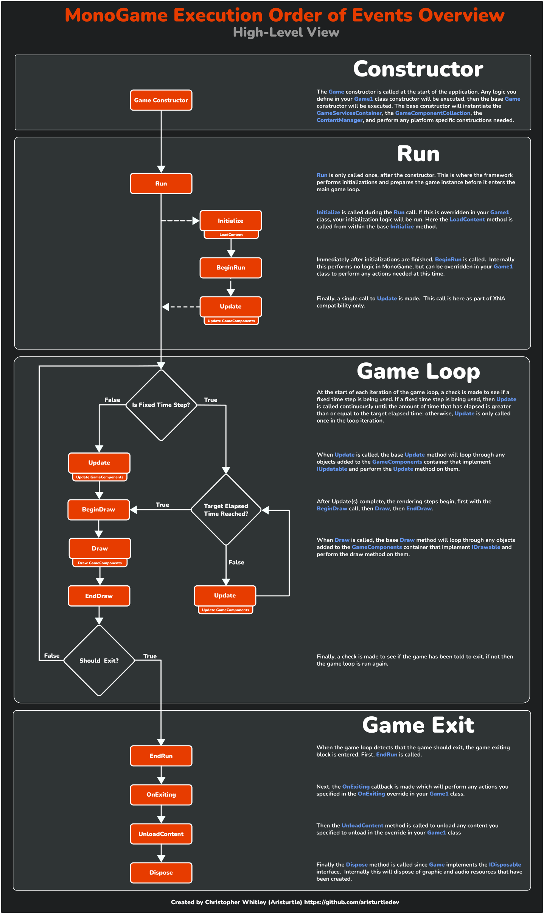

# Chapter 5: The `Game` Class

- [Instance Members](#instance-members)
- [The `Game1()` Constructor](#the-game1-constructor)
- [The `Initialize()` Method](#the-initialize-method)
- [The `LoadContent()` Method](#the-loadcontent-method)
- [The Game Loop](#the-game-loop)
  - [The `Update()` Method](#the-update-method)
  - [The `Draw()` Method](#the-draw-method)
- [Additional Methods](#additional-methods)
- [Additional Properties](#additional-properties)
- [Order of Execution](#order-of-execution)
  - [Constructor](#constructor)
  - [Run](#run)
  - [Game Loop](#game-loop)
  - [Game Exit](#game-exit)

---


At the core of every MonoGame project is the implementation of the `Game` class.  In a newly created project, this is provided in the *Game1.cs* file which contains the `Game1` class that derives from the `Game` class. 

```cs
using Microsoft.Xna.Framework;
using Microsoft.Xna.Framework.Graphics;
using Microsoft.Xna.Framework.Input;

namespace MyGame
{
    public class Game1 : Game
    {
        private GraphicsDeviceManager _graphics;
        private SpriteBatch _spriteBatch;

        public Game1()
        {
            _graphics = new GraphicsDeviceManager(this);
            Content.RootDirectory = "Content";
            IsMouseVisible = true;
        }

        protected override void Initialize()
        {
            base.Initialize();
        }

        protected override void LoadContent()
        {
            _spriteBatch = new SpriteBatch(GraphicsDevice);
        }

        protected override void Update(GameTime gameTime)
        {
            if (GamePad.GetState(PlayerIndex.One).Buttons.Back == ButtonState.Pressed || Keyboard.GetState().IsKeyDown(Keys.Escape))
                Exit();

            base.Update(gameTime);
        }

        protected override void Draw(GameTime gameTime)
        {
            GraphicsDevice.Clear(Color.CornflowerBlue);

            base.Draw(gameTime);
        }
    }
}
```

This class is responsible for initializing the graphics services used by our game, initializing the game itself, loading any content assets from disk, and maintaining the *game loop*.  We implement the logic for our game by overriding the `protected` methods of the base `Game` class. There are also various properties provided by the `Game` class to give us access to the graphics device, window settings, and content manager for our game. 

Let's break this file down into individual sections to better understand it.

> [!NOTE] 
> You may be wondering why the types within MonoGame exist with `Microsoft.Xna.Framework.*` namespaces.  If you recall from the [Introduction to MonoGame](01_introduction_to_monogame.md), MonoGame is an open source reimplementation of Microsoft's XNA Framework.  To ensure compatibility with XNA projects, MonoGame implements the same namespaces that XNA did.

## Instance Members
Starting at the top of the `Game1` class, the first thing we see are the following two instance members:

```cs
private GraphicsDeviceManager _graphics;
private SpriteBatch _spriteBatch;
```

Both of these types, the `GraphicsDeviceManager` and `SpriteBatch` will be covered in more detail in a later article.  For now, you only need to understand that the `GraphicsDeviceManager` is responsible for initialization and the configuration of the graphics device and render settings, while the `SpriteBatch` is used to perform 2D graphics rendering.

## The `Game1()` Constructor
Next is the `Game1` constructor.  This responsible for creating a new instance of the `Game1` class when `new Game1()` is called.


```cs
public Game1()
{
    _graphics = new GraphicsDeviceManager(this);
    Content.RootDirectory = "Content";
    IsMouseVisible = true;
}
```

When this executes, first, the `GraphicsDeviceManager` is created and stored int eh `_graphics` member variable.  Next, the `RootDirectory` property of the `Content` object is st to the *Content* directory.  The `Content` object is a `ContentManager` type and is provided to us through the `Game` class inheritance.  Setting the root directory tells the content manager to use that directory as the root directory when resolving relative paths during content loading.  Finally, `IsMouseVisible` is set to `tru` so that the mouse cursor is visible when moved over the game window.  This is another property that's provided through the inheritance of the `Game` class.

## The `Initialize()` Method
After the constructor we can see the `Initialize()` method override.  This method is where we can do any initializations for our game.  This method will be called only once by the MonoGame framework and *after* the constructor is called.  

```cs
protected override void Initialize()
{
    base.Initialize();
}
```

You might be wondering why we have an `Initialize` method instead of performing all of our initializations within the constructor.  It's [advised to not call overridable methods from within a constructor](https://learn.microsoft.com/en-us/dotnet/fundamentals/code-analysis/quality-rules/ca2214) as this can lead to unexpected states in object construction when called.  Additionally, the constructor itself is initially called in the *Program.cs* file when a new instance of the class is created.  When this is called, the base constructor will also be called for the `Game` class, which instantiates properties and services that maybe needed later for our game initializations.  

One important thing to note about this method is the call to `base.Initialize()`.  Internally, when this call is made, the last thing it does before returning back is call the `LoadContent()` method.  This means that if anything you are initializing requires assets loaded from the `LoadContent()` method, it should be done *after* the `base.Initialize()` call and not *before* it.

## The `LoadContent()` Method
The `LoadContent()` method is used to load any assets that are used by our game.  This method will only be called once by the MonoGame framework and it is *during* the call to `base.Initialize()` from the `Initialize()` method.

```cs
protected override void LoadContent()
{
    _spriteBatch = new SpriteBatch(GraphicsDevice);
}
```

The default implementation provided in the template instantiates a new instance of the `SpriteBatch` and stores it in the `_spriteBatch` instance member.  When creating a new `SpriteBatch` instance, it requires that an instance of the `GraphicsDevice` object type be given to it.  Here we pass in the one that is provided as a property from the `Game` class inheritance. 

Content loading and managing assets will be discussed in [{TODO ADD CHAPTER}]({TODO ADD CHAPTER LINK}), for now, it's only important to know that his is where you can load your game assets at.

## The Game Loop
After the initializations and content loading have finished, the framework will enter into the *game loop*.  The *game loop* is where hte framework will call `Update()` and then `Draw()` over and over to run the actual game until it's told to exit.  

### The `Update()` Method
The `Update()` method is where we perform all of the game logic; input handling, physics, collisions, etc.  The method takes in a single `GameTime` parameter that provides a snapshot of the timing values for the game during the current *game loop* cycle.

```cs
protected override void Update(GameTime gameTime)
{
    if (GamePad.GetState(PlayerIndex.One).Buttons.Back == ButtonState.Pressed || Keyboard.GetState().IsKeyDown(Keys.Escape))
        Exit();

    base.Update(gameTime);
}
```

The default implementation provided in the template polls the state of the game pad and keyboard inputs to see if the *Back* button or the *Esc* key was pressed, and if so, tells the game to exit by calling the `Exit()` method.  After this, a call is made to `base.Update()`.  The base update method is responsible calling the `Update()` method any `IUpdatable` objects that have been added to the `GameComponent` collection of the `Game` class.

### The `Draw()` Method
The `Draw()` method is where all of the game logic for rendering occurs.  Just like with the `Update()` method, it takes a single `GameTime` object as a parameter that provides a snapshot of the timing values for the game during the current *game loop*.

```cs
protected override void Draw(GameTime gameTime)
{
    GraphicsDevice.Clear(Color.CornflowerBlue);

    base.Draw(gameTime);
}
```

The default implementation provided in the template just calls `GraphicsDevice.Clear(Color.CornflowerBlue)` which the back buffer to prepare it for rendering, then calls the `base.Draw()` method.  The base draw method is responsible for calling the `Draw()` method on any `IDrawable` object that have been added to the `GameComponent` collection of the `Game` class.

## Additional Methods
The above sections cover the virtual methods that are overridden in the default *Game1.cs* class file.  There are several other virtual methods provided by the `Game` class that can be overridden as well that are detailed below.

**Table 5-1:** *Virtual methods of the `Game` class that can be overridden in the `Game1` class.*  
| Method Signature       | Description                                                                                                                                                                                                                                                                       |
| ---------------------- | --------------------------------------------------------------------------------------------------------------------------------------------------------------------------------------------------------------------------------------------------------------------------------- |
| `void BeginRun()`      | Called automatically by the framework, immediately after `Initialize()` but before the first call to `Update(GameTime)`.                                                                                                                                                          |
| `void EndRun()`        | Called automatically by the framework, immediately after the game loop as been terminated before the application exits.                                                                                                                                                           |
| `void UnloadContent()` | Use this method to unload graphical resources loaded by the content manager. This method is called automatically when the game is exiting.                                                                                                                                        |
| `bool BeginDraw()`     | Called automatically by the framework, immediately before `Draw()` is called.  If this method returns `false` then `Draw()` will not be called.                                                                                                                                   |
| `void EndDraw()`       | Called automatically by the framework, immediately after `Draw()` is called and performs the logic to present the rendered frame to the game window.  **If this method is overridden, ensure that you call `base.EndDraw()` so that the internal render presentation is called.** |
| `void OnExiting()`     | Called automatically by the framework when it is detected that the game should be exited. The base method raises the `Exiting` event for the application.                                                                                                                         |
| `void OnActivated()`   | Called automatically by the framework whenever the game window gains focus.  The base method raises the `Activated` event.                                                                                                                                                        |
| `void OnDeactivated()` | Called automatically by the framework whenever the game window loses focus.  The base method raises the `Deactivated` event.                                                                                                                                                      |
| `void Dispose()`       | Called when the game instance is disposed of, performing any clean up of unmanaged resources used by the application.                                                                                                                                                             |


## Additional Properties
Along with the above methods, by deriving from the `Game` class, the `Game1` class has access to the properties it provides.

**Table 5-2:** *Properties of the `Game` class that are accessible in the `Game1` class through inheritance.*  

| Property Name       | Type                      | Description                                                                                                                                                                                                                                                                                                                                                                                                                                                                                                                                                                                                                  |
| ------------------- | ------------------------- | ---------------------------------------------------------------------------------------------------------------------------------------------------------------------------------------------------------------------------------------------------------------------------------------------------------------------------------------------------------------------------------------------------------------------------------------------------------------------------------------------------------------------------------------------------------------------------------------------------------------------------- |
| `Components`        | `GameComponentCollection` | A collection of game component objects that are automatically updated and/or rendered during the base calls to `Update()` and `Draw()` respectively. To add components to this collection, they should derive from either `IUpdatable` or `IDrawable`.                                                                                                                                                                                                                                                                                                                                                       |
| `Content`           | `ContentManager`          | The content manager used to load and manage the lifetime of assets for the game.                                                                                                                                                                                                                                                                                                                                                                                                                                                                                                                                             |
| `GraphicsDevice`    | `GraphicsDevice`          | Gets the graphics device used for rendering by this game.                                                                                                                                                                                                                                                                                                                                                                                                                                                                                                                                                                    |
| `InactiveSleepTime` | `TimeSpan`                | Gets or sets the time to sleep between frames when the game is not active. Must be a positive value. When the game window loses focus, the game loop will sleep for this duration between frames to reduce CPU usage.                                                                                                                                                                                                                                                                                                                                                                                                        |
| `IsActive`          | `bool`                    | Indicates if the game window currently has focus and is active.                                                                                                                                                                                                                                                                                                                                                                                                                                                                                                                                                              |
| `IsFixedTimeStep`   | `bool`                    | Determines whether the game uses a fixed or variable time step for updates. When true, the game attempts to update at a consistent rate specified by `TargetElapsedTime`. This can provide more predictable gameplay and physics simulations, especially on varying hardware. When false, the game updates as frequently as possible, which can provide smoother animation on high-performance systems but may lead to inconsistent behavior across different hardware.                                                                                                                                                      |
| `IsMouseVisible`    | `bool`                    | Gets or sets whether the mouse cursor is visible when it's over the game window.                                                                                                                                                                                                                                                                                                                                                                                                                                                                                                                                             |
| `LaunchParameters`  | `LaunchParameters`        | Gets the startup parameters for this game instance.                                                                                                                                                                                                                                                                                                                                                                                                                                                                                                                                                                          |
| `MaxElapsedTime`    | `TimeSpan`                | The maximum amount of time allowed to pass between updates. If the time since the last update exceeds this value, it will be clamped to this value. This prevents the game from trying to "catch up" with too many updates after a large gap in time (like a freeze or breakpoint). Must be positive and greater than or equal to `TargetElapsedTime`.                                                                                                                                                                                                                                                                       |
| `Services`          | `GameServiceContainer`    | Gets a container holding service providers attached to this game instance.                                                                                                                                                                                                                                                                                                                                                                                                                                                                                                                                                   |
| `TargetElapsedTime` | `TimeSpan`                | Specifies the desired time between frames when `IsFixedTimeStep` is true. This property sets the target update rate for the game. For example, setting it to 1/60th of a second targets 60 FPS. The game loop will attempt to maintain this update rate, potentially inserting small sleep periods if updates are completed faster than the target time. If updates take longer than this time, the game may run slower than intended. This property is crucial for creating consistent gameplay experiences across different hardware capabilities. Must be positive, non-zero, and less than or equal to `MaxElapsedTime`. |
| `Window`            | `GameWindow`              | Gets the system window that this game is displayed on. Provides access to window-specific properties and methods.                                                                                                                                                                                                                                                                                                                                                                                                                                                                                                            |

## Order of Execution
In Figure 5-1 below, a high-level view of hte execution order of events for a MonoGame application is provided.  This follows the events from the initial construction of the `Game1` class, the initializations, the *game loop*, and the game exiting event.

  
**Figure 5-1:** *A high-level view of the execution order of events for a MonoGame application.*

### Constructor
The initial execution begins at the constructor.  The base `Game` constructor is executed followed by any logic defined in the `Game1` constructor.  During the execution of hte base constructor, the `GameServiceContainer`, `GameComponentCollection`, and the `ContentManager` will be initialized, followed by any platform specific initializations.

### Run
After construction, the `Run()` method is called.  Here, initializations are performed to prepare the game instance before it enters the *game loop*.  First this will execute the `Initialize()` method, which is also when `LoadContent()` is called.  After initializations, `BeginRun()` is called.  Internally this performs no logic in the `Game` class, but you can override this virtual method in `Game1` to provide any logic needed to execute at this point.  Finally, a single call is made to the `Update()` method.  This single call is made for XNA compatibility reasons.  

### Game Loop
When the *Run* block finishes, the *game loop* is entered.  At the start of each iteration of the loop, a check is made to see if a fixed time step is being used.  If a fixed time step is being used, then `Update()` will be called continuously until the amount of time that has elapsed is greater than or equal to the target elapsed time; otherwise; `Update()` is only called once.  Regardless, when `Update()` is called, the base update method will iteration the `GameComponents` collection and all the `Update()` method on any objects in the collection that implement the `IUpdatable` interface.

Once the update(s) are complete, the rendering steps begin.  First `BeginDraw()` is called.  This is a method that can be overridden in the `Game1` class to perform any actions needed before the actual rendering begins.  Following this call is an immediate call to the `Draw()` method.  Here is where all rendering of our game should occur.  The base draw method will iterate the `GameComponents` collection and call the `Draw()` method on any objects in the collection that implement the `IDrawable` interface.  Finally, after the `Draw()` method is finished, an immediate call to `EndDraw()` is made.  This method can be overridden in the `Game1` class to perform any actions needed to cleanup after rendering is completed.

Once the rendering is completed, a final check is made to see if the game has been told to exit.  If the game is not exiting at this time, a new iteration of the game loop begins; otherwise; execution moves into the game exit block.

### Game Exit
During the game exit block, methods are called in order to shutdown the game and clean up any resources loaded and/or being used.  First, a call to `EndRun()` is made.  This method can be overridden in the `Game1` class to perform any actions needed at this point.  Next, `OnExiting` is called.  Internally this method will raise the `Existing` event, so any subscribers to this event will execute at this time. Once finished, the `UnloadContent()` method is called.  This is another method that can be overridden in the `Game1` class to provide any actions needed at this point to unload graphics resources and other assets.  Finally, since the `Game` class derives from `IDisposable`, the `Dispose()` method is called 

## Conclusion
In this chapter, we took a deep dive in the `Game` class, discussed the default implementation provided when creating a new project in the `Game1` class, the order of execution.  Understanding this class and the order of events will strengthen your foundation when creating games with MonoGame.  

In the next chapter, we'll dive into the Content Pipeline workflow, it's advantages, and how to use it to manage content for your game.

[Go to Chapter 6: The Content Pipeline](./06_the_content_pipeline.md)
