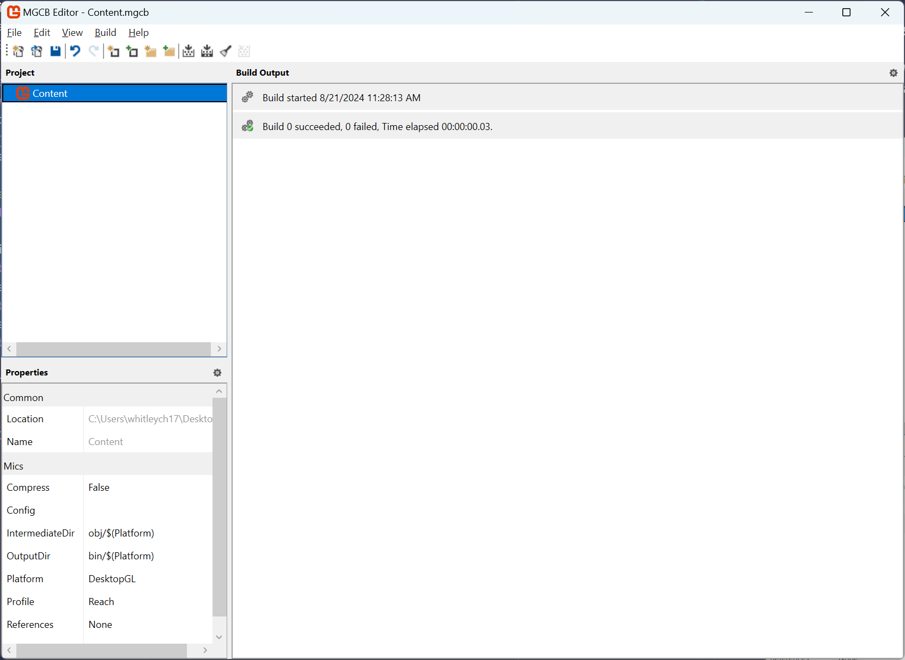

# Chapter 6: The Content Pipeline

- [What Is The Content Pipeline?](#what-is-the-content-pipeline)
  - [MonoGame Content Builder](#monogame-content-builder)
  - [MonoGame Content Builder Editor](#monogame-content-builder-editor)
  - [MonoGame.Content.Builder.Task NuGet](#monogamecontentbuildertask-nuget)
  - [ContentManager Class](#contentmanager-class)
- [Why Use The Content Pipeline?](#why-use-the-content-pipeline)
- [Conclusion](#conclusion)

---

In [Chapter 3](./03_hello_world_a_crash_course_in_monogame.md) we got a quick look at using the *content pipeline* to add both images and audio assets to our game.  In this chapter, we'll explore the *content pipeline* in more detail, discuss the advantages of using it, and how the entire workflow executes from start to finish.

## What Is The Content Pipeline?
The *content pipeline* is an out-of-the-box workflow provided by the MonoGame framework for managing the various types of assets that go into your game.  These assets can include images uses for textures, audio files used for sound effects and/or songs, fonts, 3D models, and shaders.  However it's not limited to just these asset types.  The MonoGame framework provides projects that developers can use to create extensions for the pipeline for custom asset types not handled by default.  Since the *content pipeline* itself is a workflow, it's made up of different components used at design time, build time, and run time in your game project.  These components include

1. The *MonoGame Content Builder (MGCB)* tool which performs the compilation of the game assets added to the content project
2. The *MonoGame Content Builder Editor (MGCB Editor)* tool used to edit the content project to add the assets to compile and be included with the game build
3. The *MonoGame.Content.Builder.Tasks* package reference which is used to automate the building of content when you perform a project build and copying the compiled content to the project output directory
4. The *ContentManager class* use to load the compiled assets in game at runtime to use.

### MonoGame Content Builder
The *MonoGame Content Builder* is a tool that compiles the game assets added to your content project into *.xnb* binary encoded files that can then be loaded at runtime in game using the *ContentManager class*.  For it to know which assets to compile, it reads the contents of the *Content.mgcb* file located by default in the */Content/* directory in the game project. The *Content.mgcb* file itself looks similar to the following

```text

#----------------------------- Global Properties ----------------------------#

/outputDir:bin/$(Platform)
/intermediateDir:obj/$(Platform)
/platform:DesktopGL
/config:
/profile:Reach
/compress:False

#-------------------------------- References --------------------------------#


#---------------------------------- Content ---------------------------------#

#begin image.png
/importer:TextureImporter
/processor:TextureProcessor
/processorParam:ColorKeyColor=255,0,255,255
/processorParam:ColorKeyEnabled=True
/processorParam:GenerateMipmaps=False
/processorParam:PremultiplyAlpha=True
/processorParam:ResizeToPowerOfTwo=False
/processorParam:MakeSquare=False
/processorParam:TextureFormat=Color
/build:image.png
```

In the above example, we can see that the *Content.mgcb* file is broken down into three sections, *Global Properties*, *References*, and *Content*.  The *Global Properties* section defines the flags used when calling the MGCB that will affect all content built such as the directory to output the compiled assets to and which platform is being targeted.  The *References* section would contain the path to an third party content pipeline extension dll references used to allow the MGCB to build custom content.  Finally, the *Content* section defines the content files to be built, and the flags to use when building it.  Each content item will have an */importer* and a */processor* to define what the MGCB should use for that item to import and process it.  The */processorParam* flags depend on which processor is being used.  Above, we are telling it to import *image.png* using the *TextureImporter* and *TextureProcessor*, so the processor params defined are those for textures.

> [!TIP]
> When the *Content.mgcb* file is read, each of the lines that begin with a `/` are passed as arguments to the MGCB process.  This is essentially what the schema of this file defines, the arguments to use.  For instance, without using the *Content.mgcb* file, if you wanted to call the MGCB process directly using the same configuration as above it would look like the following.
> 
> ```sh
> dotnet mgcb /outputDir:bin/$(Platform) /intermediateDir:obj/$(Platform) /platform:DesktopGL /config: /profile:Reach /compress:False /importer:TextureImporter /processor:TextureProcessor /processorParam:ColorKeyColor=255,0,255,255 /processorParam:ColorKeyEnabled=True /processorParam:GenerateMipmaps=False /processorParam:PremultiplyAlpha=True /processorParam:ResizeToPowerOfTwo=False/processorParam:MakeSquare=False /processorParam:TextureFormat=Color /build:image.png
> ```
> Thankfully, we instead have the *Content.mgcb* file to define this and make it more readable than a long cli command.

However, editing this file manually for every asset you want to add to the game through the content pipeline would overwhelming.  Instead, MonoGame provides the *MonoGame Content Builder Editor (MGCB)* editor to assist in editing this file.

### MonoGame Content Builder Editor
The *MonoGame Content Builder Editor (MGCB Editor)* is a tool that provides a graphical user interface for managing the assets to add to your game.  We briefly used this in [Chapter 03](./03_hello_world_a_crash_course_in_monogame.md) to add the images and audio content to the prototype game we created.  

  
**Figure 6-1:** *The MonoGame Content Builder Editor (MGCB Editor).*

The editor itself has three panels to make note of
1. **Project Panel**: The project panel is located in the upper-left side of the windows. Here you will see a tree node view of all the assets added to the the content project. The top node, **Content** represents the content project itself.  When selecting any item from the project panel, the properties for that item will appear in the properties panel.
2. **Properties Panel**: The properties panel displays the properties of the current item selected in the project panel.  In the Figure 6-1 above, we can see that the *Content* node is selected, and the properties panel is showing the properties of that node.  You may also notice that the properties here are the same properties that we saw above inside the *Content.mgcb* file.
3. **Build Output Panel**: The build output panel will display the results of performing a build of the current content project.  If there are any errors that occur during the content build process, you can view them here to see the exception message to further determine the cause of the failure.

Ultimately what this tool does is modify the *Content.mgcb* file for you based on the content items and properties you set inside the editor.  This provides a more manageable and visual way to define the assets to build for the game project.

> [!CAUTION]
> The MGCB Editor only applies the changes made to the *Content.mgcb* file when you tell it to save.  It does not perform any type of auto-saving and will not warn you about saving if you exit without saving first.  Ensure that after making changes you perform a save either by using the save icon in the tool bar or by selecting *File > Save* in the top menu.

### MonoGame.Content.Builder.Task NuGet
When you create a new project using the supplied MonoGame templates, there will be two NuGet package references added. The first will be the platform specific MonoGame Framework package, and the second will be the *MonoGame.Content.Builder.Task* package.

```xml
<ItemGroup>
    <PackageReference Include="MonoGame.Framework.DesktopGL" Version="3.8.2.1105" />
    <PackageReference Include="MonoGame.Content.Builder.Task" Version="3.8.2.1105" />
</ItemGroup>
```

This reference defines project build time tasks that automate the building of the content project files and then copying them to the final project build output.  It's important to note again that this task is **responsible for copying the compiled assets to the project build output**.  The *Content.mgcb* file itself is your **content project**, separate from your actual C# project (**.csproj**).  When the content project is built, the resulting *.xnb* files created are built to the location defined the *Content.mgcb* file, which will be */Content/bin/Platform/* by default.  The task will then copy those compiled *.xnb* assets from the content project output directory to the final project output directory where the game executable is created.  

### ContentManager Class
The final part of the content pipeline workflow is the *ContentManager class* used in the game code to load the content at runtime. The `Game` class initializes a new instance of the *ContentManager class* [when the constructor is called](./05_the_game_class.md#the-game1-constructor) and is provided as an inherited property.

When loading content, you use the `ContentManager.Load<T>()` method.  The `T` type parameter specifies which type of content you are loading (`Texture2D`, `SpriteFont`, `SoundEffect`, etc).  The method itself takes a single parameter which is the path to the content file to load, minus the extension.  **The path is relative to the `ContentManager.RootDirectory` path which is `/Content/` by default.**  
   
```cs
Texture2D texture = Content.Load<Texture2D>("Graphics/image");
Song music = Content.Load<Song>("Music/background_music");
SoundEffect sfx = Content.Load<SoundEffect>("Audio/pickup_sfx");
```

After an asset is loaded for the first time, the *ContentManager class* will cache it internally.  By caching the asset, any subsequent calls to load that asset will serve the cached version instead of doing a full disk read again to load it directly from the *.xnb* file.  However, this also means that all content loaded is cached and using memory.  Depending on the size and number of assets loaded, over time the memory usage can become large.

To help with this, the *ContentManager class* also has the `ContentManager.Unload()` method.  Calling this method without providing a parameter will unload all cached content that has been loaded. You can also pass in the same path value you used to load the content as a parameter to unload only that specific asset.

```cs
//  Unloads all cached assets
Content.Unload();

//  Unloads a specific asset
Content.Unload("Graphics/image");
```

## Why Use The Content Pipeline?
The content pipeline processes the assets specific for the platform being targeted.  For instance, textures can be compressed using [DXT compression](https://en.wikipedia.org/wiki/S3_Texture_Compression), leaving a smaller memory footprint for graphical resources on the graphics processing unit (GPU).  You can use audio files in the native format you have them such as *.mp3*, *.ogg*, and *.wav*, and they will be converted to a format that is compatible with the target platform. Later in development, if you decide to support additional platforms, the pipeline will handle compiling the assets to target those platforms as well.  

You also get the benefits offered at runtime with the *ContentManager class* mentioned above such as caching loaded assets.  If you were to instead use raw assets, you would need to write the code necessary to cache and manage the cache yourself.  While not a daunting task, it is extra work to create a system that already exists.

The content pipeline isn't a requirement to develop games with MonoGame; raw assets can be loaded at runtime using methods such as `Texture2D.FromFile()`.  In some cases, especially for really small games or prototypes, development time can be faster to just do this instead of going through the MGCB Editor to add assets and having them be preprocessed.  As the number of assets for the game grows, optimizing the content loaded is going to start becoming a priority.  Learning to use the content pipeline from the start is going to outweigh the benefits of quick development time.  

## Conclusion
In this chapter we discussed the components that make up the content pipeline, how they work together to compile assets, and the benefits of using the content pipeline. Now that we've covered the foundational topics of MonoGame, in the next chapter we'll take the prototype we created in [Chapter 03](./03_hello_world_a_crash_course_in_monogame.md) and expand it to design and create a finished game from it.

[Go to Chapter 07: Designing MonoGameSnake](./07_designing_monogamesnake.md)
