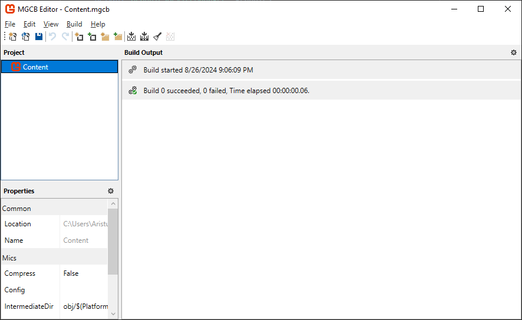
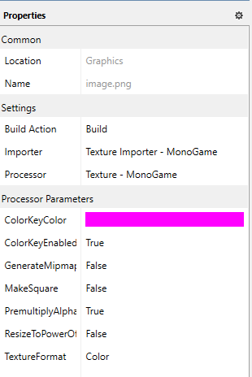
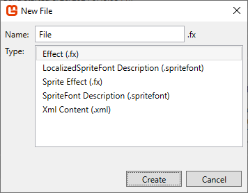

# Appendix 03: The Content Pipeline

* [Why Use The Content Pipeline?](appendix-03-the-content-pipeline.md#why-use-the-content-pipeline)
* [MonoGame Content Builder Editor (MGCB Editor)](appendix-03-the-content-pipeline.md#monogame-content-builder-editor-mgcb-editor)
  * [Using the MGCB Editor](appendix-03-the-content-pipeline.md#using-the-mgcb-editor)
    * [Toolbar](appendix-03-the-content-pipeline.md#toolbar)
    * [Project Panel](appendix-03-the-content-pipeline.md#project-panel)
    * [Properties Panel](appendix-03-the-content-pipeline.md#properties-panel)
    * [Build Output Panel](appendix-03-the-content-pipeline.md#build-output-panel)
    * [Adding New Content Items](appendix-03-the-content-pipeline.md#adding-new-content-items)
    * [Adding Existing Content Items](appendix-03-the-content-pipeline.md#adding-existing-content-items)
    * [Excluding Content Items](appendix-03-the-content-pipeline.md#excluding-content-items)
    * [Organizing Content](appendix-03-the-content-pipeline.md#organizing-content)
    * [Saving Changes](appendix-03-the-content-pipeline.md#saving-changes)
    * [Building Content](appendix-03-the-content-pipeline.md#building-content)
* [MonoGame Content Builder Tool (MGCB Tool)](appendix-03-the-content-pipeline.md#monogame-content-builder-tool-mgcb-tool)
* [MonoGame.Content.Builder.Tasks](appendix-03-the-content-pipeline.md#monogamecontentbuildertasks)
  * [1. CollectContentReferences Task](appendix-03-the-content-pipeline.md#1-collectcontentreferences-task)
  * [2. PrepareContentBuilder Task](appendix-03-the-content-pipeline.md#2-preparecontentbuilder-task)
  * [3. RunContentBuilder Task](appendix-03-the-content-pipeline.md#3-runcontentbuilder-task)
  * [4. IncludeContent Task](appendix-03-the-content-pipeline.md#4-includecontent-task)
* [ContentManager Class](appendix-03-the-content-pipeline.md#contentmanager-class)
  * [Loading Assets](appendix-03-the-content-pipeline.md#loading-assets)
  * [ContentManager Cache](appendix-03-the-content-pipeline.md#contentmanager-cache)
  * [Unload Assets](appendix-03-the-content-pipeline.md#unload-assets)
* [Conclusion](appendix-03-the-content-pipeline.md#conclusion)
* [Test Your Knowledge](appendix-03-the-content-pipeline.md#test-your-knowledge)

***

The MonoGame framework provides an out-of-box workflow for managing game assets, preprocessing them, and loading them in game. This workflow is commonly referred to as the _content pipeline_. The content pipeline is not a single thing, instead it is composed of a set of tools and utilities that create the workflow. This workflow provides the following:

1. Compiling your source file assets to an internal format that is optimized for the platform(s) your game is targeting.
2. Copying the compiled assets to the game project's build directory when you perform a project build.
3. Loading the compiled assets at runtime.

The tools and utilities that make up the content pipeline are:

1. The _MonoGame Content Builder Editor (MGCB Editor)_ - A tool used to provide a graphical user interface to edit the _Content.mgcb_ content project file in your game project.
2. The _MonoGame Content Builder Tool (MGCB Tool)_ - A tool that performs the compilation of the source assets defined in the _Content.mgcb_ content project file.
3. The _MonoGame.Content.Builder.Tasks_ - A NuGet package reference which contains tasks to automate building the content project using the MGCB Tool and then copying the compiled content to your game projects build directory.
4. The _ContentManager_ class - A class provided in code by the MonoGame framework used to load the compiled assets in your game at runtime.

## Why Use The Content Pipeline?

The content pipeline isn't a requirement when developing games with MonoGame. Developers can choose to instead load the source asset files directly using the various `FromFile` methods. When using the content pipeline, however, the source asset files are compiled into an optimized format for the platform(s) targeted by the game. For instance, when an image file is loaded as a texture in your game, the data for that image file has to be sent to the graphics processing unit (GPU) and stored in memory there. The GPU doesn't compressed formats like PNG and JPEG, instead it has to be decompressed from those formats into raw bytes as a format the GPU understands. By pre-processing the image files using the content pipeline, they can be compressed using a format that the GPUs of the target platform(s) understand. For instance, on desktop platforms, the image file can be compressed using [DXT compression](https://en.wikipedia.org/wiki/S3\_Texture\_Compression), which the GPU understands without having to decompress first reducing the overall memory footprint of the game.

Another benefit of using the content pipeline is the _ContentManager_ class provided by the MonoGame framework. This class is used to load the compiled assets in your game at runtime. The content manager itself will also cache the asset the first time it's loaded from disk, meaning any subsequent calls to load the asset will return the already read cached data instead of having to perform another disc read. This can decrease loading times for commonly used assets.

## MonoGame Content Builder Editor (MGCB Editor)

The _MonoGame Content Builder Editor (MGCB Editor)_ is a tool provided by the MonoGame framework with a graphical user interface (GUI) for managing the assets to add to your game.

<figure><figcaption><p><strong>Figure A3-1: The MonoGame Content Builder Editor (MGCB Editor).</strong></p></figcaption></figure>

When changes are made in the MGCB Editor and then saved, those changes are written to the _Content.mgcb_ content project file that is part of your MonoGame project.

The tool itself is distributed via NuGet as a [dotnet tool](https://learn.microsoft.com/en-us/dotnet/core/tools/global-tools). You can see the tool listed the _dotnet-tools.json_ dotnet tools manifest file that is part of every MonoGame project as shown in [Appendix 02](appendix-02-monogame-project-overview.md#the-dotnet-toolsjson-tools-manifest-file).

### Using the MGCB Editor

To use the MGCB Editor, you first need to launch the tool application. There are a few ways to do this depending on your environment setup.

1. When using Visual Studio Code (VSCode), there is a third-party extension created by MonoGame community member r88 canned [_MonoGame for VSCode_](https://marketplace.visualstudio.com/items?itemName=r88.monogame). While not an official extension from the MonoGame foundation, the developers regularly use it and support its recommendation. Using this extension will add an icon at the top of code files in a MonoGame project that can be clicked to open the _Content.mgcb_ file of the MonoGame project in the MGCB Editor. It also provided _Command Palette_ options to launch the MGCB Editor.
2. When using Visual Studio 2022, MonoGame offers an official extension that can be installed. The extension is named [_MonoGame Framework C# project templates_](https://marketplace.visualstudio.com/items?itemName=MonoGame.MonoGame-Templates-VSExtension). Along with installing the MonoGame C# project templates, it also allows developers to open the _Content.mgcb_ file from their project in the MGCB Editor by simply double-clicking the file in the _Solution Explorer_ panel.
3.  Regardless of editors and/or operating system, the tool can also be opened using the dotnet command line interface (CLI). To do this, open a command prompt or terminal window in the same directory as the MonoGame project's _.csproj_ file and enter the following command

    ```sh
    dotnet mgcb-editor ./Content/Content.mgcb
    ```

#### Toolbar

The toolbar is located at the top of the editor window and contains shortcut icons that can be used to perform different tasks.

<figure><figcaption><p><strong>Figure A3-2: The MonoGame Content Builder Editor (MGCB Editor) Toolbar.</strong></p></figcaption></figure>

From left-to-right, the icons on the tool bar are:

| Icon                                                                                                                                | Name                      | Description                                                                                                                                  |
| ----------------------------------------------------------------------------------------------------------------------------------- | ------------------------- | -------------------------------------------------------------------------------------------------------------------------------------------- |
|                   | _Create New Project_      | Creates a new _Content.mgcb_ content project                                                                                                 |
|      | _Open Existing Project_   | Opens an existing _Content.mgcb_ content project file.                                                                                       |
|                | _Save Current Project_    | Saves the current project, writing ot the _Content.mgcb_ content project file that is open in the editor.                                    |
|                    | _Undo Last Action_        | Performs an undo on the last action performed.                                                                                               |
|                         | _Redo Action_             | Performs a redo of the last undo action performed.                                                                                           |
|                | _Add New Item_            | Open the _Add New Item_ dialog to create and add a new item to the current selected node in the **Project Panel**.                           |
|      | _Add Existing Item_       | Adds an existing item to the current selected node in the _Project Panel_.                                                                   |
|            | _Add New Folder_          | Adds a new folder to the current selected node in the _Project Panel_.                                                                       |
|  | _Add Existing Folder_     | Adds an existing folder, and all files within that folder, to the current selected node in the **Project Panel**.                            |
|              | _Build Content Project_   | Performs a build of the current content project. Will only build content that hasn't already been built if a build was previously performed. |
|          | _Rebuild Content Project_ | Performs a rebuild of the current content project which first cleans all previous built content then performs a full build of all content.   |
|              | _Clean Content Project_   | Cleans all previously built content.                                                                                                         |
|                | _Cancel Build_            | Stops the current build in progress. Only available if a build is currently being performed.                                                 |

#### Project Panel

Below the toolbar on the left side of the MGCB Editor window is the _Project Panel_.

<figure><figcaption><p><strong>Figure A3-3: The MonoGame Content Builder Editor (MGCB Editor) Project Panel.</strong></p></figcaption></figure>

The _Project Panel_ provides a tree node view of all assets added to the content project. The top node, _Content_, represents the content project itself. Right-clicking on a node will open a context menu that is specific to that node type; content project, folder, or file. When selecting any node from the Project Panel, the properties available for that node node item will appear in the _Properties Panel_ below it.

#### Properties Panel

Below the _Project Panel_ on the left side of the MGCB Editor window is the _Properties Panel_.

<figure><figcaption><p><strong>Figure A3-4: The MonoGame Content Builder Editor (MGCB Editor) Properties Panel.</strong></p></figcaption></figure>

The _Properties Panel_ contains configurable properties for the current selected node in the _Project Panel_. The available properties will differ depending on the node item type selected and which _Processor_ is selected for that node item. In Figure A3-2 above, the _image.png_ file node is selected, so we see the properties available for an image file.

To view all available properties based on the node item type and processor selected, refer to the [Built-in Content Importers and Processors](https://docs.monogame.net/articles/getting\_started/content\_pipeline/using\_mgcb\_editor.html#built-in-content-importers-and-processors) section of the official MonoGame documentation.

#### Build Output Panel

The _Build Output Panel_ is located on the right side of the MGCB Editor window.

<figure><figcaption><p><br><strong>Figure A3-5: The MonoGame Content Builder Editor (MGCB Editor) Build Output Panel.</strong></p></figcaption></figure>

The _Build Output Panel_ displays the results of building the assets currently added to the content project. If there are any issues building assets, you can view the error message here to determine the cause and how to resolve it. For example, in Figure A3-5 above, there was an exception thrown when attempting to build the _image.png_ asset file.

#### Adding New Content Items

To add new content items to the content project, select a node in the _Project Panel_ and click the _Add New Item_ icon from the toolbar. Alternatively, you can also right-click the node and choose _Add > New Item..._ from the context menu. Doing these will open the _New File_ dialog box.

<figure><figcaption><p><strong>Figure A3-6: The MonoGame Content Builder Editor (MGCB Editor) New File Dialog.</strong></p></figcaption></figure>

As shown in Figure A3-6 above, this will display the built-in content item types that can be added. Select the item type you wish to add, give it a name, then click the _Create_ button to create the content item and add it to the content project.

#### Adding Existing Content Items

To add existing content items to the content project, select a node in the _Project Panel_ and click the _Add Existing Item_ icon from the toolbar. Alternatively, you can also right-click the node and choose _Add > Existing Item..._ from the context menu. Doing these will open a file dialog chooser window where you can navigate to the existing item you want to add and select it.

> \[!TIP] You can select multiple files to add in one go.

Once you have selected the item, you will be presented with the _Add File Dialog_ containing the following options:

<figure><figcaption><p><strong>Figure A3-7: The MonoGame Content Builder Editor (MGCB Editor) Add File Dialog.</strong></p></figcaption></figure>

* _Copy the file to the directory_: This will create a copy of the file you selected and place that copy inside the content directory. Changes to the original file will not be reflected in the copy made.
* _Add a link to the file_: This will add a reference to the file you selected instead of creating a copy. Changes to the original file will be reflected in content builds. The reference is added as a relative path, relative to the _Content.mgcb_ content project file. This means if the source file or the _Content.mgcb_ file are moved, the reference can break and will need to be re-added.
* _Skip adding the file_: This will skip adding the current file shown. This is useful when selecting multiple files to add.

Choose the option that best fits your development environment and click the _Add_ button to finish adding the existing item to the content project.

#### Excluding Content Items

If there is a content item that has been added to the content project that no longer needs to be there, you can exclude it. To do this, right-click the item node in the _Project Panel_ and choose _Exclude From Project_ in the context menu.

> \[!NOTE] When excluding an item from the content project, it removes it from the content project itself. It does not delete the actual file on your hard drive.

#### Organizing Content

Content items added to the content project can be organized by creating folders to place related content items in. For instance, you can create an _images_ folder to place your images in and an _audio_ folder to place music and sound effects in.

To add a new folder to the content project, select either the _Content_ node or an existing folder node and click the _Add New Folder_ icon from the toolbar. Alternatively, you can right-click the _Content node_ or an existing folder node and choose _Add > New Folder..._ from the context menu.

When you add a new folder to the content project, a folder will be created in teh the _Content_ directory of your MonoGame project. Folders, just like other content items, can be excluded from the content project. Excluding a folder will exclude the folder and all content items contained within it.

One gotcha to organizing content in the MGCB Editor is that you cannot drag and drop content item nodes to reorganize them into different folders. Instead, if you want ot move an existing content item to a different folder, you will need to:

1. Exclude the content item.
2. If the item was copied to the _Content_ directory when added, you will need to physically move the item into the folder using the file explorer.
3. Add the item to the desired folder node in the MGCB Editor.

#### Saving Changes

While working inside the MGCB Editor, changes performed are only saved when you click teh _Save_ icon on the tool bar or choose _File > Save_ from the top menu. The MGCB Editor does not auto-save for you.

If you attempt to close the editor when there are changes that have not been saved, you will be prompted if you would like to save those changes first or discard them.

#### Building Content

To perform a build of the content project, you can click the _Build_ icon on the toolbar or select _Build > Build_ from the top menu. Performing this action will perform a build of all content items added to the content project.

If instead you want to build a single content item, maybe due to checking for errors on that specific item, you can do so by right-clicking the content item node in the _Project Panel_ and choose _Rebuild_ from the context menu.

## MonoGame Content Builder Tool (MGCB Tool)

The _MonoGame Content Builder Tool (MGCB Tool)_ is a tool provided by the MonoGame framework that compiles the game assets added to your _Content.mgcb_ content project into _.xnb_ binary encoded files. These files can then be loaded at runtime in your game using the _ContentManager_ class.

The tool itself is distributed via NuGet as a [dotnet tool](https://learn.microsoft.com/en-us/dotnet/core/tools/global-tools). You can see the tool listed the _dotnet-tools.json_ dotnet tools manifest file that is part of every MonoGame project as shown in [Appendix 02](appendix-02-monogame-project-overview.md#the-dotnet-toolsjson-tools-manifest-file).

To execute the tool manually, you can do so by entering the following dotnet CLI command in a command prompt or terminal opened in the same directory as the MonoGame project's _.csproj_ file and enter the following command

```sh
dotnet mgcb [file_path]
```

The `[file_path]` is a required argument and is the path to the _Content.mgcb_ file that the MGCB Tool should process.

This is not something you would need to normally execute manually, as well see in the next section, the content pipeline workflow provides a utility that will automatically build the content project for you.

## MonoGame.Content.Builder.Tasks

The _MonoGame.Content.Builder.Tasks_ is a NuGet package that is referenced in all new MonoGame projects that are created using the MonoGame project templates. You can see it listed as a reference in the _.csproj_ file as shown in [Appendix 02](appendix-02-monogame-project-overview.md#the-csproj-project-file).

This NuGet contains [MSBuild tasks](https://learn.microsoft.com/en-us/visualstudio/msbuild/msbuild-tasks?view=vs-2022) that will execute when you perform a build of your game project. These tasks, in execution order are

1. _CollectContentReferences_: Identifies and organizes content project (_.mgcb_) files.
2. _PrepareContentBuilder_: Configures the environment and creates output directories.
3. _RunContentBuilder_: Executes the MGCB Tool to perform a build of the content projects collected by step 1.
4. _IncludeContent_: Includes the compiles .xnb files from step 3 in the MonoGame game project's build directory by copying them from the content project build directory.

The actual code defined within the tasks is not something you would ever need to edit yourself. However, for full transparency, each task is broken down and shown in the following sections.

### 1. CollectContentReferences Task

The first task that is executed is the _CollectContentReferences_ task.

```xml
<Target Name="CollectContentReferences">

<ItemGroup Condition="'$(EnableMGCBItems)' == 'true'">
    <MonoGameContentReference Include="**/*.mgcb" />
</ItemGroup>

<ItemGroup>

    <!-- Start with existing metadata. -->
    <ContentReference Include="@(MonoGameContentReference)">
    <Link>%(MonoGameContentReference.Link)</Link>
    <FullDir>%(MonoGameContentReference.RootDir)%(MonoGameContentReference.Directory)</FullDir>
    <ContentFolder>%(MonoGameContentReference.ContentFolder)</ContentFolder>
    <OutputFolder>%(MonoGameContentReference.OutputFolder)</OutputFolder>
    <OutputFolder Condition="'%(MonoGameContentReference.OutputFolder)' == '' ">%(MonoGameContentReference.Filename)</OutputFolder>
    </ContentReference>

    <!--
    Process intermediate metadata.
    Switch all back-slashes to forward-slashes so the MGCB command doesn't think it's trying to escape characters or quotes.
    ContentFolder will be the name of the containing folder (using the Link if it exists) so the directory structure of the included content mimics that of the source content.
    -->
    <ContentReference>
    <FullDir>$([System.String]::Copy("%(FullDir)").Replace('\','/'))</FullDir>
    <ContentFolder Condition="'%(ContentFolder)' == '' AND '%(Link)' != ''">$([System.IO.Path]::GetDirectoryName(%(Link)))</ContentFolder>
    <ContentFolder Condition="'%(ContentFolder)' == '' AND '%(Link)' == '' AND '%(RelativeDir)' != ''">$([System.IO.Path]::GetFileName($([System.IO.Path]::GetDirectoryName(%(RelativeDir)))))</ContentFolder>
    </ContentReference>

    <!-- Assemble final metadata. -->
    <ContentReference>
    <ContentDir>%(ContentFolder)/</ContentDir>
    <ContentOutputDir>%(FullDir)bin/$(MonoGamePlatform)/%(OutputFolder)</ContentOutputDir>
    <ContentIntermediateOutputDir>%(FullDir)obj/$(MonoGamePlatform)/$(TargetFramework)/%(OutputFolder)</ContentIntermediateOutputDir>
    </ContentReference>

</ItemGroup>

</Target>
```

This task will:

1. Search for all _.mgcb_ content project files in the MonoGame game project and store them as _MonoGameContentReference_ elements.
2. Populate metadata such as directories and output paths for each reference.
3. Ensure paths are formatted correctly for cross-platform builds

### 2. PrepareContentBuilder Task

After identifying the content to build, the next task to run is the _PrepareContentBuilder_ task.

```xml
<Target Name="PrepareContentBuilder" DependsOnTargets="CollectContentReferences">

<PropertyGroup>
    <PlatformResourcePrefix Condition="'$(MonoGamePlatform)' == 'MacOSX'">$(MonoMacResourcePrefix)</PlatformResourcePrefix>
    <PlatformResourcePrefix Condition="'$(MonoGamePlatform)' == 'iOS'">$(IPhoneResourcePrefix)</PlatformResourcePrefix>
    <PlatformResourcePrefix Condition="'$(MonoGamePlatform)' == 'Android'">$(MonoAndroidAssetsPrefix)</PlatformResourcePrefix>
    <PlatformResourcePrefix Condition="'$(PlatformResourcePrefix)' != '' And !HasTrailingSlash('$(PlatformResourcePrefix)')">$(PlatformResourcePrefix)\</PlatformResourcePrefix>
    <PlatformResourcePrefix Condition="'$(PlatformResourcePrefix)' == ''"></PlatformResourcePrefix>
    <MonoGameMGCBAdditionalArguments Condition="'$(MonoGameMGCBAdditionalArguments)' == ''">/quiet</MonoGameMGCBAdditionalArguments>
</PropertyGroup>

<Error
    Text="The MonoGamePlatform property was not defined in the project!"
    Condition="'$(MonoGamePlatform)' == ''" />

<Warning
    Text="No Content References Found. Please make sure your .mgcb file has a build action of MonoGameContentReference"
    Condition="'%(ContentReference.FullPath)' == ''" />

<Warning
    Text="Content Reference output directory contains '..' which may cause content to be placed outside of the output directory. Please set ContentFolder on your MonoGameContentReference '%(ContentReference.Filename)' to enforce the correct content output location."
    Condition="$([System.String]::Copy('%(ContentReference.ContentDir)').Contains('..'))" />

<MakeDir Directories="%(ContentReference.ContentOutputDir)"/>
<MakeDir Directories="%(ContentReference.ContentIntermediateOutputDir)"/>

</Target>
```

This task will:

1. Configure platform-specific properties such as resource prefixes.
2. Ensure that the required platform, _MonoGamePlatform_, value is defined.
3. Create the output directories where the compiled content assets will be stored.

### 3. RunContentBuilder Task

Next is the _RunContentBuilder_ Task

```xml
<Target Name="RunContentBuilder" DependsOnTargets="PrepareContentBuilder">

<!-- Remove this line if they make dotnet tool restore part of dotnet restore build -->
<!-- https://github.com/dotnet/sdk/issues/4241 -->
<Exec Command="&quot;$(DotnetCommand)&quot; tool restore" />

<!-- Execute MGCB from the project directory so we use the correct manifest. -->
<Exec
    Condition="'%(ContentReference.FullPath)' != ''"
    Command="&quot;$(DotnetCommand)&quot; &quot;$(MGCBCommand)&quot; $(MonoGameMGCBAdditionalArguments) /@:&quot;%(ContentReference.FullPath)&quot; /platform:$(MonoGamePlatform) /outputDir:&quot;%(ContentReference.ContentOutputDir)&quot; /intermediateDir:&quot;%(ContentReference.ContentIntermediateOutputDir)&quot; /workingDir:&quot;%(ContentReference.FullDir)&quot;"
    WorkingDirectory="$(MSBuildProjectDirectory)" />

<ItemGroup>
    <ExtraContent
    Condition="'%(ContentReference.ContentOutputDir)' != ''"
    Include="%(ContentReference.ContentOutputDir)\**\*.*">
    <ContentDir>%(ContentReference.ContentDir)</ContentDir>
    </ExtraContent>
</ItemGroup>

</Target>
```

This task will:

1. Perform a _dotnet restore_ to ensure that all dotnet tools needed, such as the MGCB Tool, are available.
2. Execute the MGCB Tool for each _.mgcb_ file found during the _CollectContentReferences_ task. This will compile the content defined in the _.mgcb_ files into _.xnb_ files and output them in the content project output directory.

### 4. IncludeContent Task

The final task to run is the _IncludeContent_ task.

```xml
<Target
Name="IncludeContent"
DependsOnTargets="RunContentBuilder"
Condition="'$(EnableMGCBItems)' == 'true' OR '@(MonoGameContentReference)' != ''"
Outputs="%(ExtraContent.RecursiveDir)%(ExtraContent.Filename)%(ExtraContent.Extension)"
BeforeTargets="BeforeBuild">

<!-- Call CreateItem on each piece of ExtraContent so it's easy to switch the item type by platform. -->
<CreateItem
    Include="%(ExtraContent.FullPath)"
    AdditionalMetadata="Link=$(PlatformResourcePrefix)%(ExtraContent.ContentDir)%(ExtraContent.RecursiveDir)%(ExtraContent.Filename)%(ExtraContent.Extension);CopyToOutputDirectory=PreserveNewest"
    Condition="'%(ExtraContent.Filename)' != ''">
    <Output TaskParameter="Include" ItemName="Content" Condition="'$(MonoGamePlatform)' != 'Android' And '$(MonoGamePlatform)' != 'iOS' And '$(MonoGamePlatform)' != 'MacOSX'" />
    <Output TaskParameter="Include" ItemName="BundleResource" Condition="'$(MonoGamePlatform)' == 'MacOSX' Or '$(MonoGamePlatform)' == 'iOS'" />
    <Output TaskParameter="Include" ItemName="AndroidAsset" Condition="'$(MonoGamePlatform)' == 'Android'" />
</CreateItem>

</Target>
```

This task will:

1. Add includes for all build _.xnb_ content files so that they are copied from the content project's build directory to the MonoGame game project's build directory.

## ContentManager Class

The final part of the content pipeline workflow is the _ContentManager_ class. This class is used at runtime in your game to load the content that was compiled and copied during the build process by the tasks defined in the _MonoGame.Content.Builder.Tasks_ NuGet.

The `Game` class that is inherited by the `Game1` class initializes a new instance of the _ContentManager_ class during its constructor and makes it available as one of the inherited properties as shown in [Appendix 02](appendix-02-monogame-project-overview.md#additional-properties).

### Loading Assets

To load content using the _ContentManager_ class, execute the `ContentManager.Load<T>` method. The `T` type parameter specifies which content type you are loading (e.g. `Texture2D`, `SpriteFont`, `SoundEffect`, etc). The method itself has a single parameter which is the _asset name_ of the content item to load.

The _asset name_ is the path to the content item to load, minus any extensions, relative to the `ContentManager.RootDirectory` path. In the `Game1` constructor, as shown in [Appendix 02](appendix-02-monogame-project-overview.md#the-game1-constructor), the `ContentManager.RootDirectory` path is set to `"Content"` by default. So if you had a content item to load that was in the directory _/Content/images/ball.png_, the _asset name_ you would provide would be \`"images/ball".

Below are some examples of loading content using the _ContentManager_ class:

```cs
Texture2D texture = Content.Load<Texture2D>("images/image");
Song music = Content.Load<Song>("audio/music/background_music");
SoundEffect sfx = Content.Load<SoundEffect>("audio/sfx/pickup_sfx");
```

### ContentManager Cache

When you load an asset for the first time using the _ContentManager_ class, it will cache the asset internally. By caching the asset, any subsequent calls to load that same asset later will return the cached version instead of having to perform a full disk read and deserialization of the content.

### Unload Assets

There may be times when you want to unload assets that were previously loaded by the _ContentManager_ class. For instance, a common scenario is to have a _ContentManager_ instance that is used to load global asset and a separate instance used in a scene that only loads assets used by that scene. When the scene ends, you may want to unload the assets that were loaded since they will no longer be used, reducing your memory footprint.

To unload assets, the _ContentManager_ class provides three methods. All three methods are demonstrated below:

```cs
//  Unloads a single asset with the asset name provided
Content.UnloadAsset(assetName);

//  Unloads multiple assets using the collection of asset names provided
Content.UnloadAssets(new List<string>() { asset1, asset2, asset3 });

//  Unloads all assets
Content.Unload();
```

## Conclusion

Here, we have discussed

* The _content pipeline_ and the advantages of using it
* The individual components of the content pipeline and how they work together to automate pre-processing and compiling game assets to load in your game.

## Test Your Knowledge

1.  When choosing to exclude an asset in the MGCB Editor, is the file deleted from your computer?

2.  Does the MGCB Editor auto save as you add and/or remove assets in the interface

3.  What is the purpose of the MGCB tool?

4.  Do you need to copy the compiled assets from the content project output directory to your game project output directory?

5.  In my Content folder, I have a directory named _images_. Inside this directory, I have an image file of a ball named _ball.png_. I have added this file to my content project in the MGCB Editor and now want to load it in the game using the _ContentManager_ class. When loading it, what value would I need to give for the _asset name_ parameter to load the _ball.png_ image.

6.  In this scenario, I need to unload two assets that were previously loaded using the _ContentManager_ class. The _asset name_ for these assets are `images/ball` and `audio/sfx/bounce`. Given this information, how can I unload these assets?
