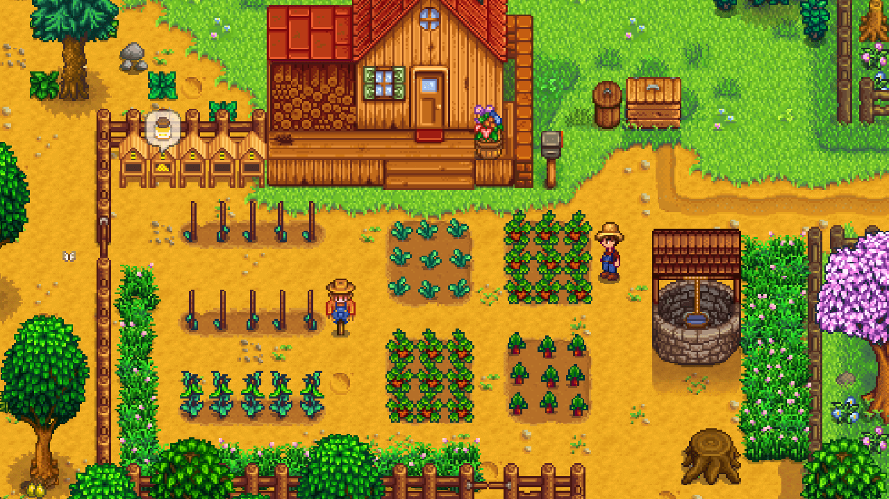

# 1-1: What Is MonoGame

- [What Can MonoGame Do](#what-can-monogame-do)
- [Programming Languages](#programming-languages)
- [Conclusion](#conclusion)
- [See Also](#see-also)
- [Next Steps](#next-steps)

---

In 2006, Microsoft released *XNA Game Studio*, a game development programming environment designed to facilitate game development for Windows PC and the Xbox 360 console.  *XNA Game Studio* revolutionized game development for indie creators.  It provided a simplified approach to building games, offering a set of tools that lowered the entry barrier for aspiring game developers.  Out of this gave rise to critically acclaimed titles like [Bastion](https://www.supergiantgames.com/games/bastion/) and [Terraria](https://terraria.org/).  

As XNA became more popular, and only targeting Windows, the need for cross-platform development grew. In 2009, [José Antonio Leal de Farias](https://github.com/jalf) introduced *XNA Touch*, an open-source project which aimed to make games with XNA playable on iOS devices. This marked the beginning what would later become MonoGame. [Dominique Louis](https://github.com/CartBlanche) came on board in 2009 and soon took over as full-time project lead, driving its initial development and expansion. The project attracted other developers such as [Tom Spilman](https://github.com/tomspilman) who were interested in expanding the scope of the project as well as its reach.

The official birth of MonoGame occurred in 2011 as an open source version of XNA framework. While it still had the same familiar API as XNA, the support also expanded to various platforms, such as Linux, macOS, iOS, Android and Playstation. Even though Microsoft discontinued XNA in 2013, MonoGame continued to grow and develop. Maintenance of the project was given to [Steve Williams](https://github.com/KonajuGames) and [Tom Spilman](https://github.com/tomspilman) in 2014. In order to direct its future developments and undertaking, the [MonoGame Foundation](https://monogame.net/about/) was formed on September 29th, 2023. 

Today, it is a mature cross-platform framework that is built with the spirit of preserving XNA but adopting modern game development practices. Some popular titles created using this platform include [Celeste](https://store.steampowered.com/app/504230/Celeste/), [Stardew Valley](https://store.steampowered.com/app/413150/Stardew_Valley/), and [Streets of Rage 4](https://store.steampowered.com/app/985890/Streets_of_Rage_4/).

  
**Figure 1-1:** *Celeste, developed by Maddy Thorson and Noel Berry.*

  
**Figure 1-2:** *Stardew Valley, developed by Eric Barone (ConcernedApe).*

  
**Figure 1-3:** *Streets of Rage 4, developed by Dotemu, LizardCube, and Guard Crush Games.*

## What Can MonoGame Do
MonoGame, following in the footsteps of XNA, is a "bring your own tools" framework where developers are given the basic blocks to design their game, engines, and tools.  As a code-first approach to game development, MonoGame does not include any pre-built editors or interfaces; instead it gives developers an opportunity to establish their own working environment.

At its core, MonoGame offers a set of libraries and APIs to handle common game development tasks:

1. **Graphics Rendering**: 2D and 3D rendering are supported through the graphics API offered by MonoGame.  This API provides sprite batching for 2D graphics, a flexible 3D pipeline, and shaders for custom visuals and effects.
2. **Input Handling**: MonoGame supports input from keyboard, mouse, game pads, and touch, making it versatile for platforms and styles of play.
3. **Audio**: MonoGame has a comprehensive audio system that can be used to create sound effects as well as play music with included support for many audio formats.
4. **Content Pipeline**: One of the biggest advantages of MonoGame is its content pipeline.  Importing and processing various asset types such as textures, models, audio, etc., to make them optimally ready to use for the target platform of the game.
5. **Math Library**: A math library specifically optimized for game development, providing essential mathematical functions and operations.

Developers are free to integrate existing tools into their workflow.  For example, popular tools such as [Tiled](https://www.mapeditor.org/) or [LDtk](https://ldtk.io/) for  creating tile based level design.  Conversely, game developers may decide to make and use custom tools that are specific to their individual game requirements as a way of taking advantage of MonoGame's flexible architecture.

One of the main advantages of MonoGame is its cross-platform support.  Games built with MonoGame are compatible with a variety of platforms including:

- **Desktop**: Windows, macOS, and Linux.
- **Mobile**: iOS and Android.
- **Consoles**: Xbox, Playstation, and Nintendo Switch (with appropriate license).

By providing cross-platform support, developers can target multiple platforms from a single codebase, significantly reducing development time and resources needed for porting.  

> [!NOTE]
> Developing games for consoles requires a more advanced skill set for programming or another developer or studio that can port the game for you.
>
> Console development is also unique in that the MonoGame Foundation can only provide the console-specific portions once developers have been approved by that console manufacturer. This is due to licensing terms and agreements imposed by console manufacturers.

## Programming Languages
MonoGame is designed and built in C#, a powerful and modern language developed by Microsoft.  It is the official programming language supported documentation, samples, and community discussion.  However, MonoGame is not exclusively tied to C#.  As a .NET library, MonoGame can be used with any .NET-compatible language including Visual Basic and F#.  While the alternative .NET languages can be used, community help and support may be limited.

Developers should have a foundational understanding of C# and programming concepts such as:

- Object-Oriented Programming
- Data types and structures
- Control flow and loops
- Error handling and debugging
  
For those that are new to programming and/or C#, it's recommended to learn core fundamentals of C# and build a solid foundation before exploring MonoGame.  Microsoft offers free resources for learning C# at https://dotnet.microsoft.com/en-us/learn/csharp

## Conclusion
In this chapter, we've explored the rich history and extensive capabilities of MonoGame. We've seen how it evolved from Microsoft's XNA Game Studio to become a powerful, open-source framework that preserves XNA's spirit while embracing modern game development practices. 

In this chapter, we explored MonoGame's evolution from XNA, its key features, and its capabilities as a flexible, cross-platform game development framework.  In the next chapter, we'll begin setting up your development environment to begin creating your own games with MonoGame.

## See Also
- [About MonoGame](https://monogame.net/about/)

## Next Steps
- [1-2: Setting Up Your Development Environment](./01-02-setting-up-your-development-environment.md)
