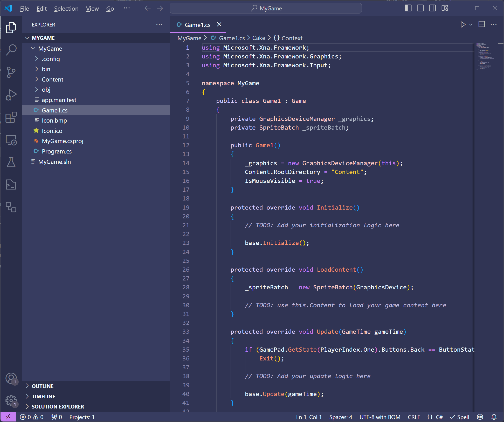
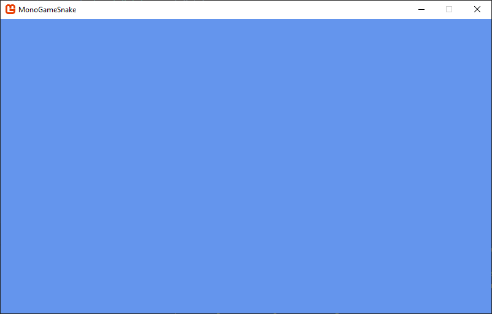

# 1-3: Hello World

- [Creating a New MonoGame Project](#creating-a-new-monogame-project)
- [Running The Game For The First Time](#running-the-game-for-the-first-time)
- [Conclusion](#conclusion)
- [See Also](#see-also)
- [Next Steps](#next-steps)

---

When learning a new programming language, tutorials will often start with some form of the "Hello World" program.  For example, a classic Hello World program in C# would look something like this

```cs
using System;

namespace HelloWorldApplication
{
    public class Program
    {
        public static void Main(string[] args)
        {
            Console.WriteLine("Hello World");
        }
    }
}
```

The entire point of the Hello World program is to introduce some usage of the language in as minimal an example as possible.  For this tutorial, our Hello World will be creating a new MonoGame project and running it.  

## Creating a New MonoGame Project
To create a new MonoGame project in Visual Studio Code, perform the following:

1. Launch the Visual Studio Code application.
   
2. Expand the *Explorer Panel* by clicking the icon on the left in the *Activity Bar* or by selecting *View > Explorer* from the top menu.
   
3. In the *Explorer Panel* cLick the *Create .Net Project* button. 

> [!TIP]  
> The *Create .NET Project button is not a  feature that is available in Visual Studio Code by default.  It's provided through the C# Dev Kit extension we installed when [setting up your development environment](./01-02-setting-up-your-development-environment.md)

4. A new prompt will open in the top center of the Visual Studio Code window showing the available C# project templates to choose from.  Enter `MonoGame` into the prompt to filter the project templates to only show the MonoGame ones.plates.
   
5. Choose the *MonoGame Cross-Platform Desktop Application* project template.
   
6. After choosing the template, a dialog window will appear asking you to choose a location to save the project.  It's recommended to keep you projects stored central directory.  For now, you can create a new directory on your desktop named *MonoGame Projects* and choose this for the dialog.

7. After choosing the directory, you'll be prompted to enter a name for the project.  Enter the name `MonoGameSnake`.
   
8. Next, in the final prompt, select *Create Project*.

After selecting *Create Project*, a new C# project will be created based on the MonoGame template chosen and opened automatically in Visual Studio Code.


**Figure 1-3-1:** *A new MonoGame project after being created in Visual Studio Code.*

Congratulations, you've just created your very first MonoGame project above. We'll cover what each of the files generated are in the next chapter.

## Running The Game For The First Time
Let's run our newly created MonoGame project and see the results. To run the project

1. Press the *F5* key on your keyboard.

2. Choose *C#* from the prompt that appears

3. Choose your project from the next prompt that appears.

> [!TIP]
> You can also run the project by opening the *Solution Explorer* panel at the bottom of the *Explorer Panel* on the left, right-clicking the project, and choosing *Debug > Start new Instance*.  This *Solution Explorer* is provided by the C# Dev Kit extension we installed when  [setting up your development environment](./01-02-setting-up-your-development-environment.md)

> [!NOTE]
> The first time you build a MonoGame project, a dotnet restore will be executed, which will download the NuGet packages used by the MonoGame project.  If they've never been restored before, then they will be downloaded from the official NuGet feed.
> 
> One of the tool packages, The *dotnet-mgcb* package is ~400mb, so depending on your internet connection speed, it may take a moment for the first build to finish.  Once the packages have been downloaded for the first time, they are cached in your global NuGet directory, so subsequent builds and projects will not have to download them.

Be amazed, the default MonoGame cornflower blue game window

  
**Figure 3-3:** *The default MonoGame cornflower blue game window.*


While there isn't much happening here visually, there is a lot going on behind the scenes that the MonoGame framework is handling for you.  When you ran the application, the following ocurred:

1. The application started
2. The game window was created and graphics were initialized
3. A loop is entered which performs the following over and over until the game is told to exit:
   1. The game is updated.
   2. The game is rendered to the window.

You can exit the game at any time by pressing the `Esc` key on yoru keyboard.

If you were to set all of this up manually, it could take hours of research and thousands of lines of code written just to get the window created, graphics initialized and input polling.  Instead, we can take advantage of this base starting point that MonoGame offers us to get started creating our game without having to worry about the lower level implementations like this.

> [!NOTE]
> In Step 3 above, it's mentioned that a loop is entered.  This is commonly referred to as the *game loop*, which we'll discuss in more detail in the next chapter.  The reason the application enters this loop is because game applications work differently than a traditional desktop application like your web browser.  
> 
> Desktop applications are event based, meaning once loaded, they do not do much at all while waiting for input from the user, and then it responds to that input event.  
> 
> In games, things are always happening such as objects moving around like the player or particles.  To handle this, games implement a loop structure that runs continuously, first calling the Update method and then the Draw method, until it has been told to exit.


## Conclusion
In this section, you created your first MonoGame project and ran it.  In the next chapter, we'll dive deeper into the files that are generated when a new MonoGame
In this chapter, we created a new MonoGame game project and ran it.  In the following chapters, we'll discuss the files that are generated when a new MonoGame project is created, dive into the *Game1.cs* file, and discuss the content pipeline.

## See Also
- [Creating a New MonoGame Project In Visual Studio 2022](https://docs.monogame.net/articles/getting_started/2_choosing_your_ide_visual_studio.html#creating-a-new-monogame-project)
- [Creating a New MonoGame Project In JetBrains Rider](https://docs.monogame.net/articles/getting_started/2_choosing_your_ide_visual_studio.html#creating-a-new-monogame-project)

## Next Steps
- [Chatper 2: Crash Course](../chapter-02-crash-course/02-00-crash-course.md)
