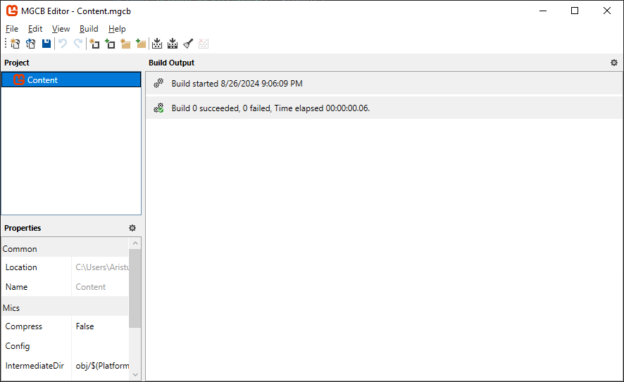
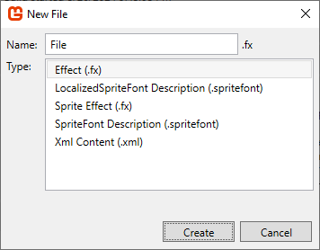

# Chapter 3-1: MonoGame Content Builder Editor

- [Using the MGCB Editor](#using-the-mgcb-editor)
  - [The Interface](#the-interface)
    - [Toolbar](#toolbar)
    - [Project Panel](#project-panel)
    - [Properties Panel](#properties-panel)
    - [Build Output Panel](#build-output-panel)
  - [Adding New Content Items](#adding-new-content-items)
  - [Adding Existing Content Items](#adding-existing-content-items)
  - [Excluding Content Items](#excluding-content-items)
  - [Organizing Content](#organizing-content)
  - [Saving Changes](#saving-changes)
  - [Building Content](#building-content)

---

  
**Figure 3-1-1:** *The MonoGame Content Builder Editor (MGCB Editor).*

The **MonoGame Content Builder Editor (MGCB Editor)** is a tool provided by the MonoGame framework that provides a graphical user interface (GUI) for managing the assets to add to your game.  When changes are made in the MGCB Editor and then saved, those changes are written to the [*Content.mgcb*](../chapter-02-monogame-project-overview/02-02-the-content-file.md) content project file so that we don't have to edit it manually.


The tool itself is distributed via NuGet as a [dotnet tool](https://learn.microsoft.com/en-us/dotnet/core/tools/global-tools).  We previously saw it listed in [the dotnet tools manifest file](../chapter-02-monogame-project-overview/02-03-the-dotnet-tools-manifest-file.md) in Chapter 2.  To open the tool, you can enter the following command in a terminal pointed at the project root directory

```
dotnet mgcb-editor [file_path]
```

The `[file_path]` is optional, and when supplied will open the MGCB Editor with the *Content.mgcb* file at the path specified.

> [!TIP]
> A [third-party extension](https://marketplace.visualstudio.com/items?itemName=r88.monogame) was created by a MonoGame community member r88 that can be used with Visual Studio Code to open the MGCB Editor by simply clicking an icon from within the Visual Studio Code editor.  While not an official extension from the MonoGame foundation, they regularly use it and support it's recommendation.
>
> For Visual Studio 2022 users, the official [MonoGame Extension](https://marketplace.visualstudio.com/items?itemName=MonoGame.MonoGame-Templates-VSExtension) can be installed which allows you to open the MGCB Editor by simply double-clicking the *Content.mgcb* file in the **Solution Explorer** panel.

## Using the MGCB Editor

### The Interface
The MGCB Editor interface is comprised of the **Toolbar**, **Project Panel**, **Properties Panel** and the **Build Output Panel**.

#### Toolbar

  
**Figure 3-1-2:** *The MonoGame Content Builder Editor (MGCB Editor) Toolbar.*

The toolbar is located at the top of the editor window and contains shortcut icons that can be used to perform different tasks.  From left-to-right, the icons are

| Icon | Name | Description |
| --- | --- | --- |
|  | **Create New Project** | Creates a new *Content.mgcb* content project |
|  | **Open Existing Project** | Opens an existing *Content.mgcb* content project file. |
|  | **Save Current Project** | Saves the current project, writing ot the *Content.mgcb* content project file that is open in the editor. |
|  | **Undo Last Action** | Performs an undo on the last action performed. |
|  | **Redo Action** | Performs a redo of the last undo action performed. |
|  | **Add New Item** | Open the **Add New Item** dialog to create and add a new item to the current selected node in the **Project Panel**. |
|  | **Add Existing Item** | Adds an existing item to the current selected node in the **Project Panel**. |
|  | **Add New Folder** | Adds a new folder to the current selected node in the **Project Panel**. |
|  | **Add Existing Folder** | Adds an existing folder, and all files within that folder, to the current selected node in the **Project Panel**. |
|  | **Build Content Project** | Performs a build of the current content project.  Will only build content that hasn't already been built if a build was previously performed. |
|  | **Rebuild Content Project** | Performs a rebuild of the current content project which first cleans all previous built content then performs a full build of all content. |
|  | **Clean Content Project** | Cleans all previously built content. |
|  | **Cancel Build** | Stops the current build in progress. Only available if a build is currently being performed. |

#### Project Panel
Below the toolbar on the left of the window is the **Project Panel**.

  
**Figure 3-1-3:** *The Project Panel.*

The project panel provides a tree node view of all assets add to the content project.  The top node, **Content**, represents the content project itself.  Right-clicking on a node will open context menu that is specific to that node type; content project, folder, or file. When selecting any node from the project panel, the properties available for that item will appear in the **Properties Panel** below it.

#### Properties Panel

    
**Figure 3-1-3:** *The Properties Panel.*

The **Properties Panel** located below the **Project Panel** contains the configurable properties for the current selected node.  The available properties will differ depending on the node selected and which **Processor** is selected for that item.  In Figure 3-1-3 above, the *image.png* file is selected, so we see the properties available for an image file. To view all available properties based on the item and processor selected, refer to the [Built-in Content Importers and Processors](https://docs.monogame.net/articles/getting_started/content_pipeline/using_mgcb_editor.html#built-in-content-importers-and-processors) section in the official MonoGame documents.

#### Build Output Panel

    
**Figure 3-1-4:** *The Build Output Panel.*

The **Build Output Panel** located on the right side of the editor window displays the results of building the assets current added to the content project. If there is an issue building any asset, you can view the error message here to determine the cause and how to resolve it.  For example in Figure 3-1-4 above, there was an exception thrown when attempting to build the *image.png* asset file.

### Adding New Content Items 
To add a new content item to the content project, select a node in the **Project Panel** and click the **Add New Item** icon in the toolbar.  Alternatively you can also right-click the node and choose *Add > New Item...* from the context menu.  Doing this will open the **New File** dialog box.

  
**Figure 3-1-5:** *New File Dialog.*

This will display the build-in item types that can be added.  Select the item type you wish to add and give it a name, then click **Create** to create the content item and add it to the content project.

### Adding Existing Content Items
To add existing content items to the content project, select a node in the **Project Panel** and click the **Add Existing Item** icon in the toolbar.  Alternatively, you can also right-click the node and choose *Add > Existing Item...* from the context menu.  This will open a file chooser dialog window where you can navigate to the existing item you want to add and select it. 

> [!TIP]
> You can select multiple files to add.

If the existing item you select is located outside of the Content directory in your project, you'll be presented with the following options

  
**Figure 3-1-6:** *Add File Dialog.*

- **Copy the file to the directory** will create a copy of the file you selected and place that copy inside the content directory
- **Add a link to the file** will instead add a reference to the file you selected instead of creating a copy.  The reference added is a relative path, relative to the *Content.mgcb* content project file being edited, so if you move the file or the *Content.mgcb* file, this reference can break.
- **Skip adding the file** will skip the adding the current file shown.  This is useful when selecting multiple files to add.

### Excluding Content Items
If there is a content item that has been added to the content project that no longer needs to be there, you can exclude it.  To do this, right-click the item node in the **Project Panel** and choose **Exclude From Project** in the context menu.  

> [!NOTE]
> When excluding an item from the content project, it removes it from the content project itself, it does not delete the actual file on your hard drive.

### Organizing Content
Content items added to the content project can be organized by creating folders to place related content items in.  For instance, you can create a *Graphics* folder to place your images in and an *Audio* folder to place sound effects and music in.  To add a new folder to the content project, select either the **Content** node or an existing folder node and click the **Add New Folder** icon on the toolbar.  Alternatively, you can right-click the **Content** node or an existing folder node and choose *Add > New Folder...* from the context menu.

When you add a new folder to the content project, a folder will be created inside the Content directory of your project.  Folders, just like content items, can be excluded from the content project, which will exclude the folder and all content items contained within the folder.

One pitfall to organizing content in the MGCB Editor is that you cannot drag and drop content item nodes to reorganize them into different folders.  Instead, if you want to move an existing content item to a folder, you'll need to
1. Exclude the content item
2. If the item was copied to the Content directory when added, you will need to physically move the item into the folder using the file explorer
3. Add the item to the folder in the MGCB Editor.


### Saving Changes
While working inside the MGCB Editor, changes performed are only saved when you click the **Save** icon in the toolbar or choose *File > Save* from the top menu.  The MGCB Editor does not auto-save for you.  If you attempt to close the editor without saving first, you will be prompted to save.

### Building Content
To build the content items currently added to the content project, you can click the **Build** icon in the toolbar or select *Build > Build* from the top menu.  Performing this action will perform a build of all content items added to the content project.

If instead you want to build a single content item, maybe due to checking for errors on that specific item, you can right-click the content item node in the **Project Panel**  and choose *Rebuild* from the context menu.

## See Also
- [Using MGCB Editor | MonoGame](https://docs.monogame.net/articles/getting_started/content_pipeline/using_mgcb_editor.html)

## Next
- [Chapter 3-2: MonoGame Content Builder](./03-02-monogame-content-builder.md)
