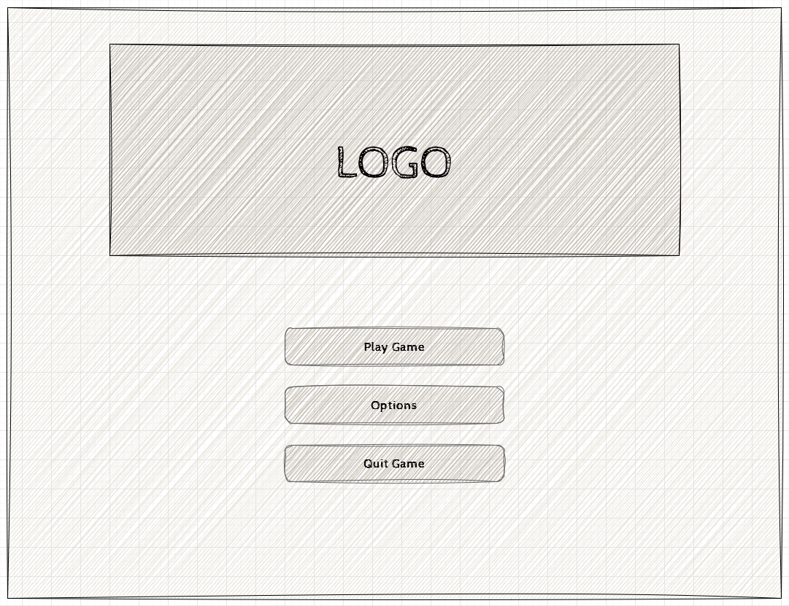

# Chapter 4: Designing the Game

- [Game Summary](#game-summary)
- [Inspiration](#inspiration)
- [Target Systems](#target-systems)
- [Resolution](#resolution)
- [User Interface Flow](#user-interface-flow)
  - [1. Splash Screen](#1-splash-screen)
  - [2. Title Screen](#2-title-screen)
  - [3. Options Screen](#3-options-screen)
  - [4. Gameplay Screen](#4-gameplay-screen)
  - [5. Pause Screen](#5-pause-screen)
  - [6. Game Over Screen](#6-game-over-screen)
- [Game Play Overview](#game-play-overview)
- [Controls](#controls)
- [See Also](#see-also)
- [Next](#next)

---  

Before jumping directly into coding a game, it's always best to start with designing an initial concept first.  These are sometimes referred to as a [Game Design Document (GDD)](https://en.wikipedia.org/wiki/Game_design_document).  A GDD is a **living document** is used to organize and describe the overall design of the game, from the systems and mechanics to the artwork direction and visual design.  Even for small games, having a GDD is helpful because it gives an overall view of the finished product and gives the developer a reference while developing the game.  As mentioned, it is a **living document** which means the information in it can change after the initial concept based on things we learn while developing.  

Below, we're going ot create a simplified design document.  We'll then use this design document as a reference while developing the game in the subsequent chapters.

## Game Summary
MonoGameSnake is a recreation of the classic snake game.  In MonoGameSnake, players control a constantly moving "snake".  The player can choose which of four directions the snake is moving in with the goal of collecting an item that will increase both the players score and the length of the snake. Colliding with the body of the snake ends the game.

## Inspiration
The inspiration for MonoGameSnake is the more known variant of snake that was originally developed for the Nokia 6110 cell phones

  
**Figure 4-0-1:** *Screenshot of Snake for the Nokia 6110.*

In that version, the snake moves on a grid based system, one grid cell at a time, in the current chosen direction by the player.  However, in that version, the game ends not only when colliding with the body, but also when colliding with the walls.  The wall limitation will be removed in our version and the snake will wrap around the play area instead.

## Target Systems
The game will be developed to target Windows, MacOS, and Linux

## Resolution
According to the [Steam Hardware Survey](https://store.steampowered.com/hwsurvey/Steam-Hardware-Software-Survey), as of September 2024, the most common display resolution is 1920 x 1080.  Given this is the most common display resolution, the game will target a resolution of 1920 x 1080

## User Interface Flow
The following defines the flow of the game and user interaction starting from the point of the initial launch of the game application.

  
**Figure 4-0-2:** *Game Flow.*

### 1. Splash Screen
When the game first launches, a splash screen is shown to players to show any branding or logos necessary. Players should be able to press an input to skip past splash screen.

### 2. Title Screen

  
**Figure 4-0-3:** *Title Screen Sketch.*

The title screen will feature the game logo at the top center with three buttons below it. The three buttons should be
1. **Play Game**: When clicked, the screen should transition to the game play screen.
2. **Options**: When clicked, the options screen should be shown.
3. **Quit Game**: When clicked the game application should exit.

### 3. Options Screen

  
**Figure 4-0-4:** *Options Screen Sketch.*

The options screen will look similar to the title screen in that it features the game logo at the top center. Below the logo are the options to adjust volume, make the game full screen, and a button to return to the title screen.

### 4. Gameplay Screen

  
**Figure 4-0-5:** *Gameplay Screen Sketch.*

The gameplay screen will contain the players current score in the top-left with a list of high scores below that.  The remaining screen content area on the right will be the game play board where the snake moves around to collect the item that increases score and length.

### 5. Pause Screen

  
**Figure 4-0-6:** *Pause Screen Sketch.*

When the player presses the input to pause the game, the pause screen will appear.  This should hide the current gameplay area and replace it with a pause menu with the options to resume gameplay or quit to return to the title screen.

### 6. Game Over Screen

  
**Figure 4-0-7:** *Game Over Screen Sketch.*

When the player meets the conditions for a game over, then the game over screen is shown. When this is shown, similar to the pause screen, the gameplay area is hidden and the menu is shown instead, with two buttons; one to retry and another to quit

## Game Play Overview
The snake itself will continuously move on a fixed timer in the direction input by the player, one grid space at a time.  The player's goal is to navigate the snake toward the item to increase their score, while avoiding colliding with the snake's body.  Each time the item is acquired, the snake's body will increase in length by 1 and a new item spawned at a random location within the game play grid.

## Controls
The game will be controllable with both keyboard and gamepad.

| Action       | Keyboard Key   | Gamepad Button        |
| ------------ | -------------- | --------------------- |
| **GamePlay** |                |
| Up           | W, Up-Arrow    | D-pad Up, Y Button    |
| Down         | S, Down-Arrow  | D-pad Down, A Button  |
| Left         | A, Left-Arrow  | D-pad Left, X Button  |
| Right        | D, Right-Arrow | D-pad Right, B Button |
| Pause        | Esc            | Start Button          |
| **Menus**    |                |
| Up           | Up-Arrow       | D-pad Up              |
| Down         | Down-Arrow     | D-pad Down            |
| Left         | Left-Arrow     | D-pad Left            |
| Right        | Right-Arrow    | D-pad Right           |
| Confirm      | Enter          | A Button              |

## See Also
- [Game Design Document | Wikipedia](https://en.wikipedia.org/wiki/Game_design_document)
  
## Next
Chapter 5 coming soon.
